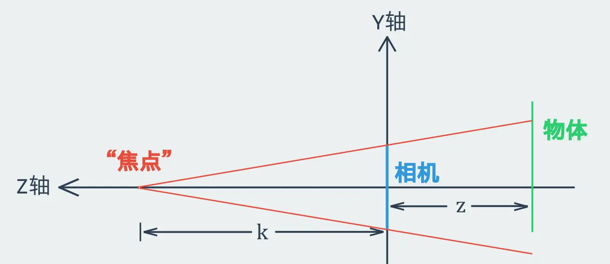
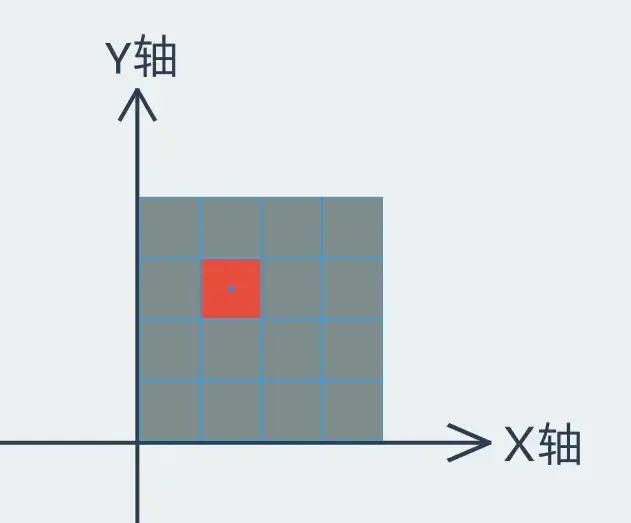
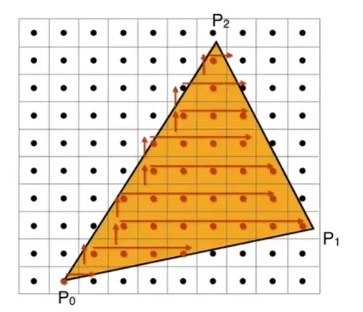
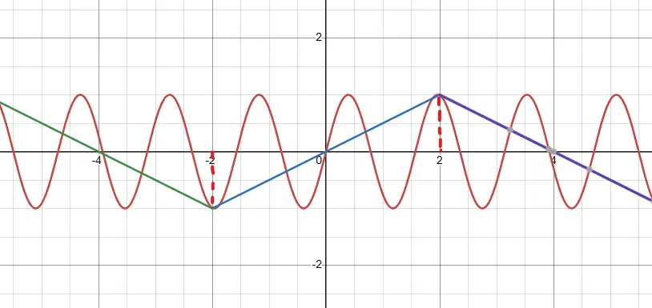
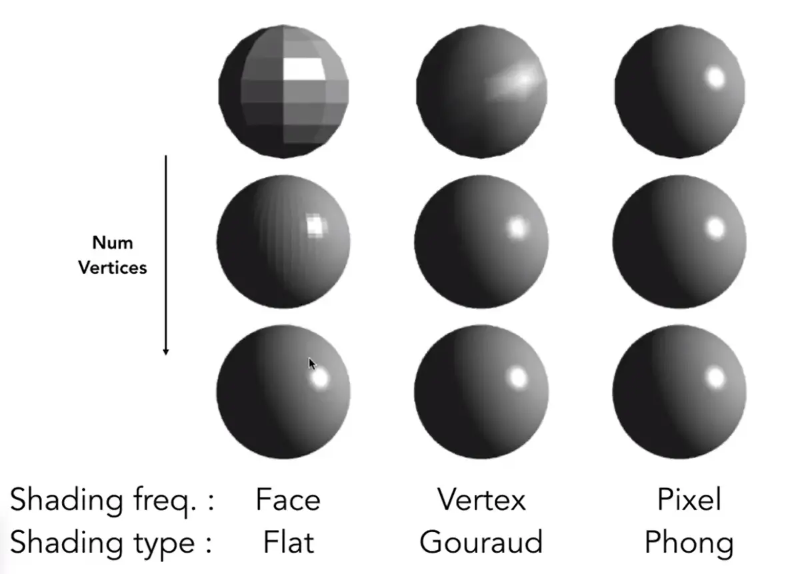
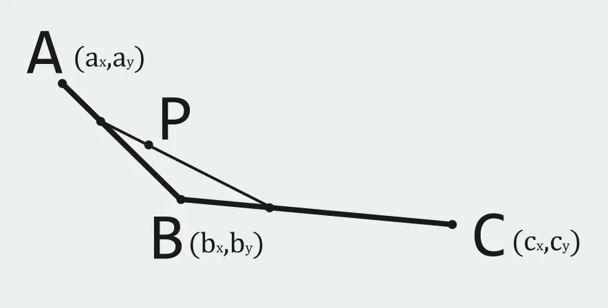
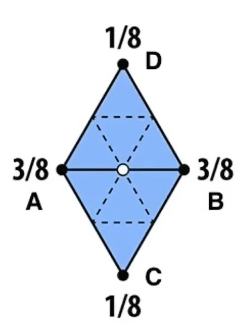
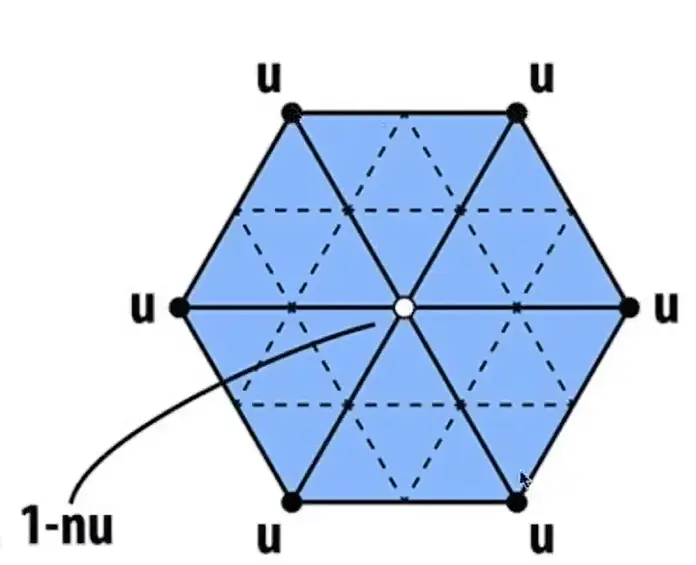

import { Note } from "@/components/note";

<Note type="warn" title="限制级内容！">

计算机图形学仅适合对游戏引擎、CG 或渲染感兴趣的人学习，且需要有高等数学和线性代数基础。

</Note>

## 零、参考文献

- [Games 101](https://sites.cs.ucsb.edu/~lingqi/teaching/games101.html "点击跳转")

## 一、数学基础

### 1. 定义

- 右手坐标系：使右手拇指、食指与中指互相垂直，拇指代表 X 轴，食指代表 Y 轴，此时 Z 轴与中指方向一致。
- 左手坐标系：使左手拇指、食指与中指互相垂直，拇指代表 X 轴，食指代表 Y 轴，此时 Z 轴与中指方向一致。
- 向量叉乘结果仍为向量，与原有两个向量所在平面垂直，朝向由左/右手坐标系决定。

### 2. 公式

- 向量点乘：
    $$
    \begin{aligned} \vec{a} \cdot \vec{b} = x_{\vec{a}} \cdot x_{\vec{b}} + y_{\vec{a}} \cdot y_{\vec{b}} \\ = \lVert \vec{a} \rVert \cdot \lVert \vec{b} \rVert \cdot \cos \theta \end{aligned}
    $$
- 向量投影：
    $$
    \vec{a}_{\perp} = \lVert \vec{a} \rVert \cdot \cos \theta \cdot \vec{b}
    $$
- 向量叉乘：
    - $$\lVert \vec{a} \times \vec{b} \rVert = \lVert \vec{a} \rVert \cdot \lVert \vec{b} \rVert \cdot \sin \theta$$
    - $$\vec{a} \times \vec{b} = A^{\ast} \vec{b}$$ （其中 $$A^{\ast}$$ 为一个反对偶矩阵）

- 矩阵乘法： 令 $$C = AB$$ ，则有 $$C_{xy} = \sum_{i=1}^{n} A_{xi} \cdot B_{iy}$$ ，其中 $$C$$ 为 $$m$$ 行 $$n$$ 列的矩阵
- 逆矩阵： $$A A^{-1} = A^{-1} A = E$$ （其中 $$E$$ 为单位矩阵）
- 伴随矩阵： $$A^{\ast} = \lvert A \rvert \cdot A^{-1}$$

## 二、仿射变换矩阵

可以通过矩阵乘以向量的方式完成的操作，称为线性变换。如无特殊说明，下述内容均以**二维右手坐标系**为例。

缩放矩阵： $$\begin{bmatrix} a_1 & 0 \\ 0 & a_2 \end{bmatrix}$$ ，其中 $$a_i$$ 为第 $$i$$ 维缩/放值，值为负数时附加镜像操作。

切变矩阵： $$\begin{bmatrix} 1 & a \\ 0 & 1 \end{bmatrix}$$ ，沿 X 轴方向切变。

旋转矩阵： $$\begin{bmatrix} \cos \theta & - \sin \theta \\ \sin \theta & \cos \theta \end{bmatrix}$$ ，其中 $$\theta$$ 为绕原点逆时针方向旋转角度。

平移矩阵： $$\begin{bmatrix} 1 & 0 & a \\ 0 & 1 & b \\ 0 & 0 & 1 \end{bmatrix}$$ ，该矩阵适用于**二维**向量，第三维度补 $$1$$ 。其中， $$a$$ 为沿 X 轴平移距离， $$b$$ 为沿 Y 轴平移距离。

平移操作无法仅使用二维矩阵达成，因此平移操作不是线性变换。为了使平移操作也可以通过矩阵乘法完成，上述操作引入了一个新的维度，引入新维度后的坐标系被称为**齐次坐标系**。原有的点在齐次坐标系下表示为 $$(\frac{x}{w},\ \frac{y}{w},\ w)$$ ，其中 $$w$$ 默认为 $$1$$ 。在齐次坐标系下，两个点的坐标相加结果为这两个点的中点。

## 三、投影

在 3D 应用程序中，3D 物体要呈现在屏幕上，就必须通过一系列仿射变换使得物体 3D 坐标转换为屏幕 2D 坐标，这种操作称为投影。常见的投影方式有正交投影和透视投影，前者直接忽略某一维度的坐标以实现投影，后者则更符合人眼成像原理。

在正交投影中，一般会将相机通过仿射变换转移到原点，并且观察方向朝向 Z 轴反方向，正上方与 Y 轴方向一致，并对剩余物体做同样的仿射变换以维持相机观察到的画面相对静止。此时忽略 Z 轴坐标，即可获得所有物体在相机上的正交投影。

在透视投影中，越远的物体在投影中所占比例越小，即 Z 轴坐标绝对值越大，整体面积越小，但长宽比例不变。

当相机位于原点、看向 Z 轴反方向且正上方与 Y 轴方向一致时，若原物体上某一点的 Y 坐标为 $$y$$ ，Z 坐标为 $$-z$$ ，则此时该点投影在相机上的点的 Y 坐标应为 $$y^{\prime} = \frac{k}{k+z} \cdot y$$ 。对于 X 坐标也同理，所以对于物体上任意一点 $$(x,\ y,\ z)$$ ，其在相机上的投影的点的坐标为 $$(\frac{k}{k-z} \cdot x,\ \frac{k}{k-z} \cdot y,\ 0)$$ 。

为了使透视投影操作也可以使用矩阵乘法完成，就必须找到一个矩阵 $$A$$ ，使得：

$$
\begin{pmatrix} \frac{k}{k-z} \cdot x \\ \frac{k}{k-z} \cdot y \\ 0 \\ 1 \end{pmatrix} = \begin{pmatrix} k \cdot x \\ k \cdot y \\ 0 \\ k-z \end{pmatrix} = A \cdot \begin{pmatrix} x \\ y \\ z \\ 1 \end{pmatrix}
$$

不难看出 ~~别问我怎么看，看不出来就给我重修线性代数，三回啊三回！~~ ：

$$
A = \begin{bmatrix} k & 0 & 0 & 0 \\ 0 & k & 0 & 0 \\ 0 & 0 & 0 & 0 \\ 0 & 0 & -1 & k \end{bmatrix}
$$

此外，在 Y 轴方向上的 FOV（Field Of View）满足：

$$
\tan{\frac{\theta _{\text{FOV}}}{2}} = \frac{h_{\text{camera}}}{2k}
$$

## 四、光栅化（Rasterization）

光栅化，就是将投影在相机上的图像绘制到屏幕上。屏幕坐标系一般是以左下角为原点，X 轴向右，Y 轴向上，以一个像素的宽/高为单位长度。像素的坐标为其左下角的坐标。

如图所示，其中红色像素的坐标为 $$(1,\ 2)$$ ，其中心坐标为 $$(1.5,\ 2.5)$$ 。

### 1. 采样（Sampling）

在现代 3D 应用程序中，3D 物体的表面往往由多个三角形拼接而成。这些三角形在投影到相机上时仍保持为三角形，因此在屏幕上绘制图像的任务就变成了将各个三角形绘制到各个像素点上。此时，对于每一个三角形，需要判断屏幕上哪些像素点在该三角形内部。

三角形的三个顶点分别为 $$A,\ B,\ C$$ ，屏幕上某个像素点为 $$P$$ ，则有：

$$
\vec{a} = \vec{AB} \times \vec{AP}
$$

$$
\vec{b} = \vec{BC} \times \vec{BP}
$$

$$
\vec{c} = \vec{CA} \times \vec{CP}
$$

上述三个公式的结果均为向量，当向量 $$\vec{a},\ \vec{b},\ \vec{c}$$ 均朝向屏幕内时，点 $$P$$ 一定在三角形内部。此外，在判断像素点是否在三角形内部时，往往采用像素点中点坐标。当像素中点恰好落在三角形边上时，这条边所对应的叉乘向量应为 $$\vec{0}$$ 。此时既可以算像素落在三角形内部，也可以算落在三角形外，取决于程序员或公司偏好。

在确定哪些像素点落在三角形内部时，不必遍历屏幕上每一个像素点，只需遍历恰好包围住当前三角形的最小边界框内的像素点即可。即：对于三个顶点，分别取其横纵坐标最大最小值，构成一个矩形，遍历这个矩形内的所有像素点。如果三角形比较细长，则可以使用逐行扫描法。即：从横纵坐标均取最值的点开始，逐行向其余两个点的方向遍历像素点，如图所示。

### 2. 抗锯齿（Anti-aliasing）

了解抗锯齿原理前，首先需要了解傅里叶展开（不必深入）。对于给定的函数：

$$
f(x) = \begin{cases} A,\ -\frac{k}{2} + T \leq x \leq \frac{k}{2} + T \\ 0,\ \frac{k}{2} + T < x < \frac{3k}{2} + T \end{cases} \ (T = 2ik \ \text{且}\ k \in N^{\ast},\ i \in Z)
$$

该函数具有周期性，且可以傅里叶展开为：

$$
f(x) = \frac{A}{2} + \sum^{n}_{i=1} (-1)^{i-1} \cdot \frac{2A \cos [(2i - 1) \cdot tx]}{(2i - 1) \cdot \pi}
$$

实际上，傅里叶展开是将具有周期性的函数分解为频率不同的正弦/余弦波。

在一幅图像中，像素值变化巨大的若干邻近像素点被定义为高频。使用高频滤波处理图像后，仅有像素值变化剧烈的部分被保留（常见于边界检测）；使用低频滤波处理图像后，图像的边界被模糊。图像处理中的滤波，就是卷积。对于高频正弦/余弦波，如果采样率不足，就会导致线性近似得出的函数失真。设有正弦函数 $$f(x) = \sin 4x$$ ，当 $$x = 4i - 2\ (i \in Z)$$ 时进行采样，所近似出的线性函数如图所示：

上述近似线性函数出现了严重失真。将图像的局部区域近似看作一个可以傅里叶展开的“周期函数”，Y 轴代表像素值，X 轴代表坐标，当采样率不足时所导致的在高频部分出现的失真就是锯齿。因此，抗锯齿的方法之一是不采样高频部分，即：先用低通滤波处理投影至相机上的图像，再进行采样。其原理也可以看作过滤图像中的高频部分，减少邻近像素点的差值，使区域内像素值平滑过渡。但这么做会造成三角形被模糊后不方便确定其边界框，同时边界框的扩大导致更高的性能开销。

在实际应用中，常见的近似方法为多重采样抗锯齿（MSAA）。MSAA 将一个像素点细分为更多的“像素点”，使用这些“像素点”进行采样，最终真实像素点的值取细分“像素点”的均值。同样地，MSAA 也会增加计算量。因此，在工业界中常用的抗锯齿是快速近似抗锯齿（FXAA）和时间性抗锯齿（TAA）。前者是使用图像后处理抗锯齿，后者是随机选定像素点“中心”，采样时参考上一帧的采样确定当前像素点的值。

## 五、着色（Shading）

在为屏幕上的像素点确定像素值时，需要考虑 3D 场景内物体之间、三角形之间可能存在遮挡关系。处理遮挡关系最直接的办法是先绘制离相机远的，再绘制近的，以达到覆盖效果。但实际上，多个三角形之间可能存在互相遮挡。常见的做法是深度缓存（Z-buffer）。

首次为像素点确定像素值时，保存当前像素点对应的原物体点的 Z 轴坐标绝对值。当且仅当有 Z 轴坐标绝对值更小的点需要绘制到此像素点时，才更新像素点的像素值并更新已保存的 Z 轴坐标绝对值。

### 1. 光照

点光源的光照效果大致可以分为两种，漫反射（Diffuse Reflection）和镜面反射（Mirror Reflection）。对于漫反射，光在射入至三角形表面时，光线越接近于垂直三角形所在平面，该三角形应该越“亮”；光源越接近三角形所在平面，该三角形越“亮”。对于镜面反射，相机越接近出射光，该三角形越“亮”。对于漫反射，三角形表面“亮度”公式应形如：

$$
f(x) = k \cdot \frac{I}{x^2} \cdot \max (0,\ \vec{e}_\text{light} \cdot \vec{e}_\text{normal})
$$

其中，常数 $$k$$ 代表该材质的漫反射能力，值越大漫反射光越强；变量 $$x$$ 代表光源到三角形的距离，向量 $$\vec{e}_\text{light}$$ 和向量 $$\vec{e}_\text{normal}$$ 分别代表从三角形指向光源的单位向量和三角形所在平面的单位法向量（法向量朝向物体外）。如果光从另一侧（物体内侧）射入此三角形，则说明光被物体本身遮挡，此三角形位于背光侧，此时 $$\vec{e}_\text{light} \cdot \vec{e}_\text{normal}$$ 的乘积为负数。

类似地，对于镜面反射，三角形表面“亮度”公式应形如：

$$
f(x) = k \cdot \frac{I}{x^2} \cdot [\max (0,\ \vec{e}_\text{half} \cdot \vec{e}_\text{normal})]^p
$$

其中，常数 $$k$$ 代表该材质的镜面反射能力，值越大镜面反射光越强；常数 $$p$$ 用于减少当相机偏离出射光时三角形表面的高光；变量 $$x$$ 代表光源到三角形的距离，向量 $$\vec{e}_\text{half}$$ 和向量 $$\vec{e}_\text{normal}$$ 分别代表从三角形指向光源的向量与指向相机的向量的单位半程向量、三角形所在平面的单位法向量（法向量朝向物体外）。单位向量 $$\vec{e}_\text{half}$$ 满足：

$$
\vec{e}_\text{half} = \frac{\vec{e}_\text{light} + \vec{e}_\text{camera}}{\lVert \vec{e}_\text{light} + \vec{e}_\text{camera} \rVert}
$$

其中，向量 $$\vec{e}_\text{camera}$$ 代表从三角形指向相机的单位向量。

除点光源外，3D 场景中还存在环境光源。环境光强度大约近似 $$kI$$ ，其中常数 $$k$$ 代表该材质的在环境光下的“亮度”系数。

### 2. 着色频率

在确定每个三角形的“亮度”后，若直接与绘制的像素画“叠加”，最终形成的 3D 图形上会呈现阶梯状、离散的亮度分布（Flat Shading）。为了使亮度平滑过渡，首先需要计算三角形每个顶点的法向量，然后分别计算每个顶点对应的像素“亮度”，从而通过插值算法得到三角形内每一个像素点的“亮度”（Gouraud Shading）。

三个点的插值算法需要利用重心坐标系。设三角形三个顶点分别为 $$\vec{P}_{\text{a}},\ \vec{P}_{\text{b}},\ \vec{P}_{\text{c}}$$ ，三角形内部的任意一个点可以表示为：

$$
\vec{P} = \alpha \cdot \vec{P}_{\text{a}} + \beta \cdot \vec{P}_{\text{b}} + \gamma \cdot \vec{P}_{\text{c}}
$$

进一步简化得到重心坐标系下的坐标 $$(\alpha,\ \beta,\ \gamma)$$ ，插值时使用的权重即为重心坐标。**注意，投影后重心坐标可能会改变，所以必须在三维空间中计算插值再投影。**

改进后的着色算法相比最初略有好转，但在三角形面数较少的 3D 物体上仍有不足。再次改进的算法通过插值算法计算三角形内每一个像素点对应的法向量，再通过法向量计算其“亮度”（Phong Shading）。这种算法即便在面数较少的模型上仍有良好效果。

顶点的法向量可以通过与其相邻的三角形所在平面的法向量加权平均得到：

$$
\vec{n}_{\text{vertex}} = \frac{\sum^n_{i=1} k_i \cdot \vec{n}_i}{\sum^n_{i=1} k_i}
$$

其中，向量 $$\vec{n}_i$$ 代表各个平面的单位法向量， $$k_i$$ 代表对应向量的权重。

### 3. 实时渲染管线（Real-time Rendering Pipeline）

相机所“拍摄”到的画面“画”到屏幕上的过程中，需要经历一系列的操作。

1. 顶点处理：将每个三角形各个顶点“放置”在屏幕上。
2. 三角形处理：根据顶点确定每个三角形在屏幕上的位置。
3. 光栅化：光栅化每个三角形。
4. 片段处理：应用深度缓存算法。
5. 呈现至屏幕。

着色可以在顶点处理阶段后处理（Flat/Gouraud Shading），也可以在片段处理后处理（Phong Shading）。最后，处理完成的图像将被呈现在屏幕上。在 OpenGL 中，顶点处理被称为 Vertex Processing；片段处理被称为 Fragment Processing。 ~~这下知道顶点着色器和片段着色器怎么来的了~~

### 4. 纹理映射（Texture Mapping）

上文提到了在计算物体表面亮度时，存在决定其表面漫反射与镜面反射强度的常数系数。物体上每一个像素点的系数都不一定相同，但可以将这些系数“画”成一幅二维“图”，这个“图”就是纹理的**一种**。纹理映射，就是将准备好的二维图映射到含有复杂曲面的物体上。

含有复杂曲面的 3D 物体本身是有若干三角形构成，一般会将对应这些三角形的顶点纹理放到二维坐标系上。在将纹理映射至物体表面时，需要确定每一个三角形内部的每一个像素点对应的纹理值，这些值同样通过插值算法求得。

当纹理“分辨率”不够高时，在纹理上取到的坐标可能没有落在“像素点”上，此时取值需要参考最近四个“像素”的值。现以最邻近左下角“像素点”为原点，设取到的点坐标为 $$(x,\ y)$$ ，“像素点”间距离为 $$l$$ ，四个“像素点”的纹理值分别为 $$\vec{C}_{\text{00}},\ \vec{C}_{\text{01}},\ \vec{C}_{\text{10}},\ \vec{C}_{\text{11}}$$ 。则取到的点的像素值应为：

$$
\vec{C} = \frac{1}{l} \cdot (y \cdot \frac{x \cdot \vec{C}_{\text{00}} + (l-x) \cdot \vec{C}_{\text{01}}}{l} + (l-y) \cdot \frac{x \cdot \vec{C}_{\text{10}} + (l-x) \cdot \vec{C}_{\text{11}}}{l})
$$

上述算法也叫双线性插值。

与采样时会发生的锯齿现象类似，当纹理分辨率过高（或者 3D 物体距离相机过远导致在屏幕上占据的像素点非常少）时，屏幕上一个像素点可能对应多个纹理值。第一反应是应用类似上文 MSAA 的算法，但这么做性能开销较高且效果不好。常见的做法是使用 Mipmap 算法，额外创建纹理“降采样”后的若干纹理。该算法性能上几乎没有开销，但需要占据额外 $$\frac{1}{3}$$ 的存储空间。

Mipmap 算法会在程序编译期就对纹理进行“降采样”，将其“分辨率”变为原来的一半，重复操作直到“分辨率”变为 1×1，并保留过程中所有的“降采样”纹理。当需要取屏幕中某个像素点的纹理值时，首先计算该像素点及其周围像素点映射至原纹理上后的距离 $$d$$ ，然后查找第 $$\log_{2}d$$ 次“降采样”的纹理即可。绝大多数时候 $$\log_{2}d$$ 值不是整数，因此可以取距离该值最近的两张纹理，分别对这两张纹理做双线性插值后再插值得到最终纹理值。这种算法也叫三线性插值。

Mipmap 算法也有其局限性，每次“降采样”时都会参考邻近的纹理值，在面对不规则形状时近似于对不规则形状的外接正方形做插值。多次“降采样”后的纹理值可能包含本不需要的大量纹理值的影响，因此会导致最终结果变糊。对其改进后的算法被称为 Ripmap，即“降采样”时分别仅纵向和仅横向压缩，使最终的纹理值可以参考自矩形而非正方形。该算法有额外的 3 倍空间开销。

Ripmap 算法仍然没有解决不规则形状下的“锯齿”问题，因此有 EWA 过滤算法。该算法将不规则的形状拆分为由若干规则形状并进行多次采样。Ripmap 和 EWA 都属于各向异性过滤算法。

### 5. 法线贴图、凹凸贴图与位移贴图

在模拟粗糙物体表面时，如果真的完全使用三角形绘制粗糙表面，最终三角形面数将会过多导致庞大的性能开销。实际上，粗糙表面可以通过纹理来实现，即法线贴图。在着色时（主要是光照处理部分）往往需要取某一个点的法向量，此时可以使用法线贴图提供的法向量代替模型本身真实法向量，经过光照处理后就可以形成逼真的粗糙表面效果而不增加三角形面数。

凹凸贴图与法线贴图功能相同，不过凹凸贴图存储的不是法向量而是“相对高度”的扰动。在取某个像素点的法向量时，先计算它与其最邻近的两个像素点的梯度向量，两个梯度向量叉乘后得到法向量。

位移贴图与法线贴图类似，但位移贴图会真实改变三角形顶点位置。位移贴图相比法线贴图在模拟效果上更佳，但要求模型本身的三角形面数足够多，否则最终结果将不够精细。

## 六、几何

三维空间的几何物体有两种表示方法，分别属于显式几何和隐式几何。显式表示法一般包含一个平面图形和一组函数：

$$
x = f(u,\ v)
$$

$$
y = g(u,\ v)
$$

$$
z = h(u,\ v)
$$

该组函数规定了平面图形如何从二维空间映射至三维空间。显示表示法的好处在于直观且方便绘制。

隐式几何则只给出物体的约束范围，例如 $$f(x,\ y,\ z) = x^2+y^2+z^2 - 1 = 0$$ 表示一个半径等于单位长度的、球心位于原点的球体。隐式表示法的好处在于可以快速计算某个点位于物体内、位于物体表面或位于物体外，坏处是既没有直观形状也不方便绘制。

复杂几何物体往往由若干简单几何物体取交集、并集和差集等操作后形成。

### 1. 距离函数

计算空间中任意一个点到物体表面最近的一个点的距离，即为距离函数。距离函数一般是隐式表示的。对于复杂物体，其表面很难用显式表示法、隐式表示法表示或距离函数表示，此时可以使用“等高线”。将空间中每一个坐标为整数倍单位长度的点，到物体表面最近的点的距离保存为三维纹理，即可做到近似效果。

### 2. 贝塞尔曲线

贝塞尔曲线某种程度上也是一种插值算法。如图所示，平面内存在 $$A,\ B,\ C$$ 三点，其坐标分别为 $$(a_x,\ a_y),\ (b_x,\ b_y),\ (c_x,\ c_y)$$ 。

设参数 $$t$$ 满足 $$t \in [0,\ 1]$$ ，则点 $$P$$ 的坐标可以通过参数方程表示：

$$
\begin{aligned} p_x = t \cdot [a_x \cdot t + b_x \cdot (1-t)] + (1-t) \cdot [b_x \cdot t + c_x \cdot (1-t)] \\ = t^2 \cdot a_x + 2t(1-t) \cdot b_x + (1-t)^2 \cdot c_x \end{aligned}
$$

$$
\begin{aligned} p_y = t \cdot [a_y \cdot t + b_y \cdot (1-t)] + (1-t) \cdot [b_y \cdot t + c_y \cdot (1-t)] \\ = t^2 \cdot a_y + 2t(1-t) \cdot b_y + (1-t)^2 \cdot c_y \end{aligned}
$$

上述参数方程实际上是做了三次插值。将点 $$A,\ B$$ 和点 $$B,\ C$$ 的坐标分别插值后得到新的两个点，再对这两个新点插值得到点 $$P$$ 的坐标。当将点 $$P$$ 看作动点、点 $$A,\ B,\ C$$ 看作控制点时，点 $$P$$ 的运动轨迹就是贝塞尔曲线。当控制点数量增加时，相应地增加插值次数，直到得到唯一一个点的坐标即可。高阶贝塞尔曲线的公式如下：

$$
P_{(x,y)}=\sum^n_{i=0}{A_i}_{(x,y)} \cdot C^i_n t^i(1-t)^{n-i}
$$

其中， $${A_i}_{(x,y)}$$ 是第 $$i$$ 个控制点， $$C^i_n$$ 表示组合（从 $$n$$ 个物体中选取 $$i$$ 个，可能的情况数）。

贝塞尔曲线有两个优良特质：

1. 将贝塞尔曲线的各个控制点分别做相同的仿射变换后，得到的控制点再画一次贝塞尔曲线就可以得到仿射变换后的贝塞尔曲线。
2. 贝塞尔曲线一定位于包含所有控制点的凸包的内部。

使用贝塞尔曲线时，一般只使用 4 个控制点，通过多段贝塞尔曲线的连接来绘制复杂曲线（PhotoShop 等图像处理软件里的钢笔工具）。

### 3. 细分（Subdivision）

将三角形面数较少的 3D 模型，通过增加三角形面数的方式更平滑地表示其表面的方法，叫细分。其中，Loop Subdivision 算法原理如下：

该算法将原有的 1 个三角形通过取每条边的中点生成新顶点的方式拆分为 4 个三角形。对于原有的两个三角形的共享边的中点，其新坐标为：

$$
P_{(x,\ y)} = \frac{3}{8} A_{(x,\ y)} + \frac{3}{8} B_{(x,\ y)} + \frac{1}{8} C_{(x,\ y)} + \frac{1}{8} D_{(x,\ y)}
$$

实际上就是原三角形几个顶点的加权平均。在计算新增顶点坐标之后，还要再更新已有顶点的坐标，算法如下：

$$
{P\prime}_{(x,\ y)} = P_{(x,\ y)} \cdot (1 - n \cdot u) + u \cdot \sum^n_{i=0} {N_i}_{(x,\ y)}
$$

$$
u = \begin{cases} \frac{3}{16},\ n = 3 \\ \frac{3}{8n},\ n > 3\ \text{且}\ n \in N \end{cases}
$$

其中， $$n$$ 为该点的度（即有多少条线连接至该点）。

Catmull-Clark Subdivision 算法也是细分算法的一种，详情请参见 [维基百科](https://en.wikipedia.org/wiki/Catmull%E2%80%93Clark_subdivision_surface "点击跳转") 。

### 4. 简化

当 3D 物体距离相机很远时，该物体在屏幕上的占比将很小。为了减轻 GPU 负担，对于较远物体可以减少其三角形面数，即：以较少的新顶点代替原有的较多旧顶点（用 1 个顶点代替 1 条边）。新顶点位于与被替代的**面**的距离的二次误差（坐标之差的平方）最小的位置。每次以点代边时，总是优先选取最小二次误差最小的边。

每次以点代边后，所有新边的最小二次误差都会变化。一般每条边的最小二次误差会存放在优先队列（最小堆）内。

## 七、光线追踪（Ray Tracing）

### 1. 阴影映射（Shadow Mapping）

在有光源的环境下，物体会在地面/其他物体上形成阴影。为了能在着色时考虑阴影，不妨将光源视作一个相机，这个相机“看不到”的坐标，就是有阴影的坐标。因此，在着色前光源会被视作相机，所有 3D 物体会被投影至该“相机”，并应用深度缓存算法。在着色时，如果某个坐标在光源相机上的深度大于已缓存的深度，则该坐标在阴影内。

通过阴影映射所绘制的阴影称为硬阴影，其特点是有阴影区和非阴影区泾渭分明。这与自然条件下阴影区与非阴影区呈现一定程度渐变的现象还有一定差距。
