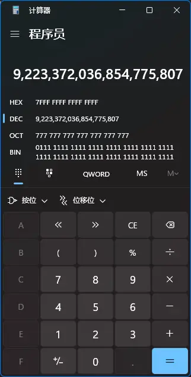

import { Code } from "@/components/code";
import { Note, NoteTitle } from "@/components/note";
import { Tab, Tabs } from "@/components/tab";

<Note type="warn" title="限制级警告！">

Lua 库仅适合会 C 语言编程的人进行学习。

</Note>

## 零、参考文献

- [Lua 官方文档](https://www.lua.org/manual/5.4/ "点击跳转")

## 一、简介

Lua 是一门解释型语言，但它具有很强的扩展性——它是由纯 C 语言编写的，可以很方便地调用 C/C++ 的函数。因为这个特性，Lua 常用于游戏开发（主要面向交互逻辑等对性能要求不高的方向）。

截止本文撰写之时，Lua 最新版本为 5.4。

## 二、基础语法

### 1. 变量声明

Lua 的变量的声明非常简单：

```lua [main.lua]
A = 114514          -- 全局变量
local a = 1919810   -- 局部变量
print("A =", A)
print("a =", a)
```

```console [命令行]
> lua main.lua
A =     114514
a =     1919810
```

按照上述方式声明的变量是全局变量。全局变量建议首字母大写，但不强制要求。要想声明局部变量，在变量名之前添加`local:kwd`修饰符即可。对于未被声明的变量，其值为`nil:kwd`。这个值类似于 C 语言的`NULL:kwd`和 C++ 的`nullptr:kwd`。

```lua [main.lua]
-- 警告：未定义的全局变量 `Lacia`
print("Lacia =", Lacia) -- [!code warning]
```

```console [命令行]
> lua main.lua
Lacia = nil
```

Lua 可以像 Python 一样一次性给多个变量赋值：

```lua
local a, b, c = 114, 514, "1919"
```

上述方式声明的变量均为局部变量。

### 2. 基本数据类型

Lua 中的变量虽然没有显式声明其类型，但所有变量都是有类型的。可以使用`type():fun`函数来查看变量的类型：

```lua [main.lua]
local a = 114514
print("type(a) =", type(a))
```

```console [命令行]
> lua main.lua
type(a) =       number
```

<Tabs>

<Tab title={<Code type="typ" code="number"/>}>

`number:typ`类型用于表示浮点数，其底层实现为`double:kwd`类型。Lua 中不存在专为整数设计的类型，因为浮点数可以表示整数。

Lua 支持基本的四则运算，支持十六进制表示法，也支持逻辑移位运算符`<<`和`>>`、科学计数法`e`，但不支持次方运算符`**`，次方运算符以`^`代替。

```lua [main.lua]
-- 分别使用科学计数法与十六进制表示法
local a, b = -16e5, 0xFE
print("a =", a)
print("b =", b)
print("a >> 3 =", a >> 3)     -- 输出的值将会很奇怪 -- [!code highlight]
print("b << 4 =", b << 4)
```

```console [命令行]
> lua main.lua
a =     -1600000.0
b =     254
a >> 3 =        2305843009213493952
b << 4 =        4064
```

第三行输出的变量`a:var`的值有点怪异，这和移位运算符有关。Lua 的移位运算符与 C/C++ 的不一样，C/C++ 的默认移位运算符是算数移位运算符（即当最高位为 1 时，执行左移位时左侧补 1 而不是补 0）。由于 Lua 左移运算符是逻辑左移运算符，因此可以推算 Lua 中`number:typ`类型占用的字节数。

```lua [main.lua]
local a = -1
print("a >> 1 =", a >> 1)
```

```console [命令行]
a >> 1 =        9223372036854775807
```

9223372036854775807 转换为十六进制为：



据此可以推算出 Lua 中，`number:typ`类型占用 8 字节，并且`number:typ`类型存在精度问题与溢出风险。

</Tab>

<Tab title={<Code type="typ" code="string"/>}>

`string:typ`类型用于表示字符串。Lua 中的字符串既可以使用单引号也可以使用双引号。除此之外还有一种表示字符串的方式，这种方式可以保留换行符并禁用转义字符：

```lua [main.lua]
local a = "114514"
local b = [[
<html>
    <head></head>
    <body></body>
</html>
]]
print("a =", a)
print("b =", b)
```

```console [命令行]
> lua main.lua
a =     114514
b =     <html>
    <head></head>
    <body></body>
</html>

```

需要注意的是，在别的语言中使用`+`运算符对字符串进行运算的时候，会尝试将其他数据类型转换为字符串类型并进行字符串拼接。但 Lua 则会尝试将字符串转换为`number:typ`类型并进行加法运算。

```lua [main.lua]
local a = "114514"
print("a + 1919810 =", a + 1919810)
```

```console [命令行]
> lua main.lua
a + 1919810 =   2034324
```

当字符串不可被转换为`number:typ`类型时，程序将会抛出异常。Lua 中字符串拼接需要使用`..`运算符：

```lua [main.lua]
local a = "114514"
print("a .. 1919810 =", a .. 1919810)      -- 此处存在隐式类型转换，number 类型转换为 string 类型
```

```console [命令行]
> lua main.lua
a .. 1919810 =  1145141919810
```

获取字符串的长度则需要使用`#`运算符：

```lua [main.lua]
local a = "114514"
print(#(a .. 1919810))
```

```console [命令行]
> lua main.lua
13
```

</Tab>

<Tab title={<Code type="typ" code="boolean"/>}>

Lua 的`boolean:typ`类型只有`true:kwd`与`false:kwd`两种值。

`nil:kwd`在逻辑运算中会被隐式类型转换为`false:kwd`，而其余的值都会被隐式类型转换为`true:kwd`，包括`number:typ`类型的`0`和`string:typ`类型的`"false":str`。

```lua [main.lua]
-- 定义三个局部变量
local a, b, c = nil, 0, "0"

-- 测试 nil 的隐式类型转换
if a then
    print("a is true")
else
    print("a is false")
end

-- 测试 0 的隐式类型转换
if b then
    print("b is true")
else
    print("b is false")
end

-- 测试 "0" 的隐式类型转换
if c then
    print("c is true")
else
    print("c is false")
end
```

```console [命令行]
> lua main.lua
a is false
b is true
c is true
```

</Tab>

<Tab title={<Code type="typ" code="function"/>}>

Lua 的函数被视为是变量的一种类型。Lua 中定义函数时，函数体必须以`end:kwd`关键字作为结尾。定义函数有两种方式：

```lua [main.lua]
-- 最普通的函数定义方式
function Plus(x, y)
    print("x + y =", x + y)
end

-- 定义一个匿名函数，然后将其赋值给变量
Multiply = function(x, y)
    print("x * y =", x * y)
end

-- 调用函数
Plus(114, 514)
Multiply(1919, 810)
```

```console [命令行]
> lua main.lua
x + y = 628
x * y = 1554390
```

Lua 的函数可以赋值给变量，也因此 Lua 可以通过写匿名函数的方式将函数作为参数传入另一个函数。

此外，Lua 的函数可以使用`return:kwd`关键字来返回值，并且可以一次性返回多个值和使用多个值来接收函数返回值。

</Tab>

<Tab title={<Code type="typ" code="nil"/>}>

在 Lua 中，`nil:kwd`值只属于`nil:typ`类型，`nil:typ`类型也只有`nil:kwd`这一个值。

</Tab>

</Tabs>

`number:typ`类型可以与`string:typ`类型互相转换，使用内置的`tostring():fun`函数与`tonumber():fun`函数即可。

```lua [main.lua]
local a, b, c = 114.514, "114.514", "ABCDE"
print("a =", a)
print("b =", b)
print("c =", c)

-- 尝试将 a 转换为 string 类型，将 b, c 转换为 number 类型
print("tostring(a) =", tostring(a))
print("tonumber(b) =", tonumber(b))
print("tonumber(c) =", tonumber(c))
```

```console [命令行]
> lua main.lua
a =     114.514
b =     114.514
c =     ABCDE
tostring(a) =   114.514
tonumber(b) =   114.514
tonumber(c) =   nil
```

当`string:typ`类型无法被转换为`number:typ`类型时，将返回`nil:kwd`。

### 3. 数据结构

可以认为，Lua 里只有一种通用的数据结构——表。集合、顺序表、哈希表、树等数据结构，都可以通过表来实现。

```lua
-- 声明一个表
local a = {
    114,
    "514",
    true,
    nil,
    function(x, y)
        return x + y, x * y
    end
}
```

#### (1) 数组

上述方式定义的表中可以存放任意类型的数据，并且可以通过索引来访问元素。当索引越界时，返回值将为`nil:kwd`。这种方式定义的表一般称为数组。Lua 的数组独特之处在于，其索引是从`1`开始而不是从`0`开始的。

```lua [main.lua]
-- ······
-- 省略上方的代码
-- ······

print("a =", a)                           -- 尝试打印数组
print("a[5](114, 514) =", a[5](114, 514)) -- 尝试调用数组中的匿名函数
print("a[5] =", a[5])                     -- 尝试打印函数

-- 尝试打印不存在的元素
print("a[0] =", a[0])
print("a[6] =", a[6])
```

```console [命令行]
> lua main.lua
a =     table: 00000274a80e34c0
a[5](114, 514) =        628     58596
a[5] =  function: 00000274a80ecb90
a[0] =  nil
a[6] =  nil
```

输出的第 1 行与第 3 行分别是打印数组本身与函数的结果（一个地址）。第 2 行成功调用了函数并正确地输出了值，第 4、5 行则是索引越界的返回值。

在 Lua 中，可以直接通过索引来修改或添加数组的元素值，并且可以使用`#`运算符来获取数组长度。

```lua [main.lua]
-- ······
-- 省略上方的代码
-- ······

print("#a =", #a)
a[8] = 1919810
print("a[8] =", a[8])
print("a[6] =", a[6])
print("#a =", #a)
```

```console [命令行]
> lua main.lua
#a =    5
a[8] =  1919810
a[6] =  nil
#a =    8
```

Lua 也为表封装了一些函数，这些函数都位于`table`库下。调用时，应当形如下述代码：

```lua [main.lua]
local a = {
    114,
    "514",
    true
}

-- 查看索引为 2 的元素值
print("a[2] = ", a[2])

-- 调用 table 库下的 inset() 函数
-- 向索引为 2 处插入元素 1919
table.insert(a, 2, 1919)

-- 查看索引为 2, 3 的元素值
print("a[2] = ", a[2])
print("a[3] = ", a[3])
```

```console [命令行]
> lua main.lua
a[2] =  514
a[2] =  1919
a[3] =  514
```

|     函数名     |       参数       |                功能                |     返回值     |
| :------------: | :--------------: | :--------------------------------: | :------------: |
| `insert():fun` |     表，元素     |         向数组末尾插入元素         |       无       |
| `insert():fun` | 表，索引值，元素 | 向数组的指定索引值元素之前插入元素 |       无       |
| `remove():fun` |    表，索引值    |    删除数组中的指定索引值的元素    | 被删除的元素值 |

需要注意的是，使用上述函数时若指定的索引越界，则会抛出异常。另外，根据[官方文档](https://www.lua.org/manual/5.4/manual.html#pdf-table.insert "点击跳转")对`table.insert():fun`函数的解释：

> Inserts element value at position pos in list, shifting up the elements list[pos], list[pos+1], ···, list[#list]. The default value for pos is #list+1, so that a call table.insert(t,x) inserts x at the end of the list t.

使用`table.insert():fun`时，若参数只有两个，则第二个参数将被默认为待插入的元素，插入位置默认为`#list+1`，即使用`#`运算符计算得到的数组长度再+1。~~这将是一个坑~~

#### (2) 字典与类

将 Lua 的表以字典（映射）形式声明也很简单：

```lua [main.lua]
local a = {
    a = 114,                    -- 第一种声明方式
    ["b"] = "1919",             -- 第二种声明方式
    c = function(x, y)
        return x + y, x * y
    end
}

print("a.a =", a.a)            -- 第一种访问方式
print("a.b =", a.b)
print("a.d = ", a.d)           -- 尝试访问不存在的成员
print("a['a'] =", a["a"])      -- 第二种访问方式
print("a['b'] =", a["b"])
print(a.c(114, 514))           -- 尝试调用成员函数
print(a["c"](114, 514))

-- 坑
print("#a =", #a)
```

```console [命令行]
> lua main.lua
a.a =   114
a.b =   1919
a.d =   nil
a['a'] =        114
a['b'] =        1919
628     58596
628     58596
#a =    0
```

<Note type="warn" title="字典长度">

使用`#`运算符获取的字典的长度为`0`，这意味着如果使用`table.insert():fun`函数向字典中插入元素，那么只能向索引为`1`的位置插入元素。

</Note>

不难看出这种方式声明的表只不过是把索引换成了字符串。利用上述声明表的方法，既可以实现类，也可以实现字典。另外，数组形式的表可以看作是字典形式的表的简写：

```lua
local a = {
    [1] = 114,
    [2] = 514,
    [3] = 1919,
    [19] = 810
}

print(#a)      -- 将输出 3，这也算个坑
```

#### (3) 全局表

在 Lua 的运行环境中，有一个名为`_G:kwd`的全局表。所有的全局变量均存放在该表中。

```lua [main.lua]
A, B, C = 114, "514", true
print("_G.A =", _G.A)
print("_G.A =", _G.B)
print("_G.A =", _G.C)

print(_G.table.insert == table.insert)     -- 判断是否指向同一地址，即是否为同一函数
```

```console [命令行]
> lua main.lua
_G.A =  114
_G.A =  514
_G.A =  true
true
```

### 4. 控制流

Lua 的与或非操作通过`and:kwd`、`or:kwd`和`not:kwd`关键字实现，比较则通过`==`（等于）、`~=`（不等于）、`<`（小于）、`<=`（小于等于）、`>`（大于）、`>=`（大于等于）运算符实现。

需要注意的是不等于运算符，其他语言一般是`!=`而 Lua 是`~=`~~不知道作者怎么想的要这么规定~~。另外，`and:kwd`和`or:kwd`关键字的返回值不一定是`true:kwd`或者`false:kwd`。

```lua [main.lua]
print("nil and 114:", nil and 114)     -- 将打印 nil
print("114 and 514:", 114 and 514)     -- 将打印 514
print("nil or nil:", nil or nil)       -- 将打印 nil
print("nil or 114:", nil or 114)       -- 将打印 114
print("not nil:", not nil)             -- 将打印 true
print("not 114:", not 114)             -- 将打印 false
```

```console [命令行]
> lua main.lua
nil and 114:    nil
114 and 514:    514
nil or nil:     nil
nil or 114:     114
not nil:        true
not 114:        false
```

虽然`not:kwd`关键字的返回值一定为`boolean:typ`类型，但`and:kwd`和`or:kwd`关键字则遵从短路运算规则，并且返回值将保留原参数值。可以利用这一特性构造三目运算符：

```lua [main.lua]
print(114 == 514 and "True" or "False")
```

```console [命令行]
> lua main.lua
False
```

#### (1) `if:kwd`

Lua 的`if:kwd`语句也需要以`end:kwd`关键字作为结束的标志。Lua 的`if:kwd`语句结构如下：

```lua
if --[[ 条件 ]] then
    -- ······
    -- 代码块
    -- ······
elseif --[[ 条件 ]] then
    -- ······
    -- 代码块
    -- ······
else
    -- ······
    -- 代码块
    -- ······
end
```

Lua 的`if:kwd`语句中，`if:kwd`和`elseif:kwd`关键字都需要`then:kwd`关键字作为条件结束的分隔符。需要注意的是，在 Lua 的逻辑运算中，`0`会被隐式类型转换为`true:kwd`而不是`false:kwd`。

#### (2) 循环

Lua 的循环有三种：`for:kwd`循环、`while:kwd`循环、`repeat:kwd`循环。其中`while:kwd`循环与`repeat:kwd`循环比较相似。

<Tabs>

<Tab title={<Code type="kwd" code="for"/>}>

Lua 的`for:kwd`循环语法大体如下：

```lua [main.lua]
for i = 1, 10, 3 do         -- 参数分别为：初始值、结束值、步长
    print("i =", i)
end

print("i =", i)            -- 检测循环外能否继续使用变量 i
```

```console [命令行]
> lua main.lua
i =     1
i =     4
i =     7
i =     10
i =     nil
```

可以看出上述代码中变量`i:var`的作用范围仅限于`for:kwd`循环内部。上述 Lua 代码的循环转换为 C 语言的循环，应该如下：

```c
for (int i = 1; i <= 10; i += 3)
{
    printf("i = %d\n", i);
}
```

Lua 的`for:kwd`循环的步长可以为负，初始值也可以比结束值大。因此需要注意你的`for:kwd`循环可能因为步长正负问题而导致死循环。

另外，Lua 的`for:kwd`循环中使用的计数变量（例如上述代码中的变量`i:var`）是**不允许**在循环中被重新赋值的。如果程序员这么做了，那么 Lua 将会新建一个同名局部变量，原计数变量并不会被更改。

</Tab>

<Tab title={<Code type="kwd" code="for in"/>}>

`for in:kwd`循环常用于遍历表。

```lua [main.lua]
local a = {
    a = 114,
    b = 514,
    [1] = "1919",
    ["c"] = function()
        print("810")
    end
}
for key, value in pairs(a) do
    print("key =", key, "value =", value)
end
```

```console [命令行]
> lua main.lua
key =   b       value = 514
key =   a       value = 114
key =   1       value = 1919
key =   c       value = function: 0000000000ecd640
```

`pairs():fun`函数将在下文详述。此处需要知道的是，上述方式的遍历是**随机遍历**，即每次输出键值对的顺序都有可能不一样。

</Tab>

<Tab title={<Code type="kwd" code="while"/>}>

`while:kwd`循环的大体语法如下：

```lua [main.lua]
local i = 1
while (i < 5) do        -- 没有括号也可以
    print("i =", i)
    i = i + 1          -- Lua不支持 ++ 和 += 运算符
end
```

```console [命令行]
> lua main.lua
i =     1
i =     2
i =     3
i =     4
```

当`while:kwd`循环的条件不被满足时将会跳出循环。

</Tab>

<Tab title={<Code type="kwd" code="repeat"/>}>

Lua 的`repeat:kwd`循环与 C/C++ 的`do while:kwd`循环有点类似。其大体语法如下：

```lua [main.lua]
local i = 1
repeat
    print("i =", i)
    i = i + 1
until i == 5           -- 结束条件
```

```console [命令行]
> lua main.lua
i =     1
i =     2
i =     3
i =     4
```

当`until:kwd`关键字后的条件**满足**时，将退出循环。

</Tab>

</Tabs>

Lua 的循环中也有`break:kwd`关键字，但很可惜的是没有`continue:kwd`关键字。在循环中使用`break:kwd`关键字可以立即跳出循环。

## 三、部分库函数

在了解库函数之前，应当先了解 Lua 的一个语法糖。以`string.byte():fun`函数为例，以下两种写法是等价的：

```lua
local a = "ABCDEFG"

print(string.byte(a, 4))       -- 不使用语法糖
print(a:byte(4))               -- 使用语法糖
```

输出结果为：

```console
> lua main.lua
68
68
```

该语法糖相当于将第一个参数前置，作为 “调用此函数的对象” 来处理。**只有部分函数可以使用该语法糖。**

### 1. 基础库

位于基础库内的函数可以直接调用。

<Tabs>

<Tab title={<Code type="fun" code="next()"/>}>

`next():fun`函数用于遍历表。该函数接受两个参数：表、键。

- 只传入表时，将默认传入的索引为`nil:kwd`。
- 传入的键为`nil:kwd`时，将返回第一对键值对。
- 传入的键不为`nil:kwd`时，将返回下一对键值对。
- 传入的键位最后一个键时，将返回`nil:kwd`。

该函数常用于遍历表（但这种遍历对于字典形式的表而言是随机遍历），也可以用于判断一个表是否为空表。

```lua [main.lua]
local a = {
    a = 114,
    b = 514,
    [1] = "1919",
    ["c"] = function()
        print("810")
    end
}

-- 使用 next() 函数遍历表
local k, v = next(a)
while v do
    print(k, v)
    k, v = next(a, k)
end

-- 查看 next() 函数的参数为空表时的返回值
local b = {}
print("next(b) =", next(b))
```

```console [命令行]
> lua main.lua
1       1919
a       114
b       514
c       function: 00000000001bd6a0
next(b) =       nil
```

</Tab>

<Tab title={<><Code type="fun" code="pairs()"/>与<Code type="fun" code="ipairs()"/></>}>

`pairs():fun`与`ipairs():fun`函数也是用于遍历表的函数，但需要搭配`for in:kwd`循环。

```lua [main.lua]
local a = {
    a = 114,
    b = 514,
    [1] = "1919",
    ["c"] = function()
        print("810")
    end
}

-- 尝试查看 pairs() 函数的返回值
local b, c, d = pairs(a)
print("b == next :", b == next)
print("c == a :", c == a)
print("d =", d)

-- 尝试查看 ipairs() 函数的返回值
b, c, d = ipairs(a)
print("b == next :", b == next)
print("c == a :", c == a)
print("d =", d)
```

```console [命令行]
> lua main.lua
b == next :     true
c == a :        true
d =     nil
b == next :     false
c == a :        true
d =     0
```

不难看出`pairs():fun`函数的返回值就是迭代器函数（此处为`next():fun`函数）、表本身和`nil:kwd`，其底层原理就是利用了`next():fun`函数进行遍历，但是`pairs():fun`函数返回的迭代器函数是可以自定义的，此处不深入涉及自定义迭代器函数。

与`pairs():fun`函数不同之处在于，`ipairs():fun`函数的返回值是另一种迭代器函数，并且初始的索引是`0`。也因此`ipairs():fun`函数仅能用于遍历数组形式的表。

</Tab>

<Tab title={<Code type="fun" code="type()"/>}>

`type():fun`函数用于查看变量的类型。

```lua [main.lua]
local a, b, c, d, e = {}, 114, "514", true, function()
end

print(type(a))
print(type(b))
print(type(c))
print(type(d))
print(type(e))
```

```console [命令行]
> lua main.lua
table
number
string
boolean
function
```

</Tab>

<Tab title={<Code type="fun" code="select()"/>}>

`select():fun`函数的参数个数可变，它常用于获取可变长度参数的个数。

```lua [main.lua]
-- 可变长度参数函数
local a = function(...)
    print(select("#", ...))
    print(select(2, ...))
    print(select(3, ...))
end

a(114, "514", 1919, "810")
```

```console [命令行]
> lua main.lua
4
514     1919    810
1919    810
```

当第一个参数为`#`时，返回值为参数的长度，当第一个参数为整数时，返回值为从该索引（包含）开始直到参数末尾的所有参数。

<Note type="info" title="处理可变长度参数的另一种方式">

可以使用`{}`将可变长度参数直接转换为数组形式的表。

```lua [main.lua]
local a = function(...)
    local b = {...}
    print(#b)
    print(b[1], b[2], b[3], b[4])
end

a(114, "514", 1919, "810")
```

```console [命令行]
> lua main.lua
4
114     514     1919    810
```

</Note>

</Tab>

</Tabs>

### 2. `string`库

`string`库下的函数都是对字符串进行操作的函数。

|     函数名      |               参数                |                      功能                      |  返回值类型  |
| :-------------: | :-------------------------------: | :--------------------------------------------: | :----------: |
|  `char():fun`   |     任意个$$[0,\ 255]$$的整数     |    将这些整数按 ASCII 码转换为字符，并拼接     | `string:typ` |
|  `byte():fun`   |        `string:typ` ，整数        |  取出指定索引的字符，并按 ASCII 码转换为整数   | `number:typ` |
| `format():fun`  |        格式化字符串，参数         |           根据格式化字符串生成字符串           | `string:typ` |
|   `len():fun`   |           `string:typ`            |                 获取字符串长度                 | `number:typ` |
| `reverse():fun` |           `string:typ`            |                返回反转的字符串                | `string:typ` |
|   `sub():fun`   | `string:typ` ，起始索引，结束索引 | 返回从起始索引（包含）到结束索引（包含）的子串 | `string:typ` |
|  `upper():fun`  |           `string:typ`            |             返回字母全大写的字符串             | `string:typ` |
|  `lower():fun`  |           `string:typ`            |             返回字母全小写的字符串             | `string:typ` |

在 Lua 中，ASCII 码为 0 的字符（即`\0`）并不表示字符串的结尾。

```lua [main.lua]
local a = "Lacia\0Kouka"

-- 使用格式化字符串输出 a
print(string.format("a = %s", a))

-- 输出 a 的长度
print(string.format("#a = %d", #a))
print(string.format("string.len(a) = %d", string.len(a)))

-- 尝试取出第 6 个字符
print(string.format("string.byte(a, 6) = 0x%x", string.byte(a, 6)))
```

```console [命令行]
> lua main.lua
a = LaciaKouka
#a = 11
string.len(a) = 11
string.byte(a, 6) = 0x0
```

`string`库中还有其他的函数，此处不做赘述，详情请查看[官方文档](http://www.lua.org/manual/5.4/manual.html#6.4 "点击跳转")。

### 3. `io`库

Lua 将文件流与标准输入输出流全都封装到了`io`库中。与 C 一样，Lua 也将标准输入输出视为文件流的一种。更严格地说，Lua 其实就是使用了 C 的标准输入输出。在 Lua 的`io`库下定义了三个变量：`stdin:var`，`stdout:var`和`stderr:var`。这三个文件是默认打开且不可关闭的。

```lua [main.lua]
print(type(io.stdin))      -- 查看标准输入流的类型
print(type(io.stdout))     -- 查看标准输出流的类型
print(type(io.stderr))     -- 查看标准错误流的类型
```

```console [命令行]
> lua main.lua
userdata
userdata
userdata
```

<Note type="info">

<NoteTitle>`userdata:typ`类型</NoteTitle>

`userdata:typ`也是 Lua 中的一种数据类型，用于表示由 C/C++所创建的类型。程序员可以将任意 C/C++的任意数据类型的数据存储到 Lua 的`userdata:typ`类型变量中并调用。这部分内容将在下文详述。

</Note>

Lua 的文件流分为两种：一种是隐式的对默认文件进行操作的文件流，一种是显式指定要操作的文件的文件流。以下是`io`库中常见的函数：

<Tabs>

<Tab title={<Code type="fun" code="io.open"/>}>

`io.open():fun`函数用于打开文件并返回文件描述符（也叫文件句柄）。该函数接受两个参数，前者为待打开的文件的路径，后者为打开的模式（`string:typ`类型）。常见的打开模式如下：

- `"r":str`：只读，保留文件原内容（默认）
- `"w":str`：只写，清除文件原内容
- `"a":str`：只写，保留文件原内容，从文件末尾开始写入（追加模式）
- `"r+":str`：读写，保留文件原内容（增强读）
- `"w+":str`：读写，清除文件原内容（增强写）
- `"a+":str`：读写，保留文件原内容，从文件末尾开始写入（增强追加）

当打开失败时，将返回`nil:kwd`。

```lua [main.lua]
-- 以只读模式打开文件
local a = io.open("./1.txt", "r")

-- 如果打开失败将会返回 nil
-- 如果尝试对 nil 进行文件流，则会抛出异常
-- 建议先检查变量是否为 nil
if a == nil then
    return
end

print(a)
```

```console [命令行]
> lua main.lua
file (00007ffe6fc44a90)
```

</Tab>

<Tab title={<Code type="fun" code="io.input()"/>}>

`io.input():fun`函数用于指定默认的输入文件或返回当前默认输入文件。当不传入参数时，该函数返回默认的输入文件；当传入文件描述符时，该函数将该文件设置为默认输入，并返回该文件。

```lua [main.lua]
local a = io.open("./1.txt", "r")

if a == nil then
    return
end

print(io.input() == io.stdin)      -- 查看初始的默认输入文件
print(io.input(a) == a)            -- 尝试修改默认输入文件
print(io.input() == a)             -- 查看修改后的默认输入文件
```

```console [命令行]
> lua main.lua
true
true
true
```

</Tab>

<Tab title={<Code type="fun" code="io.output()"/>}>

`io.output():fun`函数与`io.input():fun`函数类似，只不过前者是用于指定默认的输出文件。

```lua [main.lua]
local a = io.open("./1.txt", "w")

if a == nil then
    return
end

print(io.output() == io.stdout)
print(io.output(a) == a)
print(io.output() == a)
```

```console [命令行]
> lua main.lua
true
true
true
```

</Tab>

<Tab title={<Code type="fun" code="io.close()"/>}>

`io.close():fun`函数用于关闭文件，指定的参数应当为待关闭的文件描述符。若不给定参数，则会尝试关闭默认的输出文件。关闭成功将返回`true:kwd`。

尝试关闭已经关闭的文件时，该函数将抛出异常。

```lua [main.lua]
local a = io.open("./1.txt", "w")

if a == nil then
    return
end

print(a:close())
print(a)
```

```console [命令行]
> lua main.lua
true
file (closed)
```

</Tab>

<Tab title={<Code type="fun" code="io.type()"/>}>

`io.type():fun`函数用于检查文件的状态。

- 已打开的文件：返回`string:typ`类型的`"file":str`。
- 已关闭的文件：返回`string:typ`类型的`"closed file":str`。
- 其他：返回`nil:kwd`。

```lua [main.lua]
local a, b = io.open("./1.txt", "w"), io.open("./1.txt", "r")

if a == nil or b == nil then
    return
end

a:close()

print(io.type(a))
print(io.type(b))
print(io.type("114514"))

b:close()
```

```console [命令行]
> lua main.lua
closed file
file
nil
```

</Tab>

<Tab title={<Code type="fun" code="io.write()"/>}>

`io.write():fun`用于向默认输出文件写入内容。若使用`file:write():fun`，则会向指定的文件写入内容。

```lua [main.lua]
-- 默认输出文件是标准输出流
io.write("114", "514", 1919)
```

```console [命令行]
>  lua Hello.lua
1145141919
```

</Tab>

<Tab title={<Code type="fun" code="io.read()"/>}>

`io.read():fun`用于从默认输入文件读取内容。若使用`file:read():fun`，则会从指定的文件读取内容。该函数接受可变长度的参数，这些参数用于控制读取的内容或读取的长度。可用的选项有：

- `"n":str`：读取一个数字
- `"a":str`：从当前位置开始读取整个文件，若在文件末尾则返回空字符串。
- `"l":str`：（默认）读取一行并忽略行结束标记，若在文件末尾则返回`nil:kwd`。
- `"L":str`：读取一行并保留行结束标记，若在文件末尾则返回`nil:kwd`。
- 整数：读取一个不超过这个数量字节数的字符串，若在文件末尾则返回`nil:kwd`。

```lua [main.lua]
-- 依次读取 4 个字符、数字（尽可能长）、读取至行末
print(string.format("Input = %s, %d, %s", io.read(4, "n", "l")))
```

```console [命令行]
> lua main.lua
ABCD114514A1919810
Input = ABCD, 114514, A1919810
```

</Tab>

<Tab title={<Code type="fun" code="file:flush()"/>}>

Lua 的文件流是有缓存的。默认是每次写入换行符时再执行真正的写入（这个默认行为可以改变，但此处不做赘述）。在写入文件后关闭文件前，建议先执行`file:flush():fun`函数以立即写入缓存的数据。

</Tab>

</Tabs>

### 4. `math`库

`math`库是一个用于数学计算的库。其中所有的函数均不会改变参数的值。

|       函数名       |                     参数                     |                             功能                             |           返回值            |
| :----------------: | :------------------------------------------: | :----------------------------------------------------------: | :-------------------------: |
|    `abs():fun`     |                 `number:typ`                 |                           求绝对值                           |        `number:typ`         |
|    `ceil():fun`    |                 `number:typ`                 |                           向上取整                           |        `number:typ`         |
|   `floor():fun`    |                 `number:typ`                 |                           向下取整                           |        `number:typ`         |
|    `modf():fun`    |                 `number:typ`                 |               分别返回参数的整数部分与小数部分               | `number:typ` ，`number:typ` |
| `randomseed():fun` |   `number:typ`，`number:typ`（默认为`0`）    |                    设置随机数生成器的种子                    |     当前生效的两个种子      |
|   `random():fun`   | `number:typ`，`number:typ`（默认为`0`，`1`） |                    生成给定区间内的随机数                    |        `number:typ`         |
| `tointeger():fun`  |                   任意变量                   |        尝试将参数转换为整数，转换失败则返回`nil:kwd`         |      整数或者`nil:kwd`      |
|    `type():fun`    |                 `number:typ`                 | 返回数字的类型（`"integer":str` 、`"float":str`或`nil:kwd`） |   `string:typ`或`nil:kwd`   |

下面介绍`math`库中的一些常量。

|      常量名      |               意义               |
| :--------------: | :------------------------------: |
|    `huge:var`    |     无限大，任何数字均比其小     |
| `maxinteger:var` | `number:typ`所能表示的最大的整数 |
| `mininteger:var` | `number:typ`所能表示的最小的整数 |
|     `pi:var`     |          圆周率$$\pi$$           |

```lua [main.lua]
print(string.format("math.huge = %f", math.huge))
print(string.format("math.maxinteger = %d", math.maxinteger))
print(string.format("math.mininteger = %d", math.mininteger))
print(string.format("math.pi = %f", math.pi))
```

```console [命令行]
> lua main.lua
math.huge = inf
math.maxinteger = 9223372036854775807
math.mininteger = -9223372036854775808
math.pi = 3.141593
```

下述函数是与数学运算相关性非常强的函数：

|    函数名    |                  参数                   |          功能          |    返回值    |
| :----------: | :-------------------------------------: | :--------------------: | :----------: |
| `exp():fun`  |              `number:typ`               |      e 的次方运算      | `number:typ` |
| `log():fun`  | `number:typ` ，`number:typ`（默认为 e） | 求对数，第二个参数为底 | `number:typ` |
| `rad():fun`  |              `number:typ`               |  将角度制转换为弧度制  | `number:typ` |
| `deg():fun`  |              `number:typ`               |  将弧度制转换为角度制  | `number:typ` |
| `sqrt():fun` |              `number:typ`               |        开方运算        | `number:typ` |
| `sin():fun`  |              `number:typ`               |    弧度制的正弦函数    | `number:typ` |
| `cos():fun`  |              `number:typ`               |    弧度制的余弦函数    | `number:typ` |
| `tan():fun`  |              `number:typ`               |    弧度制的正切函数    | `number:typ` |
| `asin():fun` |              `number:typ`               |   弧度制的反正弦函数   | `number:typ` |
| `acos():fun` |              `number:typ`               |   弧度制的反余弦函数   | `number:typ` |
| `atan():fun` |              `number:typ`               |   弧度制的反正切函数   | `number:typ` |

## 四、面向对象

Lua 中提到面向对象，就绕不开“元表”和“元方法”这两个概念。元表其实就是表，只不过它是作为实例的表的原型，或者说作为“类”使用。要想设置元表，就需要使用`setmetatable():fun`函数。

```lua [main.lua]
HIE = {}

-- 将元表的 __index 元方法设置为自身
HIE["__index"] = HIE -- [!code highlight]

-- 构造函数，第一个参数为元表本身
HIE.new = function(class, name, type)
    local temp = {}
    setmetatable(temp, class) -- [!code highlight]
    temp.name = name -- 设置成员变量
    temp.type = type -- 设置成员变量
    return temp
end

-- 设置元表的元表，定义将元表当作函数调用时的行为
setmetatable(HIE, { __call = HIE.new }) -- [!code highlight]

-- 成员函数，建议第一个参数为该类的实例
HIE.say = function(this)
    print(string.format("This : Name = %s, Type = %s.", this.name, this.type))
end

-- 创建两个实例
local lacia = HIE("Lacia", "Type-005")
local kouka = HIE("Kouka", "Type-001")

-- 使用语法糖调用成员函数
lacia:say()
kouka:say()
```

```console [命令行]
> lua main.lua
This : Name = Lacia, Type = Type-005.
This : Name = Kouka, Type = Type-001.
```

上述代码使用了 Lua 的表中的一个特殊属性——`__index`属性。它就是元方法的一种（虽然叫方法，但它可以不是函数）。元方法一般定义在作为元表使用的表中。当某一个表要执行某些特定的操作时，会触发该表的元表中定义的元方法。例如上述代码中，当使用索引`say`寻找`lacia:var`表中的元素时，由于`lacia:var`表中并未定义该属性，因此会触发元表的`__index`元方法。若该元方法为函数，则会将`lacia:var`表与索引传入该方法，索引值即为函数的返回值；若该元方法为表，则会在该表中寻找该索引。

元表，就是用于规定一般表的一些特殊行为的表；元方法，就是当执行特定行为时会触发的方法。下述列表列出了一些常用的元方法：

|   元方法名   |                  作用                  |
| :----------: | :------------------------------------: |
|   `__add`    |         重载`+`（加法）运算符          |
|   `__sub`    |         重载`-`（减法）运算符          |
|   `__mul`    |         重载`*`（乘法）运算符          |
|   `__div`    |         重载`/`（除法）运算符          |
|   `__mod`    |         重载`%`（求余）运算符          |
|   `__pow`    |         重载`^`（次方）运算符          |
|   `__unm`    |         重载`-`（取负）运算符          |
|   `__idiv`   |         重载`//`（整除）运算符         |
|   `__band`   |        重载`&`（按位与）运算符         |
|   `__bor`    |        重载`\|`（按位或）运算符        |
|   `__bxor`   |       重载`~`（按位异或）运算符        |
|   `__bnot`   |        重载`~`（按位非）运算符         |
|   `__shl`    |       重载`<<`（逻辑左移）运算符       |
|   `__shr`    |       重载`>>`（逻辑右移）运算符       |
|  `__concat`  |         重载`..`（连接）运算符         |
|   `__len`    |        重载`#`（求长度）运算符         |
|    `__eq`    |         重载`==`（相等）运算符         |
|    `__lt`    |         重载`<`（小于）运算符          |
|    `__le`    |       重载`<=`（小于等于）运算符       |
|  `__index`   |     定义查找不存在的索引值时的行为     |
| `__newindex` |      定义为不存在的索引赋值的操作      |
|   `__call`   | 定义调用不存在的函数的操作，“构造函数” |
|    `__gc`    |               “析构函数”               |

<Note type="error">

<NoteTitle>`__newindex`元方法的坑</NoteTitle>

`__newindex`元方法会在为不存在的索引赋值时触发。如果在该函数内以通常的方式为该索引赋值，将引起循环调用（即`__newindex`元方法自己触发自己）。

```lua [main.lua]
HIE = {
    __newindex = function(this, key, value)
        -- 危险的操作！将导致栈溢出
        this[key] = value -- [!code error]
    end
}

local a = {}
setmetatable(a, HIE)

-- 危险的操作
a.b = 114514
```

```console [命令行]
> lua main.lua
C stack overflow
stack traceback:
        bin/main.lua:4: in metamethod 'newindex'
        bin/main.lua:4: in metamethod 'newindex'
        bin/main.lua:4: in metamethod 'newindex'
        bin/main.lua:4: in metamethod 'newindex'
        bin/main.lua:4: in metamethod 'newindex'
        bin/main.lua:4: in metamethod 'newindex'
        bin/main.lua:4: in metamethod 'newindex'
        bin/main.lua:4: in metamethod 'newindex'
        bin/main.lua:4: in metamethod 'newindex'
        bin/main.lua:4: in metamethod 'newindex'
        ...     (skipping 177 levels)
        bin/main.lua:4: in metamethod 'newindex'
        bin/main.lua:4: in metamethod 'newindex'
        bin/main.lua:4: in metamethod 'newindex'
        bin/main.lua:4: in metamethod 'newindex'
        bin/main.lua:4: in metamethod 'newindex'
        bin/main.lua:4: in metamethod 'newindex'
        bin/main.lua:4: in metamethod 'newindex'
        bin/main.lua:4: in metamethod 'newindex'
        bin/main.lua:4: in metamethod 'newindex'
        bin/main.lua:12: in main chunk
        [C]: in ?
```

正确的在`__newindex`元方法内定义新索引值的方法应该是调用`rawset():fun`函数。

```lua [main.lua]
HIE = {
    __newindex = function(this, key, value)
        -- 使用该方法新定义索引值不会触发任何元方法
        rawset(this, key, value) -- [!code highlight]
    end
}

local a = {}
setmetatable(a, HIE)
a.b = 114514
print(string.format("a.b = %d", a.b))
```

```console [命令行]
> lua main.lua
a.b = 114514
```

</Note>

Lua 的面向对象的最重要部分就是元表与元方法部分。元方法不必全部记住，忘记怎么使用的时候，可以看看[官方文档](http://www.lua.org/manual/5.4/manual.html#2.4 "点击跳转") 。

## 五、协程

Lua 是单线程的，但 Lua 可以使用协程。协程是非抢占的。当某个协程阻塞（或主动挂起）时，该协程会主动放弃 CPU，当前线程会从任务队列里选取下一个协程并开始执行。Lua 的协程需要通过`coroutine`库实现。

使用`coroutine.create():fun`函数即可新建一个协程。

```lua [main.lua]
local a = coroutine.create(function()
    print("Hello, world!")
end)

print(a)
print(type(a))
```

```console [命令行]
> lua main.lua
thread: 00000000007b88d8
thread
```

可以看出协程虽然被创建了但是并没有被执行。另外，`coroutine.create():fun`函数的返回值是一个`thread:typ`类型的变量。`thread:typ`类型也是 Lua 的基础类型之一，代表了一个协程。要开始执行一个协程并传入参数，应当使用`coroutine.resume():fun`函数。在协程中调用`coroutine.yield():fun`，可以返回值并挂起协程。

```lua [main.lua]
local a = coroutine.create(function(x, y)

    -- 第一块
    print(string.format("x = %d, y = %d", x, y))
    local a, b = coroutine.yield(x + y)

    -- 第二块
    print(string.format("a = %d, b = %d", a, b))
    coroutine.yield(a * b)

    -- 第三块
    return 114514
end)

-- 尝试多次调用协程
print(coroutine.resume(a, 114, 514))
print(coroutine.resume(a, 1919, 810))
print(coroutine.resume(a, 114, 514))
print(coroutine.resume(a, 114, 514))
```

```console [命令行]
> lua main.lua
x = 114, y = 514
true    628
a = 1919, b = 810
true    1554390
true    114514
false   cannot resume dead coroutine
```

可以看出第一次调用协程时，传入的参数即为函数的参数，返回值为协程中第一次调用`coroutine.yield():fun`的参数。第二次调用协程时，传入的参数将作为`coroutine.yield():fun`的返回值。第三次调用时则返回了`return:kwd`关键字定义的返回值。第四次调用则提示，该携程已执行完毕，不可再执行。

在`coroutine`库下还有一些其他的函数。

<Tabs>

<Tab title={<Code type="fun" code="coroutine.close()"/>}>

`coroutine.close():fun`用于彻底终止一个挂起的协程。其参数应当为一个`thread:typ`类型的变量。当终止协程成功时，将返回`true:kwd`，否则返回`false:kwd`和错误原因。

```lua [main.lua]
local a = coroutine.create(function(x, y)
    print("Hello, world!")
    coroutine.yield()          -- 保证协程挂起但不会结束
    coroutine.yield()          -- 保证协程挂起但不会结束
    coroutine.yield()          -- 保证协程挂起但不会结束
end)
print(coroutine.resume(a))     -- 第一次调用协程
print(coroutine.close(a))      -- 结束协程
print(coroutine.resume(a))     -- 尝试再次调用协程
```

```console [命令行]
> lua main.lua
Hello, world!
true
true
false   cannot resume dead coroutine
```

</Tab>

<Tab title={<Code type="fun" code="coroutine.status()"/>}>

`coroutine.status():fun`函数用于查看指定的协程的状态。

```lua [main.lua]
A = coroutine.create(function(x, y)
    print(string.format("Inside = %s", coroutine.status(A)))
    coroutine.yield()
end)
print(string.format("Before First = %s", coroutine.status(A)))
coroutine.resume(A)
print(string.format("After Yield = %s", coroutine.status(A)))
coroutine.close(A)
print(string.format("After Dead = %s", coroutine.status(A)))
```

```console [命令行]
> lua main.lua
Before First = suspended
Inside = running
After Yield = suspended
After Dead = dead
```

</Tab>

<Tab title={<Code type="fun" code="coroutine.wrap()"/>}>

`coroutine.wrap():fun`函数用于把函数 “封装” 成协程。该函数与`coroutine.create():fun`函数大同小异。

```lua [main.lua]
local a = coroutine.wrap(function(a, b)
    print(string.format("a = %s, b = %s", a, b))
    local c, d = coroutine.yield(a + b)
    print(string.format("c = %s, d = %s", c, d))
    local e, f = coroutine.yield(c * d)
    print(string.format("e = %s, f = %s", e, f))
    return e ^ f
end)

print(string.format("First: %d", a(114, 514)))
print(string.format("Second: %d", a(114, 514)))
print(string.format("Third: %d", a(2, 8)))
```

```console [命令行]
> lua main.lua
a = 114, b = 514
First: 628
c = 114, d = 514
Second: 58596
e = 2, f = 8
Third: 256
```

`coroutine.wrap():fun`函数的返回值是一个函数，调用该返回的函数相当于调用`coroutine.resume():fun`。

</Tab>

</Tabs>

## 六、模块化

### 1. 引用文件

使用`require():fun`函数可以引入其他的`.lua`文件。

```lua [main.lua]
local a = require("hello")
print(string.format("a = %d", a))
```

```lua [hello.lua]
print("This is hello.lua.")
return 114514
```

```console [命令行]
> lua main.lua
This is hello.lua.
a = 114514
```

上述代码中的`main.lua`文件和`hello.lua`文件均存放于同一文件夹下。当要加载的模块与当前模块所处的路径不同时，使用相对路径即可（但似乎**不能**通过相对路径加载上级目录中的模块）。使用`require():fun`函数加载的模块不需要加后缀名`.lua`，并且在加载中会执行模块所含有的所有代码，该函数的返回值即为模块的`return:kwd`关键字所返回的值。

在模块化下，局部变量与全局变量就有了明显的不同。被`require():fun`函数载入的模块中定义的全局变量，可以在`require():fun`函数之后被使用，而局部变量则不行。另外，被`require():fun`函数载入过的模块，再次载入时不会重新执行代码，并且返回值将会沿用第一次载入后的返回值。

与`require():fun`函数类似的基础库函数还有两个：`load():fun`函数与`loadfile():fun`函数。这两个函数都是将字符串形式的 Lua 代码打包，并作为一个函数返回。不同之处在于前者是从`string:typ`类型的变量中加载代码，后者则是直接从`.lua`文件中加载代码。具体详情请参考[官方文档](http://www.lua.org/manual/5.4/manual.html#pdf-load "点击跳转")。

### 2. `arg:var`表

`arg:var`表是 Lua 环境下的一个数组形式的表，它存储了从命令行传入的参数。

```lua [main.lua]
-- 直接打印 arg
print(string.format("arg[0] = %s, arg[1] = %s, arg[2] = %s.", arg[0], arg[1], arg[2]))

-- 将命令行参数视为可变长度参数，用表进行封装
local a = {
    ...
}
print(string.format("a[0] = %s, a[1] = %s, a[2] = %s.", a[0], a[1], a[2]))
```

```console [命令行]
> lua main.lua 114 514
arg[0] = main.lua, arg[1] = 114, arg[2] = 514.
a[0] = nil, a[1] = 114, a[2] = 514.
```

~~你终于还是漏出了马脚啊！~~ 可以看出`arg:var`表的索引为`0`的值代表了这个文件的名称。当`.lua`文件被作为模块引入时，`...:kwd`和`arg:var`表将会出现明显区别：

```lua [main.lua]
local a = require("hello")

print("main.lua arg =", arg[0], arg[1], arg[2], arg[3])
print("main.lua params =", ...)
print("a =", a)
```

```lua [hello.lua]
print("hello.lua arg =", arg[0], arg[1], arg[2], arg[3])
print("hello.lua params =", ...)
return 11514
```

```console [命令行]
> lua main.lua 114514 1919810
hello.lua arg = main.lua        114514  1919810 nil
hello.lua params =      hello   .\hello.lua
main.lua arg =  main.lua        114514  1919810 nil
main.lua params =       114514  1919810
a =     11514
```

不难看出，实际上`arg:var`表的值恒为命令行参数，而`...:kwd`的值在模块文件内则变为导入时模块名和该文件的相对路径。

## 七、与 C 语言交互

在使用 Lua 库之前，需要正确下载并配置 Lua 链接库。具体配置方法取决于 IDE 或项目配置。此处仅给出 MSYS2 环境下以 CMake 作为构建工具的配置参考：

```cmake [./CMakeLists.txt]
cmake_minimum_required(VERSION 3.30)

project(hello LANGUAGES C)

find_package(PkgConfig)
pkg_search_module(LUA REQUIRED lua)
include_directories(${CMAKE_SOURCE_DIR}/src ${LUA_INCLUDE_DIRS})

file(GLOB_RECURSE SOURCES "${CMAKE_SOURCE_DIR}/src/*.c")

add_executable(${PROJECT_NAME} ${SOURCES})

target_link_libraries(${PROJECT_NAME} PRIVATE ${LUA_LIBRARIES})
```

```jsonc [./CMakePresets.json]
{
    "version": 9,
    "cmakeMinimumRequired": {
        "major": 3,
        "minor": 30,
    },
    "configurePresets": [
        {
            "name": "base",
            "hidden": true,
            "binaryDir": "${sourceDir}/build",
            "generator": "MinGW Makefiles",
            "cacheVariables": {
                "CMAKE_C_COMPILER": "clang",
                "CMAKE_C_STANDARD": "17",
                "CMAKE_EXPORT_COMPILE_COMMANDS": "on",
                "CMAKE_RUNTIME_OUTPUT_DIRECTORY": "${sourceDir}/bin",
                "CMAKE_ARCHIVE_OUTPUT_DIRECTORY": "${sourceDir}/bin",
                "CMAKE_LIBRARY_OUTPUT_DIRECTORY": "${sourceDir}/bin",
            },
        },
        {
            "name": "dbg",
            "inherits": "base",
            "cacheVariables": {
                "CMAKE_BUILD_TYPE": "Debug",
            },
        },
        {
            "name": "rel",
            "inherits": "base",
            "cacheVariables": {
                "CMAKE_BUILD_TYPE": "Release",
            },
        },
    ],
}
```

```c [./src/main.c]
#include <lauxlib.h>
#include <lualib.h>

int main(int argc, char *argv[]) {
    lua_State *lua = luaL_newstate();  // 创建新 Lua 环境

    /* 加载所有的 Lua 库 */
    luaL_openlibs(lua); // [!code highlight]

    /* 载入命令行参数指定的文件（未执行） */
    luaL_loadfile(lua, argv[1]);

    /* 执行 */
    lua_call(lua, 0, 0);

    lua_close(lua);  // 关闭 Lua 环境

    return 0;
}
```

```lua [./bin/main.lua]
print("Hello, world!")
```

```console [命令行（./build）]
> cmake .. --preset dbg && mingw32-make && ../bin/hello ../bin/main.lua
Hello, world!
```

### 1. Lua 栈

C 语言和 Lua 交互的基本原理，就是先用 C 语言为 Lua 环境分配一个堆空间，这个堆将作为 Lua 的栈模拟 Lua 的运行环境。调用 Lua 文件的基本思路，就是先把 Lua 文件中的代码作为一个函数入栈，再把参数入栈，调用函数时将会自动出栈函数本身和参数，函数结束时返回的值会自动入栈。这一点与 C 语言调用函数类似（除了将函数本身入栈以外）。

以下文本由作者个人译自[官方文档](https://www.lua.org/manual/5.4/manual.html#4.1 "点击跳转")：

> Lua 使用一个虚拟栈来传递值给 C 或从 C 接收值。每一个栈上元素都表示一个 Lua 值（`nil:typ`、`number:typ`、`string:typ`，等）。API 内的函数可以通过从参数获取的 Lua 状态（译者注：`lua_State*:typ`类型的参数）访问这个栈。当 Lua 调用 C 函数时，被调用的函数会获得一个新栈，该栈独立于之前的栈和其它运行中的函数的栈。该栈初始就包含了所有传递给该 C 函数的参数，C 函数可以临时存放 Lua 值于其中并且必须将返回值入栈。为方便使用，API 内的绝大多数查询操作并不严格遵守栈的约束。这些操作可以通过索引（index）指定栈内的任意元素：正索引表示一个绝对栈位置，从`1`开始代表栈底；负索引表示一个相对于栈顶的偏移量。更具体地说，如果栈内有`n`个元素，那么索引`1`表示第一个元素（这表示该元素第一个入栈）并且索引`n`表示最后一个元素；索引`-1`也表示最后一个元素（这表示该元素在栈顶）并且索引`-n`表示第一个元素。

Lua 使用的栈空间是有限的，因此如果要进行大量的入栈操作，建议使用`lua_checkstack():fun`函数检查栈空间是否足够。否则有可能造成栈溢出。

### 2. 基础 API

Lua 库提供的头文件中（`lua.h`、`lualib.h`、`lauxlib.h`），分别声明了原生的 C 语言的 API 和使用上述 API 封装的一些常用函数，后者位于辅助库内。辅助库内的函数前缀均为`luaL`。要加载 Lua 代码，有两种辅助库的函数可供选择：`luaL_loadbuffer():fun`和`luaL_loadfile():fun`。前者是直接加载字符串形式的代码，后者是加载`.lua`文件。

|         函数名          |                         参数                         |                   功能                   |
| :---------------------: | :--------------------------------------------------: | :--------------------------------------: |
|  `luaL_loadfile():fun`  |              `lua_State*:typ`，文件路径              |     加载指定文件中的 Lua 代码到栈中      |
| `luaL_loadbuffer():fun` | `lua_State*:typ`，字符串，字符串长度，名称（调试用） | 从指定的字符串中加载代码，命名后压入栈中 |

除了将 Lua 代码入栈之外，还可以直接压入 C 语言的数据：

|            函数名             |                       参数                        |                  功能                   |
| :---------------------------: | :-----------------------------------------------: | :-------------------------------------: |
|      `lua_pushnil():fun`      |                 `lua_State*:typ`                  |            入栈一个`nil:kwd`            |
|    `lua_pushboolean():fun`    |            `lua_State*:typ`，`int:kwd`            |             入栈一个布尔值              |
|    `lua_pushinteger():fun`    |        `lua_State*:typ`，`lua_Integer:typ`        |              入栈一个整数               |
|    `lua_pushnumber():fun`     |        `lua_State*:typ`，`lua_Number:typ`         |         入栈一个`number:typ`值          |
|    `lua_pushliteral():fun`    |          `lua_State*:typ`，字面量字符串           |          入栈一个字面量字符串           |
|    `lua_pushstring():fun`     |        `lua_State*:typ`，`const char*:kwd`        |  入栈一个以`\0`结尾的字符串（深拷贝）   |
|    `lua_pushlstring():fun`    | `lua_State*:typ`，`const char*:kwd`，`size_t:typ` |     入栈指定长度的字符串（深拷贝）      |
|    `lua_pushfstring():fun`    |     `lua_State*:typ`，格式化字符串，可变参数      | 入栈格式化后的字符串（由 Lua 管理内存） |
|   `lua_pushvfstring():fun`    |   `lua_State*:typ`，格式化字符串，`va_list:typ`   | 入栈格式化后的字符串（由 Lua 管理内存） |
|     `lua_pushvalue():fun`     |            `lua_State*:typ`，`int:kwd`            |      入栈位于指定索引的元素的拷贝       |
|   `lua_pushcfunction():fun`   |       `lua_State*:typ`，`lua_CFunction:typ`       |            入栈一个函数指针             |
|   `lua_pushcclosure():fun`    | `lua_State*:typ`，`lua_CFunction:typ`，`int:kwd`  |              入栈一个闭包               |
| `lua_pushlightuserdata():fun` |           `lua_State*:typ`，`void*:kwd`           |              入栈一个指针               |
|        `lua_pop():fun`        |            `lua_State*:typ`，`int:kwd`            |           出栈指定个数的元素            |

其中，`lua_Number:typ`是`double:kwd`类型的别名；`lua_Integer:typ`是`long long:kwd`类型的别名；`lua_CFunction:typ`的定义如下：

```c
typedef int (*lua_CFunction) (lua_State *L);
```

在参考工程的代码中，有一个函数的作用是加载所有的 Lua 库。类似的函数还有：

|          函数名           |       参数       |         功能          |
| :-----------------------: | :--------------: | :-------------------: |
|   `luaopen_base():fun`    | `lua_State*:typ` |      加载基础库       |
| `luaopen_coroutine():fun` | `lua_State*:typ` |   加载`coroutine`库   |
|    `luaopen_io():fun`     | `lua_State*:typ` |      加载`io`库       |
|   `luaopen_math():fun`    | `lua_State*:typ` |     加载`math`库      |
|  `luaopen_string():fun`   | `lua_State*:typ` |    加载`string`库     |
|   `luaopen_table():fun`   | `lua_State*:typ` |     加载`table`库     |
|   `luaL_openlibs():fun`   | `lua_State*:typ` | 加载 Lua 自带的所有库 |

上述函数均在`lualib.h`头文件中声明。

### 3. 函数/闭包注册

上文中提到的`lua_pushcfunction():fun`其实是一个宏函数，等价于`lua_pushcclosure():fun`函数的第三个参数为`0`的情况。能入栈的 C 函数必须符合 Lua 的规定，以下文本由作者个人译自[官方文档](https://www.lua.org/manual/5.4/manual.html#lua_CFunction "点击跳转")：

> 为了能和 Lua 正确通信，C 函数必须使用下述定义了如何传递参数与返回值的协议：C 函数按顺序（第一个参数先入栈）从 Lua 栈接收参数。所以，当函数开始执行时，`lua_gettop(L)`返回该函数接收了多少参数。第一个参数（如果有）位于索引`1`处且最后一个参数位于索引`lua_gettop(L)`处。向 Lua 返回值时，C 函数直接将其按顺序（第一个返回值先入栈）入栈，并且在函数内 return 返回值数量。任何在此之后的返回值均会被 Lua 正确地丢弃。与 Lua 函数类似，被 Lua 调用的 C 函数也可以有多个返回值。

所以将 C 函数入栈的代码大致如下：

```c [main.c]
static int add(lua_State *lua) {
    lua_Number temp = 0;
    int n = lua_gettop(lua);

    /* 错误处理：当参数个数/类型不正确时 */
    if (n != 2) return luaL_error(lua, "should have 2 arguments");
    if (!lua_isnumber(lua, 1) || !lua_isnumber(lua, 2))
        return luaL_error(lua, "arguments should be number");

    /* 简单加法 */
    temp = lua_tonumber(lua, 1);
    temp += lua_tonumber(lua, 2);
    lua_pushnumber(lua, temp);

    return 1;
}

int main(int argc, char *argv[]) {
    lua_State *lua = luaL_newstate();

    /* 入栈函数 */
    lua_pushcfunction(lua, add);

    /* 入栈参数 */
    lua_pushnumber(lua, 114);
    lua_pushnumber(lua, 514);

    /* 调用函数，指定参数个数和返回值个数 */
    /* 参数和函数本身会自动出栈，最终栈内仅会留下一个返回值 */
    lua_call(lua, 2, 1);

    /* 打印结果 */
    printf("lua_gettop() = %d, 114 + 514 = %F\n", lua_gettop(lua),
           lua_tonumber(lua, -1));

    lua_close(lua);
    return 0;
}
```

```console [命令行]
> cmake .. --preset dbg && mingw32-make && ../bin/hello
lua_gettop() = 1, 114 + 514 = 628.000000
```

上述代码中，`luaL_error():fun`函数用于抛出错误且永远不会返回，但一般约定俗成会按照上述方式编写代码。上述代码仅仅是将一个 C 函数入栈并且在 C 内通过 Lua API 调用该函数。若要在 Lua 中调用 C 函数，则需将该函数“注册”为全局变量。

```c [main.c]
int main(int argc, char *argv[]) {
    lua_State *lua = luaL_newstate();

    luaopen_base(lua);

    lua_pushcfunction(lua, add);

    /* 将栈顶元素注册为全局变量 Add，并出栈 */
    lua_setglobal(lua, "Add"); // [!code highlight]

    luaL_loadfile(lua, argv[1]);
    lua_call(lua, 0, 0);
    lua_close(lua);

    return 0;
}
```

```lua [main.lua]
print("Add(114, 514) =", Add(114, 514))
```

```console [命令行]
> cmake .. --preset dbg && mingw32-make && ../bin/hello ../bin/main.lua
Add(114, 514) = 628.0
```

当需要入栈闭包时，就必须使用`lua_pushcclosure():fun`函数。以下文本由作者个人译自[官方文档](https://www.lua.org/manual/5.4/manual.html#4.2 "点击跳转")：

> 当创建一个 C 函数时，该函数有可能与一些其它值相关联（译注：指闭包捕获的变量），这就创建了一个 C 闭包；这些值被称为 upvalues 且当函数被调用时总是可被该函数访问。当一个 C 函数被调用时，该函数的 upvalues 位于一个特定的伪索引下。这些伪索引由`lua_upvalueindex:kwd`宏产生。第一个与该函数相关的 upvalue 的索引为`lua_upvalueindex(1)`，以此类推。任何试图获取`lua_upvalueindex(n)`且`n`比当前函数的 upvalues 数量大（但不超过 256，这是一个闭包所能拥有的最大 upvalues 数量再加 1）的操作会获得一个可接受（acceptable）但无效（invalid）的索引。一个 C 闭包也可以改变与之相关的 upvalues 的值。

一个注册闭包的示例如下：

```c [main.c]
static int add(lua_State *lua) {
    lua_Number temp = 0;
    int n = lua_gettop(lua);
    if (n != 2) return luaL_error(lua, "should have 2 arguments");
    if (!lua_isnumber(lua, 1) || !lua_isnumber(lua, 2))
        return luaL_error(lua, "arguments should be number");

    temp = lua_tonumber(lua, 1);
    temp += lua_tonumber(lua, 2);
    lua_pushnumber(lua, temp);

    int *called_times = (int *)lua_touserdata(lua, lua_upvalueindex(1)); // [!code ++]
    lua_Number *total = (lua_Number *)lua_touserdata(lua, lua_upvalueindex(2)); // [!code ++]
    (*called_times)++; // [!code ++]
    *total += temp; // [!code ++]

    return 1;
}

int main(int argc, char *argv[]) {
    int called_times = 0; // [!code ++]
    lua_Number total = 0; // [!code ++]
    lua_State *lua = luaL_newstate();

    luaopen_base(lua);

    lua_pushcfunction(lua, add); // [!code --]

    /* 入栈两个指针 */
    lua_pushlightuserdata(lua, &called_times); // [!code ++]
    lua_pushlightuserdata(lua, &total); // [!code ++]

    /* 入栈一个捕获了两个变量的闭包 */
    /* 被捕获的变量会自动出栈 */
    lua_pushcclosure(lua, add, 2); // [!code ++]

    lua_setglobal(lua, "Add");
    luaL_loadfile(lua, argv[1]);
    lua_call(lua, 0, 0);
    lua_close(lua);

    return 0;
}
```

```lua [main.lua]
print("Add(114, 514) =", Add(114, 514))
print("Add(1919, 810) =", Add(1919, 810))
```

```console [命令行]
> cmake .. --preset dbg && mingw32-make && ../bin/hello ../bin/main.lua
Add(114, 514) = 628.0
Add(1919, 810) =        2729.0
called_times = 2, total = 3357.000000
```

上述代码还是不太令人满意，因为似乎无法在其它 C 函数内读取被闭包捕获的变量。实际上 Lua 贴心地提供了对应的 API：`lua_setupvalue():fun`和`lua_getupvalue():fun`。前者用于改变被闭包捕获变量的值，后者则用于读取该值。所以最终最优雅的闭包注册应如下：

```c
static int add(lua_State *lua) {
    lua_Number temp = 0;
    int n = lua_gettop(lua);
    if (n != 2) return luaL_error(lua, "should have 2 arguments");
    if (!lua_isnumber(lua, 1) || !lua_isnumber(lua, 2))
        return luaL_error(lua, "arguments should be number");

    temp = lua_tonumber(lua, 1);
    temp += lua_tonumber(lua, 2);
    lua_pushnumber(lua, temp);

    int *called_times = // [!code --]
        (int *)lua_touserdata(lua, lua_upvalueindex(1));  // [!code --]
    lua_Number *total = // [!code --]
        (lua_Number *)lua_touserdata(lua, lua_upvalueindex(2));  // [!code --]
    (*called_times)++; // [!code --]
    *total += temp; // [!code --]

    lua_Integer called_times = lua_tointeger(lua, lua_upvalueindex(1)); // [!code ++]
    lua_Number total = lua_tonumber(lua, lua_upvalueindex(2)); // [!code ++]

    /* lua_replace()：交换栈顶元素和指定索引的元素，并出栈 */
    lua_pushinteger(lua, called_times + 1); // [!code ++]
    lua_replace(lua, lua_upvalueindex(1)); // [!code ++]
    lua_pushnumber(lua, total + temp); // [!code ++]
    lua_replace(lua, lua_upvalueindex(2)); // [!code ++]

    return 1;
}

int main(int argc, char *argv[]) {
    int called_times = 0;  // [!code --]
    lua_Number total = 0;  // [!code --]
    lua_State *lua = luaL_newstate();

    luaopen_base(lua);

    lua_pushlightuserdata(lua, &called_times);  // [!code --]
    lua_pushlightuserdata(lua, &total);         // [!code --]

    /* 入栈闭包捕获的变量 */
    lua_pushinteger(lua, 0); // [!code ++]
    lua_pushnumber(lua, 0); // [!code ++]

    lua_pushcclosure(lua, add, 2);
    lua_setglobal(lua, "Add");
    luaL_loadfile(lua, argv[1]);
    lua_call(lua, 0, 0);

    lua_getglobal(lua, "Add"); // [!code ++]

    /**
     * lua_getupvalue()
     *
     * 参数：Lua 栈、闭包索引、捕获变量的索引
     * 作用：入栈被捕获变量
     */
    lua_getupvalue(lua, -1, 1); // [!code ++]
    lua_getupvalue(lua, -2, 2); // [!code ++]
    printf("called_times = %lld, total = %F\n", lua_tointeger(lua, -2), // [!code ++]
           lua_tonumber(lua, -1)); // [!code ++]
    lua_pop(lua, 3); // [!code ++]

    lua_close(lua);

    return 0;
}
```

注意，在闭包函数内部不能使用`lua_setupvalue():fun`函数，因为该函数需要一个闭包函数索引作为参数，而闭包函数内的栈是独立且不包含该函数本身的。

### 4. 环境隔离

C 并不能通过 Lua 提供的 API 注册局部变量（`debug`库除外）。在实际生产环境下，C 往往需要加载不同的 Lua 代码，当所有代码都载入同一个环境下时很有可能出现全局表污染的情况。因此，最佳解决方案是在全局表`_G:kwd`下创建若干表，将载入的代码统一“注册”至这些表内再执行。

<Note type="info" title="代码运行环境">

上文提到了 Lua 允许`.lua`文件返回值，并且 C 中调用 Lua 代码所使用的函数与调用函数所使用的函数均为`lua_call():fun`。到这里大致能猜出，`.lua`文件本身将被视为函数/闭包处理。载入至 Lua 栈的 Lua 代码也有一个 upvalue，该 upvalue 的值即为运行该代码时的全局表`_G:kwd`。因此，通过修改每个 Lua 代码的 upvalue 即可实现环境隔离。

但是，C 调用 Lua 代码前需要打开 Lua 库以让 Lua 代码能使用这些库。若将 Lua 代码加载到全局表的子表下，则即便打开了库这些代码也不能使用 Lua 库中的函数，原因是修改了代码的运行环境。实际上，打开库的函数就是向全局表`_G:kwd`中注册了函数和表。因此，修改代码运行环境的表的**元表**的`__index`元方法即可实现既环境隔离又使用 Lua 库。

</Note>

```c [main.c]
int main(int argc, char *argv[]) {
    lua_State *lua = luaL_newstate();

    luaL_openlibs(lua);

    /* 新建一个表并入栈 */
    lua_newtable(lua);                  // 运行环境表
    lua_newtable(lua);                  // 运行环境表; 元表
    lua_getglobal(lua, "_G");           // 运行环境表; 元表; _G

    /* 等价于 t["__index"] = v 并出栈 */
    /* 其中，t 为 -2 指向的表，v 为栈顶元素 */
    lua_setfield(lua, -2, "__index");   // 运行环境表; 元表

    /* 将栈顶元素设置为 -2 指向的表的元表并出栈 */
    lua_setmetatable(lua, -2);          // 运行环境表
    lua_setglobal(lua, argv[1]);        // （空栈）

    luaL_loadfile(lua, argv[1]);        // Lua 代码
    lua_getglobal(lua, argv[1]);        // Lua 代码; 运行环境表

    /* 将栈顶元素设置为 -2 指向的表的第 1 个 upvalue 并出栈 */
    lua_setupvalue(lua, -2, 1);         // Lua 代码
    lua_call(lua, 0, 0);                // （空栈）

    lua_close(lua);

    return 0;
}
```

```lua [main.lua]
print(114 * math.pi)
```

```console [命令行]
> cmake .. --preset dbg && mingw32-make && ../bin/hello ../bin/main.lua
358.14156250924
```

~~感觉分析 Lua 栈很绕？没事，后面还有更绕的~~ 上述代码的注释模拟了 Lua 栈在执行完该行代码后的状态，左侧为栈底，右侧为栈顶。

### 5. 表/类注册

Lua 中面向对象的实现依赖于元表，因此将 C 中的结构体或 C++ 中的类注册至 Lua 中的主要思路为：

1. 将成员函数封装为符合`lua_CFunction:typ`类型的一般函数。
2. 将构造函数注册为**元表的元表**的`__call`方法。
3. 将析构函数注册为元表的`__gc`元方法。
4. 将其余成员函数注册在元表的`__index`表中，并将该元表放在一个随时可取的“位置”。
5. 创建实例时，**在 Lua 栈上分配空间**并入栈指针，将该指针的元表设置为第 2 步的表。
6. 在 C 中调用 Lua 实例的成员函数时，将实例的指针（若有参数则参数也一并）入栈，再找到第 2 步的元表并调用其中定义的函数。

在封装构造函数时，将指针入栈后还需要通过`lua_setmetatable():fun`函数设置该指针的元表。那么又该如何找到对应的元表并将其入栈呢？此时就该使用 registry 表。

<Note type="info" title="Registry 表">

根据 Lua[官方文档](https://www.lua.org/manual/5.4/manual.html#4.3 "点击跳转")所述，Lua 提供了一个叫做 registry 的预定义的表，该表总是可以通过伪索引`LUA_REGISTRYINDEX:kwd`获取。任意 C 代码都可以读取/写入键值对，但必须慎重考虑如何选取键以避免冲突。比较常见的做法是使用库名字符串、指针或 Lua 对象作为键。

需要注意的是，registry 表也会被 Lua 插入键为整数的键值对，因此编写代码时不能使用整数作为键。

</Note>

再次强调，若非必要，则应在 Lua 栈中分配实例空间。如果在堆上分配实例空间再将指针入栈，那么 Lua 栈内只会有 light userdata。以下文本由作者个人译自[官方文档](https://www.lua.org/manual/5.4/manual.html#lua_pushlightuserdata "点击跳转")中对`lua_pushlightuserdata():fun`函数的注释：

> userdata 在 Lua 里代表 C 值。light userdata 代表指针，`void*:kwd`。它是一种值（类似`number:typ`）：你没有创建它，它没有独立的元表，并且它不会被回收（就像它从未被创建一样）。一个 light userdata 与任意拥有相同 C 地址的 light userdata 相等。

所以，如果在堆上分配实例空间，那么 Lua 将不会为该实例调用析构函数。下述代码是一个很好的例子：

```c [queue.h]
#ifndef __QUEUE_H__
#define __QUEUE_H__

#include <lua.h>
#include <stddef.h>

/* 简单声明一个双端队列 */
typedef struct __Queue Queue;

/* 构造函数 */
Queue *queue_new(size_t capacity);

/* 析构函数 */
void queue_free(Queue *this);

size_t queue_size(const Queue *this);

lua_Number queue_front(const Queue *this);

lua_Number queue_back(const Queue *this);

void queue_push_front(Queue *this, lua_Number value);

void queue_push_back(Queue *this, lua_Number value);

void queue_pop_front(Queue *this);

void queue_pop_back(Queue *this);

lua_Number queue_get(const Queue *this, size_t index);

#endif  // __QUEUE_H__
```

```c [queue.c]
#include "queue.h"

#include <assert.h>
#include <malloc.h>
#include <memory.h>
#include <stdio.h>

/* 双端队列的实现：环形缓冲区 */
struct __Queue {
    lua_Number *ring_buffer;    // 环形缓冲区

    size_t capacity;            // 缓冲区容量
    size_t size;                // 当前大小

    size_t head;                // 头索引
    size_t tail;                // 尾索引
};

Queue *queue_new(size_t capacity) {
    Queue *this = (Queue *)malloc(sizeof(Queue));
    assert(this != NULL);
    this->capacity = capacity;
    this->size = 0;
    this->head = 0;
    this->tail = 0;
    this->ring_buffer = (lua_Number *)calloc(capacity, sizeof(lua_Number));
    return this;
}

void queue_free(Queue *this) {
    if (this == NULL) return;
    free(this->ring_buffer);
    free(this);

    /* 如果调用了 __gc ，则应该正常打印 */
    printf("queue destructed.\n"); // [!code highlight]
}

size_t queue_size(const Queue *this) {
    assert(this != NULL);
    return this->size;
}

lua_Number queue_front(const Queue *this) {
    assert(this != NULL);
    assert(this->size > 0);

    return this->ring_buffer[this->head];
}

lua_Number queue_back(const Queue *this) {
    assert(this != NULL);
    assert(this->size > 0);

    return this->ring_buffer[this->tail];
}

void queue_push_front(Queue *this, lua_Number value) {
    assert(this != NULL);
    assert(this->capacity > this->size);

    if (this->size != 0)
        this->head = (this->head + this->capacity - 1) % this->capacity;

    this->ring_buffer[this->head] = value;
    this->size++;
}

void queue_push_back(Queue *this, lua_Number value) {
    assert(this != NULL);
    assert(this->capacity > this->size);

    if (this->size != 0) this->tail = (this->tail + 1) % this->capacity;

    this->ring_buffer[this->tail] = value;
    this->size++;
}

void queue_pop_front(Queue *this) {
    assert(this != NULL);

    if (this->size == 0) return;

    this->head = (this->head + 1) % this->capacity;
    this->size--;
}

void queue_pop_back(Queue *this) {
    assert(this != NULL);

    if (this->size == 0) return;

    this->tail = (this->tail + this->capacity - 1) % this->capacity;
    this->size--;
}

lua_Number queue_get(const Queue *this, size_t index) {
    assert(this != NULL);
    assert(index < this->size);

    return this->ring_buffer[(this->head + index) % this->capacity];
}
```

```c [lua-queue.h]
// 将类的各个成员函数封装为 lua_CFunction 类型的函数
#ifndef __LUA_QUEUE_H__
#define __LUA_QUEUE_H__

#include <lua.h>

/* registry 表的键，即构造函数的指针 */
#define LUA_QUEUE_KEY lua_queue_new

int lua_queue_new(lua_State *lua);

int lua_queue_free(lua_State *lua);

int lua_queue_size(lua_State *lua);

int lua_queue_front(lua_State *lua);

int lua_queue_back(lua_State *lua);

int lua_queue_push_front(lua_State *lua);

int lua_queue_push_back(lua_State *lua);

int lua_queue_pop_front(lua_State *lua);

int lua_queue_pop_back(lua_State *lua);

int lua_queue_get(lua_State *lua);

#endif  // __LUA_QUEUE_H__
```

```c [lua-queue.c]
#include "lua-queue.h"

#include <lauxlib.h>

#include "queue.h"

int lua_queue_new(lua_State *lua) {
    int n = lua_gettop(lua);
    if (n != 2 || !lua_istable(lua, 1) || !lua_isinteger(lua, 2))
        return luaL_error(
            lua, "should have 1 metatable argument and 1 integer argument");

    /* 在堆上分配空间、入栈指针 */
    Queue *queue = queue_new(lua_tointeger(lua, 2)); // [!code warning]
    lua_pop(lua, 1);
    lua_pushlightuserdata(lua, queue); // [!code warning]

    /* 将栈顶元素插入至指定索引 */
    lua_insert(lua, -2);

    lua_setmetatable(lua, -2);

    return 1;
}

int lua_queue_free(lua_State *lua) {
    int n = lua_gettop(lua);
    if (n != 1 || !lua_islightuserdata(lua, 1))
        return luaL_error(lua, "should have 1 light userdata argument");

    Queue *queue = lua_touserdata(lua, 1);
    queue_free(queue);

    return 0;
}

int lua_queue_size(lua_State *lua) {
    int n = lua_gettop(lua);
    if (n != 1 || !lua_islightuserdata(lua, 1))
        return luaL_error(lua, "should have 1 light userdata argument");

    Queue *queue = lua_touserdata(lua, 1);
    size_t size = queue_size(queue);
    lua_pushinteger(lua, size);

    return 1;
}

int lua_queue_front(lua_State *lua) {
    int n = lua_gettop(lua);
    if (n != 1 || !lua_islightuserdata(lua, 1))
        return luaL_error(lua, "should have 1 light userdata argument");

    Queue *queue = lua_touserdata(lua, 1);
    lua_Number element = queue_front(queue);
    lua_pushnumber(lua, element);

    return 1;
}

int lua_queue_back(lua_State *lua) {
    int n = lua_gettop(lua);
    if (n != 1 || !lua_islightuserdata(lua, 1))
        return luaL_error(lua, "should have 1 light userdata argument");

    Queue *queue = lua_touserdata(lua, 1);
    lua_Number element = queue_back(queue);
    lua_pushnumber(lua, element);

    return 1;
}

int lua_queue_push_front(lua_State *lua) {
    int n = lua_gettop(lua);
    if (n != 2 || !lua_islightuserdata(lua, 1) || !lua_isnumber(lua, 2))
        return luaL_error(
            lua, "should have 1 light userdata argument and 1 number argument");

    Queue *queue = lua_touserdata(lua, 1);
    lua_Number value = lua_tonumber(lua, 2);
    queue_push_front(queue, value);

    return 0;
}

int lua_queue_push_back(lua_State *lua) {
    int n = lua_gettop(lua);
    if (n != 2 || !lua_islightuserdata(lua, 1) || !lua_isnumber(lua, 2))
        return luaL_error(
            lua, "should have 1 light userdata argument and 1 number argument");

    Queue *queue = lua_touserdata(lua, 1);
    lua_Number value = lua_tonumber(lua, 2);
    queue_push_back(queue, value);

    return 0;
}

int lua_queue_pop_front(lua_State *lua) {
    int n = lua_gettop(lua);
    if (n != 1 || !lua_islightuserdata(lua, 1))
        return luaL_error(lua, "should have 1 light userdata argument");

    Queue *queue = lua_touserdata(lua, 1);
    queue_pop_front(queue);

    return 0;
}

int lua_queue_pop_back(lua_State *lua) {
    int n = lua_gettop(lua);
    if (n != 1 || !lua_islightuserdata(lua, 1))
        return luaL_error(lua, "should have 1 light userdata argument");

    Queue *queue = lua_touserdata(lua, 1);
    queue_pop_back(queue);

    return 0;
}

int lua_queue_get(lua_State *lua) {
    int n = lua_gettop(lua);

    if (n != 2 || !lua_islightuserdata(lua, 1) || !lua_isinteger(lua, 2))
        return luaL_error(
            lua, "should have 1 light userdata argument and 1 integer");

    Queue *queue = lua_touserdata(lua, 1);
    size_t index = (size_t)lua_tointeger(lua, 2);
    lua_Number element = queue_get(queue, index);
    lua_pushnumber(lua, element);

    return 1;
}
```

```c [main.c]
#include <lauxlib.h>
#include <lualib.h>

#include "lua-queue.h"

int main(int argc, char *argv[]) {
    lua_State *lua = luaL_newstate();

    luaL_openlibs(lua);

    lua_newtable(lua);                                  // 元表

    /* 将元表注册到 registry 表中并出栈 */
    /* lua_rawsetp() 参数：Lua 状态、表索引、键（指针类型）*/
    lua_rawsetp(lua, LUA_REGISTRYINDEX, LUA_QUEUE_KEY); // （空栈）

    /* 入栈元表 */
    lua_rawgetp(lua, LUA_REGISTRYINDEX, LUA_QUEUE_KEY); // 元表
    lua_rawgetp(lua, LUA_REGISTRYINDEX, LUA_QUEUE_KEY); // 元表; 元表

    /* 将元表改造为构造函数 */
    lua_newtable(lua);                      // 元表; 元表的元表
    lua_pushcfunction(lua, lua_queue_new);  // 元表; 元表的元表; 构造函数
    lua_setfield(lua, -2, "__call");        // 元表; 元表的元表 // [!code highlight]
    lua_setmetatable(lua, -2);              // 元表

    /* 将元表的 __index 元方法设置为其本身 */
    lua_setfield(lua, -2, "__index");                   // 元表

    lua_pushcfunction(lua, lua_queue_free);             // 元表; 析构函数
    lua_setfield(lua, -2, "__gc");                      // 元表 // [!code highlight]
    lua_pushcfunction(lua, lua_queue_size);             // 元表; 成员函数
    lua_setfield(lua, -2, "size");                      // 元表
    lua_pushcfunction(lua, lua_queue_front);            // 元表; 成员函数
    lua_setfield(lua, -2, "front");                     // 元表
    lua_pushcfunction(lua, lua_queue_back);             // 元表; 成员函数
    lua_setfield(lua, -2, "back");                      // 元表
    lua_pushcfunction(lua, lua_queue_push_front);       // 元表; 成员函数
    lua_setfield(lua, -2, "push_front");                // 元表
    lua_pushcfunction(lua, lua_queue_push_back);        // 元表; 成员函数
    lua_setfield(lua, -2, "push_back");                 // 元表
    lua_pushcfunction(lua, lua_queue_pop_front);        // 元表; 成员函数
    lua_setfield(lua, -2, "pop_front");                 // 元表
    lua_pushcfunction(lua, lua_queue_pop_back);         // 元表; 成员函数
    lua_setfield(lua, -2, "pop_back");                  // 元表
    lua_pushcfunction(lua, lua_queue_get);              // 元表; 成员函数
    lua_setfield(lua, -2, "get");                       // 元表
    lua_setglobal(lua, "queue");                        // （空栈）

    luaL_loadfile(lua, argv[1]);
    lua_call(lua, 0, 0);

    /* Lua 将在销毁时调用所有对象的 __gc （如果有的话） */
    lua_close(lua); // [!code highlight]

    return 0;
}
```

```lua [main.lua]
local q = queue(10)

-- 测试对象是否创建成功
print(q)
-- 测试元表与 __gc 是否绑定成功
print(q.__gc)

-- 功能测试
q:push_back(1)
q:push_back(2)
q:push_back(3)
q:push_back(4)
q:push_front(5)
q:push_front(6)
q:push_front(7)
q:push_front(8)
print(string.format("q:front() = %d", q:front()))
print(string.format("q:back() = %d", q:back()))
for i = 0, q:size() - 1, 1 do
    print(string.format("q:get(%d) = %d", i, q:get(i)))
end

-- 新赋值一个表，即原来的实例可以被销毁了
q = {}

-- 为该表设置 __gc
setmetatable(q, {
    __gc = function()
        print("__gc triggered")
    end
})

-- 销毁该表
q = nil
```

```console [命令行]
> cmake .. --preset dbg && mingw32-make && ../bin/hello ../bin/main.lua
userdata: 0000022e7d6ed1e0
function: 00007ff7e0d314a0
q:front() = 8
q:back() = 4
q:get(0) = 8
q:get(1) = 7
q:get(2) = 6
q:get(3) = 5
q:get(4) = 1
q:get(5) = 2
q:get(6) = 3
q:get(7) = 4
__gc triggered
```

很显然上述代码中虽然正确设置了元表，也正确设置了`__gc`元方法，但`q:var`的第一个值并没有被释放。若把对象作为 light userdata 类型入栈，则必须手动管理为该对象分配的内存。上述代码稍作修改，即可成功触发`__gc`元方法：

```c [queue.h]
void queue_init(Queue *this, size_t capacity); // [!code ++]

size_t queue_type_size(); // [!code ++]

void queue_release(Queue *this); // [!code ++]
```

```c [queue.c]
Queue *queue_new(size_t capacity) {
    Queue *this = (Queue *)malloc(sizeof(Queue));

    assert(this != NULL); // [!code --]
    this->capacity = capacity; // [!code --]
    this->size = 0; // [!code --]
    this->head = 0; // [!code --]
    this->tail = 0; // [!code --]
    this->ring_buffer = (lua_Number *)calloc(capacity, sizeof(lua_Number)); // [!code --]

    queue_init(this, capacity); // [!code ++]

    return this;
}

void queue_init(Queue *this, size_t capacity) { // [!code ++]
    assert(this != NULL); // [!code ++]
    this->capacity = capacity; // [!code ++]
    this->size = 0; // [!code ++]
    this->head = 0; // [!code ++]
    this->tail = 0; // [!code ++]
    this->ring_buffer = (lua_Number *)calloc(capacity, sizeof(lua_Number)); // [!code ++]
} // [!code ++]

size_t queue_type_size() { return sizeof(Queue); } // [!code ++]

void queue_release(Queue *this) { // [!code ++]
    if (this == NULL) return; // [!code ++]
    free(this->ring_buffer); // [!code ++]
    printf("queue released.\n"); // [!code ++]
} // [!code ++]
```

```c [lua-queue.c]
int lua_queue_new(lua_State *lua) {
    int n = lua_gettop(lua);
    if (n != 2 || !lua_istable(lua, 1) || !lua_isinteger(lua, 2))
        return luaL_error(
            lua, "should have 1 metatable argument and 1 integer argument");

    Queue *queue = queue_new(lua_tointeger(lua, 2)); // [!code --]

    /* 在 Lua 栈上分配空间并入栈指针 */
    Queue *queue = lua_newuserdata(lua, queue_type_size()); // [!code ++]
    queue_init(queue, lua_tointeger(lua, 2)); // [!code ++]

    lua_insert(lua, 1); // [!code ++]
    lua_pop(lua, 1);

    lua_pushlightuserdata(lua, queue); // [!code --]
    lua_insert(lua, -2); // [!code --]

    lua_setmetatable(lua, -2);

    return 1;
}


int lua_queue_free(lua_State *lua) {
    int n = lua_gettop(lua);
    if (n != 1 || !lua_islightuserdata(lua, 1)) // [!code --]
    if (n != 1 || !lua_isuserdata(lua, 1)) // [!code ++]
        return luaL_error(lua, "should have 1 light userdata argument");

    Queue *queue = lua_touserdata(lua, 1);

    /* 在 Lua 栈上分配的空间不能释放 */
    queue_free(queue); // [!code --]
    queue_release(queue); // [!code ++]

    return 0;
}

// ······省略部分修改
// 省略的修改均为 lua_islightuserdata() 替换为 lua_isuserdata()
```

```lua [main.lua]
local q = queue(10)

-- 测试对象是否创建成功
print(q)
-- 测试元表与 __gc 是否绑定成功
print(q.__gc)

-- 功能测试
q:push_back(1)
q:push_back(2)
q:push_back(3)
q:push_back(4)
q:push_front(5)
q:push_front(6)
q:push_front(7)
q:push_front(8)
print(string.format("q:front() = %d", q:front()))
print(string.format("q:back() = %d", q:back()))
for i = 0, q:size() - 1, 1 do
    print(string.format("q:get(%d) = %d", i, q:get(i)))
end
```

```console [命令行]
> cmake .. --preset dbg && mingw32-make && ../bin/hello ../bin/main.lua
userdata: 000002576517abf8
function: 00007ff611d514c0
q:front() = 8
q:back() = 4
q:get(0) = 8
q:get(1) = 7
q:get(2) = 6
q:get(3) = 5
q:get(4) = 1
q:get(5) = 2
q:get(6) = 3
q:get(7) = 4
queue released.
```
