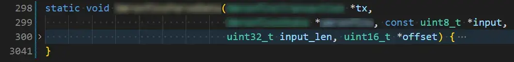
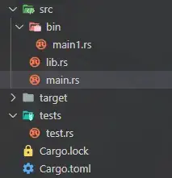

import { Code } from "@/components/code";
import { Note, NoteTitle } from "@/components/note";
import { Tab, Tabs } from "@/components/tab";

<Note type="warn" title="限制级内容！">

Rust 语言仅适合有编程基础的人学习，会的编程语言越多越好。另外，由于 Rust没有GC，因此也最好有一定的操作系统或者计算机组成原理的基础。

</Note>

## 零、参考文献

- [Rust 语言圣经](https://course.rs/about-book.html "点击跳转")
- [The Rust Programming Language](https://doc.rust-lang.org/book/title-page.html "点击跳转")
- [Rust Doc](https://doc.rust-lang.org/std/index.html "点击跳转")
- [Asynchronous Programming in Rust](https://rust-lang.github.io/async-book/ "点击跳转")

## 一、简介

> A language empowering everyone to build reliable and efficient software.

Rust 是一门近年来声名鹊起的编程语言，它号称兼具 C/C++的性能，又可以做到内存安全，并且有编译通过即可运行 10 年不出 BUG 的传说（先怀疑一手，毕竟是传说）。总之，某不可名状不堪入目不三不四的项目的源代码里使用了 Rust，正好也早已久仰 Rust 大名，所以就有了这篇笔记。

Rust 的安装方法请自行搜索，本文不做赘述。截至本文撰写之日，Rust 最新稳定版本为 1.79.0。

## 二、基础语法

不管学什么编程语言，总之先学标准输入与标准输出就对了。

```rust [main.rs]
// 程序入口函数
fn main() {

    // 定义一个字符串类型的变量
    let mut input = String::new();

    // 永不退出的循环
    loop {

        // 从标准输入读取字符串，并将其附加至 input 末尾
        std::io::stdin().read_line(&mut input).ok();

        // 宏定义函数，输出至标准输出。其中 {} 为占位符
        print!("input = {}", input);
        // 也可以使用如下语句
        // print!("input = {input}");

        // 清空字符串
        input.clear();

    }

}
```

```console [命令行]
> cargo run
114514
input = 114514
1919810
input = 1919810
error: process didn't exit successfully: `target\debug\hello.exe` (exit code: 0xc000013a, STATUS_CONTROL_C_EXIT)
```

上述命令行中出现的 error 是 Ctrl+C 导致的，属正常现象。

### 1. 变量与常量

在 Rust 中，声明变量应使用`let:kwd`关键字。但仅仅使用`let:kwd`关键字声明的变量的值一旦确定（被首次赋值后）就不可更改，除非再添加一个`mut:kwd`关键字。

```rust [错误示例]
let a = 114514;             // 不可变变量，默认
let mut b = "1919810";      // 可变变量
println!("a = {}, b = {}", a, b);
b = "114514";
a = 1919810; // 静态检查时报错 // [!code error]
println!("a = {}, b = {}", a, b);
```

```rust [修正后]
let a = 114514;
let mut b = "1919810";
println!("a = {}, b = {}", a, b);
b = "114514";
a = 1919810; // [!code --]
let a = 1919810; // [!code ++]
println!("a = {}, b = {}", a, b);
```

```console [命令行]
> cargo run
a = 114514, b = 1919810
a = 1919810, b = 114514
```

上述代码中将出现一个错误。错误原因是尝试更改不可变变量`a:var`。

<Note type="info" title="变量遮蔽（Variable Shadowing）">

在上述修正后的代码中，仅添加了一个`let:kwd`关键字就可以使代码编译通过。在大多数编程语言中，同一作用域内声明多个同名变量是错误的语法，但 Rust 允许这么做，甚至允许声明为不同类型的变量。如果你这么做了，则后声明的变量将**遮蔽**之前的同名变量。这意味着，在重新声明的语句之后，将不能访问之前的变量。

</Note>

不可变变量似乎类似于其它编程语言中的常量。但 Rust 不仅有不可变变量，还有常量。常量必须显式标注其类型、不可被遮蔽、不可与变量同名、不可被`mut:kwd`关键字修饰。

### 2. 基本类型

Rust 是强类型语言，但一般情况下编译器都会智能地推导类型，在多数情况下程序员不需要显式标注类型，除非编译器无法自动推导。

#### (1) 整型

Rust 的整型也分为有符号和无符号两种，如下所示。

|        长度         | 有符号类型  | 无符号类型  |
| :-----------------: | :---------: | :---------: |
|       1 字节        |  `i8:typ`   |  `u8:typ`   |
|       2 字节        |  `i16:typ`  |  `u16:typ`  |
|       4 字节        |  `i32:typ`  |  `u32:typ`  |
|       8 字节        |  `i64:typ`  |  `u64:typ`  |
|       16 字节       | `i128:typ`  | `u128:typ`  |
| 目标平台的 CPU 位数 | `isize:typ` | `usize:typ` |

其中，`isize:typ`类型和`usize:typ`类型的长度取决于目标平台的 CPU 的位数。对于 64 位的 CPU，其长度就是 8 字节；对于 32 位的 CPU，其长度就是 4 字节，以此类推。

<Note type="warn" title="显式类型转换">

Rust**_不允许_**不同类型的**数值类型**直接做数学运算，必须使用`as:kwd`关键字将变量显式转换为同一类型才可进行运算。

```rust [错误示例]
let a: i8 = 114;
let b: i32 = 514 * a; // 静态检查时报错 // [!code error]
println!("a = {}, b = {}", a, b);
```

```rust [修正后]
let a: i8 = 114;
let b: i32 = 514 * a; // [!code --]
let b: i32 = 514 * a as i32; // [!code ++]
println!("a = {}, b = {}", a, b);
```

```console [命令行]
> cargo run
a = 114, b = 58596
```

</Note>

对于数值类型的字面量，可以使用`_:kwd`（下划线）做分割符使字面量更直观，也可以在字面量之后添加类型标注。

```rust
let a = 114514_f32;
let b = 1_1451_4191_9810_i64;
```

Rust 的整型当然也无可避免地存在溢出现象（浮点数会变成`INFINITY:kwd`）。在 debug 模式下，Rust 会检查整型的溢出，一旦发生溢出，则**当前线程**将崩溃。在 release 模式下，溢出则会以经典 C/C++的方式处理（补码循环溢出）。若要处理可能出现的溢出，则可使用下列 4 类方法中的其中一个。

```rust [main.rs]
let a = 114514i32;

// 1. checked_* 类方法
// 若溢出，则返回 None
let b = a.checked_mul(1919810);         // 乘法运算
match b {
    None => println!("b = None"),       // 当 b 为 None 时，执行此行
    Some(i) => println!("b = {}", i),   // 当 b 不为 None 时，执行此行
}

// 2. overflowing_* 类方法
// 返回正常运算结果，和一个表示是否有溢出的 bool 型变量
let b = a.overflowing_shl(114);         // 左移运算
println!("b = ({}, {})", b.0, b.1);

// 3. saturating_* 类方法
// 若溢出，则返回最大值或最小值（取决于溢出方式）
let b = a.saturating_add(i32::MAX);     // 加法运算
println!("b = {}", b);

// 4. wrapping_* 类方法
// 按照补码循环方式处理
let b = a.wrapping_pow(11);             // 次方运算
println!("b = {}", b);
```

```console [命令行]
> cargo run
b = None
b = (-45613056, true)
b = 2147483647
b = -537933824
```

需要注意的是，移位运算是逻辑移位而不是算数移位，因此不会触发有符号整型溢出至符号位时的溢出。

#### (2) 浮点型

浮点型类型只有两种：`f32:typ`和`f64:typ`，分别占 4 字节和 8 字节。浮点类型不会出现溢出，但是会出现`inf:kwd`（infinite，无限）和`NaN:kwd`（Not a Number，不是数字） 。

```rust [main.rs]
let a: f64 = 1.0 / 0.0;
println!("a = {}, a.is_infinite() = {}", a, a.is_infinite());
let mut b = 0;
b = 1 / b; // 编译通过，但是运行时崩溃 // [!code error]
println!("b = {}", b);
```

```console [命令行]
> cargo run
a = inf, a.is_infinite() = true
thread 'main' panicked at src/main.rs:5:9:
attempt to divide by zero
note: run with `RUST_BACKTRACE=1` environment variable to display a backtrace
error: process didn't exit successfully: `target\debug\hello.exe` (exit code: 101)
```

整型变量在除以 0 时会直接触发错误；但浮点型变量只会变为`inf:kwd`。`NaN:kwd`则常发生于对负数开平方时：

```rust [main.rs]
let a = (-4.0f64).sqrt();
println!("a = {}, a.is_nan() = {}", a, a.is_nan());
```

```console [命令行]
> cargo run
a = NaN, a.is_nan() = true
```

#### (3) 字符型

Rust 的字符类型仅有`char:typ`类型，该类型占 **4** 字节。所有的 Unicode 字符（包括单个汉字）均可以作为 Rust 的字符。若只希望只用 ASCII 字符，则需要使用`u8:typ`类型。

```rust [main.rs]
let a = b'a';
let b = '啊';
println!("a = {}, b = {}", a, b);
```

```console [命令行]
> cargo run
a = 97, b = 啊
```

#### (4) 布尔、字符串字面量与单元类型

Rust 的布尔类型平平无奇，仅有`bool:typ`类型。该类型占 1 字节，仅有`true:kwd`和`false:kwd`两个可选值。

字符串字面量的类型是`str:typ`。当将字符串字面量赋值给变量（或作参数）时，变量（或参数）的类型只能是`&str:typ`，意为对字符串字面量的不可变引用。关于不可变引用，请参考下文的所有权一节。

单元类型仅有`():kwd`一个值，不占用任何空间。任意没有返回值、但又会返回的函数，其返回类型均为单元类型。永远不会返回的函数（例如固定触发错误的函数）不会返回任何值（包括单元类型）。

### 3. 函数

Rust 要求为函数的每个参数、函数的返回值显式标注类型。一个简单函数的示例如下：

```rust [main.rs]
fn safe_add(a: i32, b: i32) -> i32 {
    match a.checked_add(b) {
        None => return a,
        Some(i) => return i,
    }
}

fn main() {
    println!("114514 + 1919810 = {}", safe_add(114514, 1919810));
}
```

```console [命令行]
> cargo run
114514 + 1919810 = 2034324
```

Rust 的函数不一定要声明在前使用在后，只要定义了函数就行。另外，若最后一行代码不加`;`（分号），则该行代码的运算结果就是此函数的返回值，等价于在其开头添加`return:kwd`关键字并在末尾添加`;`。当函数永不返回时，其返回类型应当标注为`!`（感叹号）。

### 4. 流程控制

`if:kwd`语句在前文的代码示例中已经出现过了。Rust 的`if:kwd`语句可以像 Kotlin 一样使用：

```rust [main.rs]
let a = 5;

let b = if a == 1 {
    "0079"      // 若 a == 1，则 b 会被赋予 "0079" 值，以此类推
} else if a == 9 {
    "0087"
} else if a == 5 {
    "0083"
} else {
    "NOT UC"
};

println!("b = {}", b);
```

```console [命令行]
> cargo run
b = 0083
```

`for in:kwd`循环则涉及到所有权概念，将于下文的切片一节叙述。`while:kwd`循环与`loop:kwd`循环相对简单，前者是满足条件则维持循环，后者是无条件循环。

```rust
let mut i = 0;

// while 循环
while i < 114 {
    if i == 37 {
        continue;
    }
    println!("i = {}", i);
    i += 1;
}

// loop 循环
loop {
    i += 1;
    if i == 1919 {
        break;
    }
}
```

### 5. 所有权（Ownership）

在堆上分配空间后却又不释放，是最常见的破坏内存安全的一种操作。Rust 为了可以及时释放堆上空间，但又不想引入 GC 造成性能开销，所以使用了所有权概念：同一时刻，只能有一个变量保存合法的、指向同一片堆内存的指针。对于基本类型的实例而言，所有的值都是放在栈上的；但对于`String:typ`这种类型的实例，其值有一部分需要存放于堆上。

```rust
let a = 114;
let b = a;
println!("a = {}, b = {}", a, b); // 可以编译通过并正常运行

let a = String::from("114");
let b = a;
println!("a = {}, b = {}", a, b); // 静态检查时报错 // [!code error]
```

上述代码中将出现一个错误：借用已被移除的变量。因为变量`a:var`对堆内存的所有权已被转移至变量`b:var`。当调用函数时，也可能会发生所有权的转移：

```rust
fn wash(black: String) -> String {
    return black;
}

fn main() {
    let a = String::from("114514");
    let b = wash(a);
    println!("a = {}, b = {}", a, b); // 静态检查时报错 // [!code error]
}
```

调用`wash():fun`函数时，所有权发生了两次转移：第一次从变量`a:var`转移至形参`black:var`，然后再从形参转移至接受返回值的变量`b:var`。

Rust 为了使程序员不需要关注底层实现，贴心地添加了**特征**这个概念。所有实现了拷贝特征的类型，在拷贝时均会深拷贝；否则仅会转移所有权。所有基本类型和任意类型的不可变引用都实现了拷贝特征。关于特征，将在下文的特征一节详述。

#### (1) 引用（Reference）

在最开始的标准输入输出的代码示例中，`read_line():fun`方法并没有让`input:var`变量失去所有权，因为该函数需要的参数仅仅是一个引用。引用并不拥有所有权，只有读写权。引用也分为不可变引用和可变引用，不可变引用只读，而可变引用可读可写。

```rust [main.rs]
let mut a = String::from("114514");
let b = &a;                                     // b 为不可变引用
println!("a = {}, b = {}, *b = {}", a, b, *b);  // *b 为解引用
let c = &mut a;                                 // c 为可变引用
c.push_str("1919810");
println!("c = {}, *c ={}", c, *c);
println!("a = {}", a);
```

```console [命令行]
> cargo run
a = 114514, b = 114514, *b = 114514
c = 1145141919810, *c =1145141919810
a = 1145141919810
```

在上述的代码中，引用和解引用似乎没有什么行为上的差异，但它们的类型是不同的。变量`b:var`的类型是`&String:typ`，而解引用后的类型是`String:typ`。如果在使用引用时报了类型不匹配的错，或许使用解引用即可解决。

#### (2) 引用作用域

上一小节的代码中没有同时输出变量`a:var`，变量`b:var`和变量`c:var`，因为会触发错误。当可变引用存在时，不允许同时存在其它引用，类似于读写锁：当存在“写者”时，不允许其它“读者”同时读，更不允许其它“写者”同时写。但代码中变量`b:var`和变量`c:var`却又似乎同时存在于同一作用域？不，引用有其独特的作用域。在编译时，Rust 会追踪引用的使用，引用的作用域只会到其最后一次使用后。

```rust
let mut a = String::from("114514");
let b = &a;
println!("a = {}, b = {}, *b = {}", a, b, *b);

// 此时，b 的作用域结束

let c = &mut a;
c.push_str("1919810");
println!("c = {}, *c ={}", c, *c);

// 此时，c 的作用域结束

println!("a = {}", a);
```

没有让变量`a:var`和变量`c:var`同时输出也是因为违反了“读写锁”规则：`println!():fun`**宏函数**会创建对变量`a:var`的引用，使“读者”和“写者”同时存在。

### 6. 复杂类型

#### (1) 枚举

在默认情况下，枚举类型**没有**实现拷贝特征。比起 C/C++的枚举，Rust 的枚举更像 C/C++的`union:kwd`。

```rust
// 定义一个枚举类型
enum HIE {
    Kouka,
    Lacia,
}

// 定义一个枚举类型的变量
let a = HIE::Kouka;
```

其实早在整型类型的溢出处理部分就已经使用到了枚举。`checked_mul():fun`方法的返回值类型为`Option<T>:typ`，该类型就是一个（使用了泛型的）枚举。Rust 的枚举可以整很多花活儿：

```rust
// 定义一个字符枚举类型
enum Char {
    ASCII(u8),  // ASCII 编码
    UTF8(u32),  // UTF-8 编码
    GBK(u16),   // GBK 编码
}

// 使用了泛型的枚举
enum Promise<T, E> {
    Resolve(T),
    Reject(E),
}

// 整点儿花活儿
enum Troll<T> {
    Enum,                       // 一般通过枚举项
    Switch(u32),                // 带个参数的枚举项
    Collection(T),              // 泛型枚举项
    Struct { meme: String },    // 结构体枚举项
    Tuple(u32, String),         // 元组枚举项
}
```

这些花活儿恐怕就是枚举类型默认没有实现拷贝特征的原因。关于泛型，请参考下文的泛型一节。

#### (2) 定长数组

当定长数组内的元素类型实现了拷贝特征时，定长数组类型本身也实现了拷贝特征；否则就没有实现拷贝特征。另，仅有被`mut:kwd`关键词修饰的数组可以更改其元素值，或被重新赋值。

```rust
let a = [0, 1, 2, 3, 4];    // 手动指定元素值
let b = ["114514"; 5];      // 每个元素值都是 "114514"，共 5 个元素
```

其中，变量`a:var`的类型为`[i32; 5]:typ`类型；变量`b:var`的类型为`[&str; 5]:typ`类型。数组类型遵循`[元素类型; 元素个数]`格式。需要注意的是，若要像变量`b:var`那样初始化，则元素类型必须是实现了拷贝特征的类型。

<Note type="error" title="数组生成方式">

在上述代码中，变量`b:var`在初始化时，会不断拷贝字面量字符串`"114514":str`的不可变引用。但对于复杂类型，就没有这么简单了：

```rust
enum HIE {
    Kouka,
}

fn main() {
    let a = [HIE::Kouka; 5]; // 静态检查时报错 // [!code error]
}
```

由于复杂类型默认的拷贝是浅拷贝（即：转移所有权），因此初始化数组时将导致除了最后一个元素以外的元素均因失去所有权而导致废弃。

</Note>

#### (3) 切片（Slice）

切片是对数组的某部分的引用。

```rust [main.rs]
let mut a = [0, 1, 2, 3, 4];
let b = &mut a[0..3];   // b 是 a 的可变引用

b[2] = 514;
println!("a[2] = {}", a[2]);
```

```console [命令行]
> cargo run
a[2] = 514
```

上述代码中，变量`b:var`是对变量`a:var`的$$[0, 3)$$区间的元素的引用。

<Note type="warn">

<NoteTitle>`for in:kwd`循环遍历可迭代对象</NoteTitle>

可迭代的对象都可以使用`for in:kwd`循环遍历，定长数组与切片就是可迭代的。

```rust [main.rs]
let a = [0, 1, 2, 3, 4];
let b = &a[0..3];

for i in a {
    println!("a: i = {}", i)
}

for i in b {
    println!("b: i = {}", i)
}
```

```console [命令行]
> cargo run
a: i = 0
a: i = 1
a: i = 2
a: i = 3
a: i = 4
b: i = 0
b: i = 1
b: i = 2
```

需要注意的是，`for in:kwd`循环本身会**浅拷贝**被遍历对象。如果该对象实现了拷贝特征，则无事发生；若没有，则所有权转移到`for in:kwd`循环内的临时对象上，循环结束后对象销毁。因此，在遍历可迭代对象时，推荐使用不可变引用而非对象本身；若要在循环内更改对象内的值，则需使用可变引用。

</Note>

#### (4) 元组（Tuple）

定长数组中的元素类型必须一致，而元组则是元素类型可以不一致的、不可迭代的定长数组。当元组内的所有类型均实现了拷贝特征时，则该元组也实现了拷贝特征；否则就没有实现拷贝特征。

```rust
let a = (114, "514", 1919u32, 810u16);

let (b, c, d, e) = a;       // 解构赋值

println!("a.0 = {}", a.0);  // 访问元素
println!("b = {},c = {}, d = {}, e = {}\n", b, c, d, e);
```

元组常见于函数返回值中。当一个函数需要返回多个值时，往往会采用元组形式组织返回值，然后再将返回值解构赋值给若干新变量。同样可以解构的还有定长数组与切片。

#### (5) 结构体

结构体默认没有实现拷贝特征。

```rust [main.rs]
// 定义结构体类型
struct Double {
    negative: bool,
    integer: u32,
    decimal: u32,
}

let negative = true;
let a = Double {
    negative,   // 简写 // [!code highlight]
    integer: 114,
    decimal: 514,
};

// 结构体的解构
let Double {
    negative: b,
    integer: c,
    decimal: d,
} = a;

println!(
    "a = {}{}.{}",
    if a.negative { "-" } else { "" },
    a.integer,
    a.decimal,
);
println!("b = {}, c = {}, d = {}", b, c, d);
```

```console [命令行]
> cargo run
a = -114.514
b = true, c = 114, d = 514
```

在初始化结构体实例时，必须初始化所有字段；当字段名与变量名相同时，可以像 JavaScript 一样简写；结构体可以被解构；结构体仅允许其实例被`mut:kwd`关键字修饰，不允许仅某个字段被`mut:kwd`关键字修饰；结构体内的字段也可能存在所有权问题，但所有权被转移后，其余字段仍可正常使用。

若设计结构体时，觉得其中的字段没必要逐个命名，则可以使用元组结构体或单元结构体：

```rust
// 定义一个元组结构体类型
struct Double(bool, u32, u32);

// 定一个元组结构体的实例
let a = Double(true, 114, 514);

println!("a = {}{}.{}", if a.0 { "-" } else { "" }, a.1, a.2);

struct Interface;   // 定义一个单元结构体类型，没有任何字段
let b = Interface;  // 定义一个单元结构体实例
```

单元结构体不包含任何字段，它往往作为包含静态方法的静态类。

#### (6) 函数

函数本身也是一种类型，且实现了拷贝特征。

```rust [main.rs]
fn hello() {
    println!("test");
}

let a = hello;  // [!code highlight]
let b = a;
a();            // [!code highlight]
b();            // [!code highlight]
```

```console [命令行]
> cargo run
test
test
test
```

### 7. 模式匹配（Pattern Matching）

模式匹配在前文中已经有过使用，即`match:kwd`关键字，属于流程控制的一种。它与 C/C++的`switch:kwd`关键字类似，但远比其强大。

```rust
// 定义一个枚举类型
enum Char {
    ASCII(u8),
    UTF8(u32),
    GBK(u16),
}

// 定义一个枚举类型变量
let a = Char::ASCII(b'?');

// 模式匹配，根据 a 的值返回结果
let b = match a {
    Char::ASCII(_) => 114,
    Char::UTF8(i) => i,

    // 其余可能分支，other 为形式参数
    other => {
        if matches!(other, Char::GBK(114)) {
            514
        } else {
            1919
        }
    }
};
```

`match:kwd`语句必须覆盖所有可能分支。与`if:kwd`语句类似，`match:kwd`语句同样可以返回值。若某些分支可以被忽略，则可以使用通配符`\_:var`替换形式参数。上述代码中使用了`matches!():fun`宏函数，该宏函数使用`match:kwd`语句实现。当第一参数与第二参数匹配时，返回值为`true:kwd`，否则为`false:kwd`。

在仅需要处理少部分分支时，`match:kwd`语句，显得过于笨重。这种情况建议使用`if let:kwd`语句：

```rust
enum Char {
    ASCII(u8),
    UTF8(u32),
    GBK(u16),
}

let a = Char::ASCII(b'?');

if let Char::GBK(114) = a {
    // 当 a 为 Char::GBK(114) 时进入
    println!("branch 1");
} else if let Char::UTF8(i) = a {
    // 当 a 为 Char::UTF8 时进入，i 为形式参数
    println!("branch 2, i = {}", i);
} else {
    // 其余情况
    println!("default");
}
```

类似的，循环也有`while let:kwd`循环，当模式匹配成功时，循环将一直持续。上述代码中的例子仅为模式匹配的冰山一角，常用的模式匹配有：

```rust [字面量匹配]
match x {
    1 => println!("x = 1"),
    2 => println!("x = 2"),
}
```

```rust [带形参匹配]
match x {
    Some(i) => println!("x = {}", i),
    value => println!("x = {}", value),
}
```

```rust [多模式匹配]
match x {
    1..=5 => println!("x < 6"),     // 序列生成式
    6 | 7 | 8 => println!("5 < x < 9 "),
    value => println!("x = {}", value),
}
```

```rust [解构匹配]
struct Double(bool, u32, u32);
struct Troll {
    common: i32,
    tuple: (i32, Double),
    array: [String; 4],
}

let a = Troll {
    common: 114,
    tuple: (514, Double(false, 1919, 810)),
    array: [
        String::from("114"),
        String::from("514"),
        String::from("1919"),
        String::from("810"),
    ],
};

// 解构赋值
let Troll {
    common: b,
    tuple: (c, Double(d, e, f)),
    array: [g, h, i, j],
} = a;
```

```rust [带守卫的匹配]
match x {
    Some(i) if i == 114 => println!("114514"), // [!code highlight]
    _ => println!("1919"),
}
```

```rust [带绑定的匹配]
match x {
    // 若匹配成功，则形式参数 value 的值等于 x 的值
    value @ (1..=5 | 6) => println!("x = {}", value), // [!code highlight]

    value => println!("x = {}", value),
}
```

## 三、面向对象

Rust 的面向对象可以用枚举或者结构体实现，这一部分可能与 Go 语言比较接近。比较遗憾的是，Rust **不支持**继承。

### 1. 方法

Rust 将类（枚举或结构体）的字段定义与其成员方法的定义分离开，成员方法需要定义在`impl:kwd`块内，一个类可以有多个`impl:kwd`块。比较遗憾的是 Rust 不支持函数重载，但是可以通过**特征**来实现方法重载。

```rust
// 结构体定义
struct HIE {
    name: String,
    age: u32,
}

// 成员方法定义
impl HIE {
    // 静态方法，构造方法
    fn constructor(name: &str, age: u32) -> Self {
        HIE {
            name: String::from(name),
            age: age,
        }
    }

    // 成员方法
    fn say_hello(&self) {
        println!("Hello, I'm {}", self.name);
    }

    // getter
    fn name(&self) -> &String {
        return &self.name;
    }

    // setter
    fn age(&mut self, value: u32) {
        self.age = value;
    }
}
```

在上述代码中，位于`impl:kwd`块中的方法均为类型`HIE:typ`的成员方法。其中，若参数列表中第一个参数不为`Self:typ`类型（此处等价于`HIE:typ`类型）或其引用类型，则该成员方法为静态方法。`&self`为`self: &Self`的简写；`&mut self`为`self: &mut Self`的简写。需要注意的是，成员方法的`self:kwd`也存在所有权问题，定义时应考虑究竟是获取所有权、获取不可变引用还是获取可变引用。Rust 编译器会自动引用或解引用，因此调用成员方法仅需使用`.`运算符。

### 2. 特征（Trait）

Rust 的特征类似于其它编程语言的接口。一个类可以同时实现多个特征，一个特征也可以被多个类同时实现。与其它编程语言不同的是，Rust 的特征内可以有被实现的方法，该方法将作为默认的实现方法。

```rust
// 定义一个结构体
struct Gundam {
    producer: String,
    code_name: String,
    service_age: u32,
}

// 定义一个特征
trait Artefact { // [!code highlight]
    // 无默认实现
    fn maker(&self) -> &String;

    // 有默认实现
    fn service_age(&self) -> u32 {
        0
    }
}

// 为 Gundam 结构体实现 Artefact 特征
impl Artefact for Gundam {
    fn maker(&self) -> &String {
        &self.producer
    }
}
```

若要为某个类实现特征，则要么该类是在当前作用域下定义的，要么该特征是在当前作用域下定义的。与接口一样，特征也可以作为函数的参数或返回值。

```rust
// 给大家整个活儿
fn troll(a: &mut impl Artefact, b: &impl Artefact, c: impl Artefact) -> impl Artefact {
    Gundam {
        producer: a.maker().clone(),
        code_name: String::from("Aerial"),
        service_age: b.service_age(),
    }
}
```

上述代码中的三个形式参数和返回值均为实现了`Artefact:typ`特征的对象（的引用）。从这个例子也能看出，这种函数依然需要注意所有权问题。

<Note type="info" title="使用特征实现成员方法重载">

虽然 Rust 不允许成员方法同名，但若成员方法通过实现特征的方式实现，则可以同名。

```rust
struct Gundam {
    producer: String,
    code_name: String,
    service_age: u32,
}

// 所有的 getter 方法
trait GundamGetter {
    fn producer(&self) -> &String;
    fn code_name(&self) -> &String;
    fn service_age(&self) -> u32;
}

// 所有的 setter 方法
trait GundamSetter {
    fn producer(&mut self, value: String);
    fn code_name(&mut self, value: String);
    fn service_age(&mut self, value: u32);
}

impl GundamGetter for Gundam {
    fn producer(&self) -> &String {
        &self.producer
    }
    fn code_name(&self) -> &String {
        &self.code_name
    }
    fn service_age(&self) -> u32 {
        self.service_age
    }
}

impl GundamSetter for Gundam {
    fn producer(&mut self, value: String) {
        self.producer = value;
    }
    fn code_name(&mut self, value: String) {
        self.code_name = value;
    }
    fn service_age(&mut self, value: u32) {
        self.service_age = value;
    }
}

let mut a = Gundam {
    producer: String::from("114"),
    code_name: String::from("514"),
    service_age: 2,
};

println!("{}", a.code_name());

// 必须显式声明是哪个特征的方法
GundamSetter::code_name(&mut a, String::from("1919810")); // [!code highlight]
```

上述重载和使用方式着实有点别扭，只能祈祷开发者们有空闲能考虑考虑为 Rust 添加方法重载特性了。

</Note>

Rust 标准库里有一些含有默认实现的特征，例如`Debug:typ`特征、`Copy:typ`特征和`Clone:typ`特征。这些特征可以通过`derive:fun`宏直接为类实现。

```rust
#[derive(Clone, Debug)]
struct Gundam {
    producer: String,
    code_name: String,
    service_age: u32,
}

let a = Gundam {
    producer: String::from("Shinsei Kaihatsu"),
    code_name: String::from("Aerial"),
    service_age: 2,
};

println!("a = {:?}", a);
```

实现了`Debug:typ`特征的类，可以通过`println!():fun`宏函数输出其实例对象。

### 3. 泛型

泛型是面向对象的特色，不能不品尝。

```rust
// 泛型结构体
struct ArrayQueue<T> {
    array: [T; 10],
    head: usize,
    tail: usize,
    size: usize,
}

// 指定默认泛型参数的泛型结构体
struct Queue<T = u32> {
    array: [T; 10],
    head: usize,
    tail: usize,
    size: usize,
}

// 泛型特征
trait IConstructable<T> {
    fn construct() -> T;
}

// 泛型枚举
enum Promise<T, E> {
    Resolve(T),
    Reject(E),
}

// 泛型函数
fn troll<T>(a: T) {
    println!("troll");
}
```

与 C++一样，Rust 的泛型类型会在编译时搜索所有使用到的类型，然后仅实现被使用了的类型。

<Note type="info" title="特征的关联类型">

泛型特征还有另一种写法：

```rust
trait IConstructable {
    type T;
    fn construct() -> Self::T;
}
```

不论哪种写法，均需要在实现该特征时指定`T:typ`的类型（可以是泛型参数）。

</Note>

#### (1) 泛型的特征约束

在某些情况下，泛型需要限定类型实现了某些特征。Rust 提供了两种途径实现这种需求：

```rust
// 第一种，传统方法
enum Promise<T, E: Error + Debug> {
    Resolve(T),
    Reject(E),
}

// 第二种，使用 where 关键字
struct ArrayQueue<T>
where
    T: Debug + PartialEq + PartialOrd,
{
    array: [T; 10],
    head: usize,
    tail: usize,
    size: usize,
}
```

当然，特征也可以使用特征约束：

```rust
trait IPrintableError: Error {
    fn print_stack(&self) {
        println!("{:?}", self.source())
    }
}
```

上述代码中， 由于限定了能实现`IPrintableError:typ`特征的类型必须也实现了`Error:typ`特征，因此可以在特征方法的默认实现内调用`Error:typ`特征声明的方法。

#### (2) 常量泛型（Const Generics）

但是上面这个数组队列`ArrayQueue<T>:typ`还是不太让人满意，因为它的存储上限被固定为了`10`。若希望能够在初始化类型实例的时候才确定队列存储上限，则需要使用常量泛型。

```rust
struct ArrayQueue<T, const S: usize>
where
    T: Debug + PartialEq + PartialOrd,
{
    array: [T; S],  // 此时队列上限还未被确定 // [!code highlight]
    head: usize,
    tail: usize,
    size: usize,
}

// 初始化一个 ArrayQueue 类型的实例
let a = ArrayQueue {
    array: [0u32; 114],
    head: 0,
    tail: 0,
    size: 0,
};
```

上述代码中的泛型参数`S:typ`代表了一个`usize:typ`类型的常量，该值需要等到实例初始化时能确定。常量泛型仅允许整型、布尔型和`char:typ`类型。

#### (3) 泛型类的方法

Rust 允许为某一确定的泛型类型实现特有的方法。

```rust
// 通用方法，任意符合条件的 T，S 类型都可以调用
impl<T: Debug + PartialEq + PartialOrd, const S: usize> ArrayQueue<T, S> {
    fn push(&mut self, value: T) -> bool {
        if self.size == self.array.len() {
            return false;
        } else if self.size == 0 {
            self.array[self.head] = value;
            self.size += 1;
            return true;
        } else {
            self.tail = (self.tail + 1) % self.array.len();
            self.array[self.tail] = value;
            self.size += 1;
            return true;
        }
    }
}

// 仅为 T = u32 时的泛型类实现 sort 方法
impl<const S: usize> ArrayQueue<u32, S> {
    fn sort(&mut self) {
        self.array.sort();
    }
}
```

### 4. 多态

Rust 没有继承特性，因此其多态通过特征（接口）实现。在特征一节的代码示例中，`troll():fun`函数的返回类型不是某个特定类型，而是一个特征。该函数可以通过编译，因为其返回的类型确定为`Gundam:typ`类型。但下述代码则会报错：

```rust
// 结构体定义
struct MobileSuit {     // 机动战士
    code: String,
}
struct MobileArmour {   // 机动要塞
    code: String,
}

// 特征定义
trait CodedWeapon {     // 带编号的武器
    fn code(&self);
}

// 为结构体实现特征
impl CodedWeapon for MobileSuit {   // MS 是带编号的武器
    fn code(&self) {
        println!("code = {}", self.code)
    }
}
impl CodedWeapon for MobileArmour { // MA 是带编号的武器
    fn code(&self) {
        println!("code = {}", self.code)
    }
}

// 制造武器
fn make_weapon(t: bool, code: String) -> impl CodedWeapon {
    if t {
        return MobileArmour { code };
    } else {
        return MobileSuit { code }; // 静态检查时报错 // [!code error]
    }
}
```

报错原因是 Rust 编译器判定`make_weapon():fun`函数的返回类型是`MobileArmour:typ`类型，但函数内却试图返回`MobileSuit:typ`实例。解决这个问题需要引入一个新的泛型类型`Box<T, A>:typ`和一个新的关键字`dyn:kwd`。

```rust
fn make_weapon(t: bool, code: String) -> Box<dyn CodedWeapon> {
    if t {
        return Box::new(MobileArmour { code }); // 创建对象
    } else {
        return Box::new(MobileSuit { code });
    }
}
```

`Box<T, A>:typ`类型的作用是把`T:typ`实例通过伪函数`A:typ`存放在堆上，栈上仅保留指向堆内存的指针（智能指针的一种）。通过套一层`Box<T, A>:typ`类型就能解决这个报错的根本原因是，Rust 必须在编译时确定每一个栈上值所占用的字节数。对于仅实现了某个特征的类型，Rust 无法确定它的实例到底需要多少栈空间；而`Box<T, A>:typ`类型的实例则明确地仅在栈上保留指针。

`dyn:kwd`关键字表明`Box<T, A>:typ`里可能存放任意实现了`CodedWeapon:typ`特征的类型的实例，这种不固定类型的实例被称为特征对象（Trait Objects）。

```rust [main.rs]
// 变量 a 丢失了类型，只知道是一个实现了 CodedWeapon 特征的类型
let a = make_weapon(false, String::from("Gundam"));

a.code();
```

```console [命令行]
> cargo run
code = Gundam
```

特征对象的使用必须要满足栈空间可计算原则。因此，若某个特征中的某方法的参数类型或返回值类型为`Self:typ`类型，则此特征不可用于特征对象。另，含有泛型方法的特征也**不可**用于特征对象。

## 四、生命周期

在泛型一章的示例代码中，有一个用数组实现的队列。若尝试将该队列替换为链表实现，则在实现链表结点时会出现报错：

```rust
struct ListNode<T> {
    value: T,
    next: &ListNode<T>, // 静态检查时报错 // [!code error]
}
```

产生错误的原因是 Rust 编译器不知道`next:var`字段引用的对象在何时被释放，且 Rust 不允许存在对象已经被释放的引用。所以此处需要显式地标注引用的生命周期：

```rust
// 别管生命周期对不对，反正静态检查不报错了
struct ListNode<'lf, T> {
    value: T,
    next: &'lf ListNode<'lf, T>, // [!code highlight]
}
```

生命周期，即对象或引用在何时会被创建或释放。在上述代码中，`ListNode<T>:typ`实例的生命周期被标记为`'lf:typ`，`next:var`字段（引用）的生命周期也被标记为`'lf:typ`。编译器在编译时通过标注知道了`next:var`字段和`ListNode<T>:typ`实例的生命周期一样，前者一定在后者被释放前都是有效引用。但是，生命周期标注毕竟是标注，并**不会**实际改变运行时的生命周期，仅仅会在静态检查和编译时改变报错判定。

另，上述链表结点的实现方式是有问题的，但这并不妨碍接下来使用有问题的链表结点做演示。与特征约束类似，生命周期也有约束：

```rust
struct ListNode<'a, 'b: 'a, T> {
    value: T,
    previous: &'a ListNode<'a, 'b, T>,
    next: &'b ListNode<'a, 'b, T>,
}
```

在上述代码中，生命周期`'b:typ`应当比生命周期`'a:typ`更长。即，$$'a \subset 'b$$。若不满足这个标记条件，编译器将报错。另，泛型参数也可以有生命周期约束：

```rust
struct ListNode<'a, 'b: 'a, T: PartialOrd + PartialEq + 'b> {
    value: T,
    previous: &'a ListNode<'a, 'b, T>,
    next: &'b ListNode<'a, 'b, T>,
}
```

泛型参数的生命周期约束一般可以省略，因为编译器会自动推导。对于特殊情况，生命周期可以使用`'static:typ`标注，该标注意为此引用（或对象）将从进程（或线程）开始运行后，到进程（或线程）终止前都将有效。

## 五、异常处理

Rust 的异常大致分为两种，一种是触发了直接导致当前线程崩溃的错误，另一种是`Result<T, E>:typ`类型的`Err(E):kwd`。

### 1. `panic!():fun`宏函数

该宏函数的参数与`println!():fun`宏函数一致，但区别在于这个宏函数一旦调用，当前线程就直接崩溃。一般情况下，当环境变量中的`RUST_BACKTRACE:var`值为`1:var`时，调试模式编译的二进制可以在崩溃时打印栈信息。

### 2. `Result<T, E>:typ`类型

该类型是一个枚举类型，其定义的简化版代码如下：

```rust
enum Result<T, E> {
    Ok(T),
    Err(E),
}
```

和前文代码示例中的`Promise<T, E>:typ`类型类似。该类型常常出现在各个函数的返回类型中，`Ok(T):kwd`值表示函数执行成功，并将值包裹后返回；`Err(E):kwd`值表示函数执行失败，并将异常信息包裹后返回。

```rust [main.rs]
let a = String::from("114514");
// 编译器不知道要解析为哪种数值类型，所以必须标注 u32
let b = a.parse::<u32>();
match b {
    Ok(i) => println!("b = {}", i), // [!code highlight]
    Err(i) => println!("Error: {:?}", i.source()),
}


let a = String::from("-114514");
let b = a.parse::<u32>();
match b {
    Ok(i) => println!("b = {}", i),
    Err(i) => println!("Error: {:?}", i), // [!code highlight]
}
```

```console [命令行]
> cargo run
b = 114514
Error: ParseIntError { kind: InvalidDigit }
```

### 3. `unwrap():fun`方法和`expect():fun`方法

这两个方法都是`Result<T, E>:typ`类型的成员方法（`Option<T>:typ`类型也有这两个成员方法），功能也是类似的。

```rust [main.rs]
// a 为 u32 类型
let a = String::from("114514").parse::<u32>().unwrap();
println!("a = {}", a);

let a = String::from("114.514").parse::<u32>().expect("Not u32");
println!("a = {}", a);
```

```console [命令行]
> cargo run
a = 114514
thread 'main' panicked at src/main.rs:5:52:
Not u32: ParseIntError { kind: InvalidDigit }
note: run with `RUST_BACKTRACE=1` environment variable to display a backtrace
error: process didn't exit successfully: `target\debug\hello.exe` (exit code: 101)
```

这两个函数将判断`Result<T, E>:typ`实例究竟包裹了数据还是异常。若为异常，则直接调用`panic!():fun`宏函数；若为数据，则将其返回。唯一不同之处在于，`expect():fun`方法会在触发异常时打印给定的参数。当确信不会返回异常，或出现异常程序就不该再继续运行时，可以直接使用这两个方法。

### 4. 抛出异常

异常不一定非要在哪发生就在哪处理。Rust 提供了一个非常优雅的异常处理方式：

```rust
// 将字符串转换为数值，以字符串形式返回其相加的结果
fn str_add(base: &String, index: &String) -> Result<String, ParseFloatError> {
    // b 和 i 的类型都是 f64
    let b = base.parse::<f64>()?;
    let i = index.parse::<f64>()?;

    Ok((b + i).to_string())
}

// 可以再简化一下
fn str_add(base: &String, index: &String) -> Result<String, ParseFloatError> {
    Ok((base.parse::<f64>()? + index.parse::<f64>()?).to_string())
}
```

若运算结果是`Ok(T):kwd`，则`?`运算符会取被包裹的值；若运算结果是`Err(T):kwd`，则`?`运算符会直接`return:kwd`异常本身。`?`运算符也可用于`Option<T>:typ`类型，效果类似。另，若`Err(T):kwd`的类型与函数返回类型不一致，且`T:typ`类型实现了返回类型的`std::convert::From:typ`特征，则`?`会自动做类型转换。

在`main():fun`函数里也可以抛出错误，但函数返回类型需为`Result<(), E>:typ`，并且正常返回时的返回值应为`Ok(()):kwd`。

### 5. `Result<T, E>:typ`类型和`Option<T>:typ`类型的方法

`Result<T, E>:typ`类型和`Option<T>:typ`类型可以互相转换。

```rust [main.rs]
let res_ok: Result<String, String> = Ok(String::from("Ok"));
// ok() 方法：若调用者为 Ok(T) 则返回 Some(T)，否则返回 None
match res_ok.clone().ok() {
    Some(i) => println!("res_ok.ok() = {}", i),
    None => println!("res_ok.ok() = None"),
}
// err() 方法：若调用者为 Err(T) 则返回 Some(T)，否则返回 None
match res_ok.clone().err() {
    Some(i) => println!("res_ok.err() = {}", i),
    None => println!("res_ok.err() = None"),
}


let res_err: Result<String, String> = Err(String::from("Err"));
match res_err.clone().ok() {
    Some(i) => println!("res_err.ok() = {}", i),
    None => println!("res_err.ok() = None"),
}
match res_err.clone().err() {
    Some(i) => println!("res_err.err() = {}", i),
    None => println!("res_err.err() = None"),
}

let opt_some = Some(String::from("Some"));
// ok_or() 方法：若调用者为 Some(T) 则返回 Ok(T)，否则返回 Err(参数)
match opt_some.clone().ok_or(String::from("None")) {
    Ok(i) => println!("opt_some.ok_or() = {}", i),
    Err(i) => println!("opt_some.ok_or() = {}", i),
}

let opt_none: Option<String> = None;
match opt_none.clone().ok_or(String::from("None")) {
    Ok(i) => println!("opt_none.ok_or() = {}", i),
    Err(i) => println!("opt_none.ok_or() = {}", i),
}
```

```console [命令行]
> cargo run
res_ok.ok() = Ok
res_ok.err() = None
res_err.ok() = None
res_err.err() = Err
opt_some.ok_or() = Some
opt_none.ok_or() = None
```

上述代码中的`ok():fun`方法、`err():fun`方法和`ok_or():fun`方法均会获取调用者（和参数）的所有权。

`Result<T, E>:typ`类型和`Option<T>:typ`类型还都可以做“布尔运算”：

```rust [main.rs]
// “或”运算
let ok: Result<String, String> = Ok(String::from("ok"));
let err: Result<String, String> = Err(String::from("err"));
match err.or(ok) {
    Ok(i) => println!("err or ok = {}", i),
    Err(i) => println!("err or ok = {}", i),
}

// 与运算
let some = Some(String::from("some"));
let none: Option<String> = None;
match some.and(none) {
    Some(i) => println!("some and none = {}", i),
    None => println!("some and none = none"),
}
```

```console [命令行]
> cargo run
err or ok = ok
some and none = none
```

上述代码中，当调用者为“真”时，`or():fun`方法立即返回之，否则返回参数；当调用者为“假”时，`and():fun`方法立即返回之，否则返回参数。简单地说，“布尔运算”遵循短路运算原则。同样地，这两个方法都会获取调用者和参数的所有权。

这两个类型还有其它的方法，此处不做赘述，详细信息请参考官方文档的[std::option 模块](https://doc.rust-lang.org/std/option/index.html#transforming-contained-values "点击跳转")和[std::result 模块](https://doc.rust-lang.org/std/result/index.html#transforming-contained-values "点击跳转")。

## 六、工程化

模块化是每个程序员的必修课。~~没学的建议通通抓去维护一个函数三千行的屎山项目，体会一下什么叫做地狱。~~



模块化是为了项目结构清晰，便于维护。~~而像一个函数三千行，一个目录放两千份源代码文件的项目，就是纯纯的\_\_山。~~

### 1. 项目结构

通过 Cargo 创建的项目，其目录结构应当如下：



所有的源代码都应放在`src`目录下；所有的集成测试代码都应放在`tests`目录下；所有的编译缓存都会放在`target`目录下。`Cargo.toml`文件内存放着项目信息，类似于`package.json`文件。

一个 Rust 项目允许输出多个可执行文件，但仅允许输出一个库文件。可执行文件一般是由`src/main.rs`和`src/bin/main[num].rs`源代码文件编译而成，这些源代码文件内均包含一个`main():fun`函数。唯一的库输出，由`src/lib.rs`文件编译而成。

### 2. 模块（Module）

每一份源代码文件都是一个模块，并且源代码文件内还可以再创建多个内部模块及其套娃。

```rust [math/str.rs]
use std::num::ParseFloatError;

// 这个函数前文出现过
pub fn str_add(base: &String, index: &String) -> Result<String, ParseFloatError> {
    Ok((base.parse::<f64>()? + index.parse::<f64>()?).to_string())
}

// 在文件内再定义一个模块
pub mod hello {
    pub fn hello() {
        println!("Hello, world!");
    }
}
```

```rust [math/mod.rs]
// 声明当前目录下有一个 str 模块（此处为 str.rs 源代码文件）
pub mod str;
```

```rust [main.rs]
use std::num::ParseFloatError;

// 声明当前目录下有一个 math 模块（此处为 math/mod.rs 源代码文件）
mod math;
use math::str::hello::hello;    // 直接引用 hello 函数
use math::str::str_add;         // 直接引用 str_add 函数

fn main() -> Result<(), ParseFloatError> {
    println!(
        "114.514 + 1919.81 = {}",
        str_add(&String::from("114.514"), &String::from("1919.81"))?
    );

    hello();

    Ok(())
}
```

```console [命令行]
> cargo run
114.514 + 1919.81 = 2034.3239999999998
Hello, world!
```

若要把源代码文件作为模块，则要么这个模块与使用者处于同一目录，要么这个模块位于含有`mod.rs`文件的子目录内，且`mod.rs`文件内声明了此模块。

`pub:kwd`关键字表明模块/函数/结构体等可以被外部导入，类似于 C++的`public:kwd`关键字。未被`pub:kwd`关键字修饰的模块/函数/结构体则默认不可被外部导入（文件作为模块时，本身默认是`pub:kwd`的）。

上述代码实现了模块的定义与声明分离。导入模块时，应首先声明此模块（父模块或标准库的模块不需要此步骤），然后使用`use:kwd`关键字按照相对路径或绝对路径导入。

```rust
use self::hello::{self, hello}; // 相对路径，导入此模块下定义的 hello 模块
use super::super::main;         // 相对路径，导入父模块的父模块的 main() 函数
pub use crate::main;            // 绝对路径，导入根模块下的 main() 函数
```

上述代码中，`self`类似于文件系统的`.`；`super`类似于文件系统的`..`；`crate`类似于文件系统的`/`。所有父模块的项，不论是否被`pub:kwd`关键字修饰，均可以被子模块导入；子模块的项必须被`pub:kwd`关键字修饰才能被父模块导入。`use:kwd`关键字也可以被`pub:kwd`关键字修饰，表明导入的项会被再导出。

若仅希望某个项仅对某些模块可见，则可使用类似如下的代码：

```rust
pub(crate) struct MobileSuit;           // 仅在此项目内可见
pub(self) struct MobileArmour;          // 仅在此模块内可见
pub(super) struct Gundam;               // 仅在父模块内可见
pub(in super::super) struct Guntank;    // 仅在父模块的父模块内可见
pub(in crate::math) struct Guncannon;   // 仅在 math 模块内可见
```

### 3. 测试

Rust 的单元测试一般是在所处源代码文件内的`test`模块内。

```rust [lib.rs]
// math 模块
pub mod math {
    // 求最大公因数
    pub fn gcd(a: u32, b: u32) -> u32 {
        let (mut max, mut min) = if a > b { (a, b) } else { (b, a) };
        let mut temp = max % min;
        while temp != 0 {
            max = min;
            min = temp;
            temp = max % min;
        }
        return min;
    }
}

// 单元测试模块
#[cfg(test)] // [!code highlight]
mod test {
    use crate::math::gcd;

    #[test] // 单元测试函数必须有此属性 // [!code highlight]
    fn gcd_test01() -> Result<(), u32> {
        let res = crate::math::gcd(114, 514);
        if res != 2 {
            Err(res)
        } else {
            Ok(())
        }
    }
}
```

```console [命令行]
> cargo test
   Compiling hello v0.1.0
    Finished `test` profile [unoptimized + debuginfo] target(s) in 0.85s
     Running unittests src\lib.rs (target\debug\deps\hello-90ec4ff7ca6c9938.exe)

running 1 test
test test::gcd_test01 ... ok

test result: ok. 1 passed; 0 failed; 0 ignored; 0 measured; 0 filtered out; finished in 0.00s
```

与`main():fun`函数一样，单元测试函数可以不返回值，直接在错误时调用`panic!():fun`宏函数；或者返回一个`Result<T, E>:typ`的实例。在`cargo test`命令之后还可以输入字符串来过滤要执行的单元测试，所有从根模块（不含）到函数（含）的“路径”完整包含字符串的单元测试函数都会被执行。

在运行测试时，命令行参数中`--`之前的参数将被认为是`cargo`的参数，其后的参数将被认为是测试函数的参数。

```rust
#[cfg(test)]
mod test {
    use std::env;
    #[test]
    fn env_test() {
        panic!("args = {:?}", env::args().collect::<Vec<String>>());
    }
}
```

运行测试后，上述代码应当抛出错误并打印所有的命令行参数。

集成测试一般放在工程根目录下的`test`文件夹下，其中的每一份`.rs`文件都将被视为一个独立的模块。若要编写部分集成测试共用的代码，则应当在测试目录下新建文件夹并在其中添加`mod.rs`文件，然后按照一般模块导入即可。由于集成测试不能导入`main.rs`内的内容，因此代码应尽量写在其它文件中，尽可能保持`main():fun`函数所在的文件简洁。

## 七、lambda 表达式

在 Rust 中，每个 lambda 表达式的类型都**不一致**，但一定都实现了`Copy:typ`特征和`FnOnce:typ`特征。lambda 表达式类似于函数，其完整语法如下：

```rust
let a = |x: u32, y: u32| -> u32 {
    return x + y;
};
```

其中，变量`a:var`的类型为实现了`Fn(u32, u32) -> u32:typ`**特征**的类型。编译器将在编译时自动生成该类型，因此尝试对变量`a:var`进行类型标注会触发报错。虽然 lambda 表达式不能像函数一样导出，但编译器可以根据上下文自动推导其类型：

```rust
// 极简 lambda 表达式
let add = |x, y| x + y;

// 根据这行代码推断 add 的类型
println!("114 + 514 = {}", add(114, 514));
```

与普通函数相比，lambda 表达式的强大之处在于**闭包**。

```rust
let ok: Result<String, String> = Ok(String::from("114"));
let err: Result<String, String> = Err(String::from("514"));

// or_else() 方法：若调用者为 Ok(T) 则返回之，否则返回 lambda 表达式的返回值
let a = err.or_else(|e| {
    println!("error = {}", e);
    ok  // 这个变量未在 lambda 表达式内定义
});

println!("a = {}", a.unwrap());
```

lambda 表达式会自动收集在其内部被使用，但又未在其内部被定义的符号。`or_else()`方法的参数类型为任意实现了`FnOnce(E) -> Result<T, F>:typ`特征的类型。与 lambda 表达式相关的特征有三种：

- `FnOnce:typ`特征。所有 lambda 表达式默认实现了此特征。
- `FnMut:typ`特征。所有**修改捕获变量的值，但不移交所有权**的 lambda 表达式默认实现了此特征。
- `Fn:typ`特征。所有**不修改捕获变量值，且不移交所有权**的 lambda 表达式默认实现了此特征。

三者关系大致为：$$Fn \subsetneqq FnMut \subsetneqq FnOnce$$。

```rust
let mut a = String::from("114514");
// 仅实现了 FnOnce 特征
let fun0 = || a;

let mut a = String::from("114514");
// 实现了 FnOnce 和 FnMut 特征
let mut fun1 = || a.push_str("1919810");

// 实现了 FnOnce、FnMut 和 Fn 特征
let fun2 = || println!("a = {}", a);
```

上述代码中，变量`fun1:var`被`mut:kwd`关键字修饰，不是意味着该变量的值可变，而是表示该 lambda 表达式需要修改捕获变量的值。lambda 表达式的关键字还有`move:kwd`，该关键字表示所有被捕获的变量均会**移交所有权**给 lambda 表达式。

```rust
let a = String::from("114514");
let fun = || println!("a = {}", a);
println!("a = {}", a);

let fun = move || println!("a = {}", a);
println!("a = {}", a); // 静态检查时报错 // [!code error]
```

在默认情况下，lambda 表达式捕获变量时均会使用引用形式（自动判断是不可变引用还是可变引用）。而`move:kwd`关键字则表示 lambda 表达式将会直接获取变量的所有权。

<Note type="info" title="lambda 表达式的实现">

了解 lambda 表达式的实现，有助于理解`move:kwd`关键字的意义，以及为什么 lambda 表达式的`mut:kwd`关键字没有和`move:kwd`关键字放在同一位置。此处用**C 语言**做演示。

```c [main.c]
#include <malloc.h>
#include <stdio.h>
#include <string.h>

/*
 * lambda 表达式所捕获的变量
 * 由编译器自动创建对应结构体
 */
typedef struct Args {
    size_t repeat;
    const char *str;
} Args;

/*
 * lambda 表达式
 * 由编译器自动转换为函数
 *
 * 将 str 重复 repeat 次，并添加前缀 prefix 与后缀 suffix
 */
static char *lambda(const Args *const restrict args,
                    const char *const restrict prefix,
                    const char *const restrict suffix) {
    char *result = NULL;
    size_t arg_str_len = strlen(args->str), prefix_len = strlen(prefix),
           suffix_len = strlen(suffix),
           len = prefix_len + arg_str_len * args->repeat + suffix_len;

    result = (char *)calloc(len, sizeof(char));

    strcpy(result, prefix);
    for (size_t i = 0; i < args->repeat; i++) {
        strcpy(result + prefix_len + i * arg_str_len, args->str);
    }
    strcpy(result + prefix_len + arg_str_len * args->repeat, suffix);

    return result;
}

int main() {
    size_t repeat = 3;
    const char *str = "1919";

    // 表达式的创建与调用部分，由编译器自动转换
    Args args = {repeat, str};                   // [!code highlight]
    char *result = lambda(&args, "114", "514");  // [!code highlight]

    printf("result = %s\n", result);
    free(result);
    return 0;
}
```

```console [命令行]
> clang main.c -o main && ./main
result = 114191919191919514
```

捕获变量这一过程将由编译器自动转换为：

1. 创建对应的结构体
2. 将被捕获的变量赋值给结构体实例对应的字段
3. 将结构体实例作为参数传递给 lambda 表达式

对于作为函数参数的 lambda 表达式也是一样的，只不过在 C 语言中，需要再修改此函数的参数列表，添加一个结构体指针的形式参数。

</Note>

## 八、标准容器

Rust 共有四类标准容器：序列（Sequences）、映射（Maps）、集合（Sets）、其它（Misc）。标准容器都可迭代，它们都定义了`iter():fun`和`into_iter():fun`方法。

```rust [main.rs]
let a = vec![114514; 5];

for i in a.iter() {
    println!("i = {}", i);
}

for j in a.into_iter() {
    println!("j = {}", j);
}
```

```console [命令行]
> cargo run
i = 114514
i = 114514
i = 114514
i = 114514
i = 114514
j = 114514
j = 114514
j = 114514
j = 114514
j = 114514
```

请注意，`into_iter():fun`方法的参数类型是`Self:typ`，即该方法会获取调用者的所有权。

### 1. 序列

Rust 标准库提供的序列共有三种实现：`Vec<T, A>:typ`类型（变长数组）、`VecDeque<T, A>:typ`类型（双向队列）和`LinkedList<T, A>:typ`类型（双向链表）。其中，泛型参数`A:typ`是一个伪函数，用于自定义如何在堆上分配内存。一般情况下，该类型不需要指定，使用默认指定的类型即可。

<Tabs>

<Tab title={<Code type="typ" code="Vec<T, A>"/>}>

最佳适用范围：

- 仅在尾部附近做插入/删除时（例如栈）
- 可变长的数组
- 需要排序

`Vec<T, A>:typ`类型的底层实现是数组，其实例会在存储的元素超出存储上限前自动扩容，并**重新**分配各个元素的空间。该类型的实例存储于栈上的值仅有一个指针、一个表示当前元素个数的`usize:typ`类型的值和一个表示当前变长数组容量的`usize:typ`类型的值。

初始化一个`Vec<T, A>:typ`实例有四种常用方法：

```rust
// 宏函数初始化
let a = vec![0; 5];

// from() 静态方法，与宏函数等价
let a = Vec::from([0; 5]);

// 构造函数
let a: Vec<i32> = Vec::new();

// with_capacity() 静态方法，设置初始容量的初始化
let a: Vec<i32> = Vec::with_capacity(5);
```

下表为`Vec<T, A>:typ`类型常用的部分方法：

|      方法名      |                  作用                  |    时间复杂度     |
| :--------------: | :------------------------------------: | :---------------: |
|   `push():fun`   |          向容器尾添加一个元素          | **摊销** $$O(1)$$ |
|   `pop():fun`    |         删除最后一个元素并返回         |     $$O(1)$$      |
|  `append():fun`  | 将另一个容器的元素**转移**至该容器尾部 |     $$O(m)$$      |
|  `insert():fun`  |           插入元素至指定下标           |     $$O(n)$$      |
|  `remove():fun`  |         删除指定下标元素并返回         |     $$O(n)$$      |
| `truncate():fun` |          仅保留指定个数的元素          |                   |
|  `clear():fun`   |              删除所有元素              |                   |
|  `resize():fun`  |             设置容器的容量             |                   |
|   `sort():fun`   |           稳定排序，从小到大           | $$O(nlog_2(n))$$  |
| `sort_by():fun`  |      稳定排序，根据给定的比较函数      | $$O(nlog_2(n))$$  |
|   `len():fun`    |            获取当前元素个数            |                   |
| `capacity():fun` |              获取当前容量              |                   |
| `is_empty():fun` |            判断容器是否为空            |                   |
|   `get():fun`    |           获取指定下标的元素           |                   |
| `contains():fun` |       检查容器内是否含有指定元素       |     $$O(n)$$      |
|  `first():fun`   |             获取第一个元素             |                   |
|   `last():fun`   |            获取最后一个元素            |                   |

关于上述函数的参数类型与返回类型此处略去。~~反正 IDE 会告诉你的，没告诉你就去查官方文档罢（无慈悲）。~~

</Tab>

<Tab title={<Code type="typ" code="VecDeque<T, A>"/>}>

最佳适用范围：

- 需要在头尾处频繁插入
- （双向）队列

`VecDeque<T, A>:typ`类型的底层实现仍然是数组，但是有头尾指针（环形缓冲区，Ring Buffer）。也因此，其中存储的元素不一定是物理上连续的。若要获取其切片，必须先调用`make_contiguous():fun`方法，将其中的元素调整为物理连续的。

```rust
// 初始化
let mut a = VecDeque::from([114514; 5]);

// 获取 [0, 3) 区间的切片
let b = &a.make_contiguous()[0..3];
```

下表为`VecDeque<T, A>:typ`类型常用的部分方法：

|       方法名       |                  作用                  |    时间复杂度     |
| :----------------: | :------------------------------------: | :---------------: |
| `push_back():fun`  |          向容器尾添加一个元素          | **摊销** $$O(1)$$ |
| `push_front():fun` |          向容器头添加一个元素          | **摊销** $$O(1)$$ |
|  `pop_back():fun`  |         删除最后一个元素并返回         |     $$O(1)$$      |
| `pop_front():fun`  |          删除第一个元素并返回          |     $$O(1)$$      |
|   `append():fun`   | 将另一个容器的元素**转移**至该容器尾部 |     $$O(m)$$      |
|  `truncate():fun`  |          仅保留指定个数的元素          |                   |
|   `insert():fun`   |           插入元素至指定下标           |     $$O(n)$$      |
|   `remove():fun`   |         删除指定下标元素并返回         |     $$O(n)$$      |
|   `clear():fun`    |              删除所有元素              |                   |
|   `resize():fun`   |             设置容器的容量             |                   |
|    `len():fun`     |            获取当前元素个数            |                   |
|  `capacity():fun`  |              获取当前容量              |                   |
|  `is_empty():fun`  |            判断容器是否为空            |                   |
|    `get():fun`     |           获取指定下标的元素           |     $$O(1)$$      |
|  `contains():fun`  |       检查容器内是否含有指定元素       |     $$O(n)$$      |
|   `front():fun`    |             获取第一个元素             |                   |
|    `back():fun`    |            获取最后一个元素            |                   |

</Tab>

<Tab title={<Code type="typ" code="LinkedList<T, A>"/>}>

最佳适用范围：

- 需要可扩展大小的容器，但不能接受扩容开销时
- 需要经常将容器一分为 N，或 N 个容器合并

> NOTE: It is almost always better to use Vec or VecDeque because array-based containers are generally faster, more memory efficient, and make better use of CPU cache.

（个人译自官方文档）请注意：使用`Vec<T, A>:typ`或`VecDeque<T, A>:typ`几乎总是最佳的，因为基于数组的容器基本上更快，内存效率更高且更能有效利用 CPU 缓存。

下表为`LinkedList<T, A>:typ`类型常用的部分方法：

|       方法名       |                  作用                  | 时间复杂度 |
| :----------------: | :------------------------------------: | :--------: |
| `push_back():fun`  |          向容器尾添加一个元素          |  $$O(1)$$  |
| `push_front():fun` |          向容器头添加一个元素          |  $$O(1)$$  |
|  `pop_back():fun`  |         删除最后一个元素并返回         |  $$O(1)$$  |
| `pop_front():fun`  |          删除第一个元素并返回          |  $$O(1)$$  |
|   `append():fun`   | 将另一个容器的元素**转移**至该容器尾部 |  $$O(1)$$  |
| `split_off():fun`  |      将容器一分为二，返回后半部分      |  $$O(n)$$  |
|   `clear():fun`    |              删除所有元素              |            |
|    `len():fun`     |            获取当前元素个数            |            |
|  `is_empty():fun`  |            判断容器是否为空            |            |
|  `contains():fun`  |       检查容器内是否含有指定元素       |  $$O(n)$$  |
|   `front():fun`    |             获取第一个元素             |  $$O(1)$$  |
|    `back():fun`    |            获取最后一个元素            |  $$O(1)$$  |

截至目前，`LinkedList<T, A>:typ`类型不能使用下标访问，没有`get():fun`方法。要访问第 N 个元素，只能：

```rust [main.rs]
let a = LinkedList::from([0, 1, 2, 3, 4, 5]);

let mut iter = a.iter();

for _ in 0..2 {
    iter.next();
}

println!("a[2] = {}", iter.next().unwrap())
```

```console [命令行]
> cargo run
a[2] = 2
```

</Tab>

</Tabs>

### 2. 映射

Rust 标准库提供的映射仅有`HashMap<K, V, S>:typ`（哈希表）和`BTreeMap<K, V, A>:typ`（B 树）。同样地，第三个泛型参数均有默认值，在使用时保持默认即可。

<Tabs>

<Tab title={<Code type="typ" code="HashMap<K, V, S>"/>}>

最佳适用范围：

- 不需要对键排序
- 仅存储键值对

> By default, HashMap uses a hashing algorithm selected to provide resistance against HashDoS attacks. The algorithm is randomly seeded, and a reasonable best-effort is made to generate this seed from a high quality, secure source of randomness provided by the host without blocking the program. Because of this, the randomness of the seed depends on the output quality of the system’s random number coroutine when the seed is created. In particular, seeds generated when the system’s entropy pool is abnormally low such as during system boot may be of a lower quality.

（个人译自官方文档）在默认情况下，`HashMap<K, V, S>:typ`使用特定的、可以抵抗哈希碰撞攻击的哈希算法。此算法使用随机种子，并且合理地尽最大努力从高质量且可信的、由主机提供的、不会阻塞程序运行的随机性源生成种子。因此，种子的随机性取决于生成种子时系统的随机数协程的输出质量。具体而言，在系统内核熵池异常低效时（例如系统启动时）生成的种子质量可能比较低。

`HashMap<K, V, S>:typ`类型底层实现使用了数组，因此也存在潜在的扩容开销。下表为`HashMap<K, V, S>:typ`类型常用的部分方法：

|      方法名      |           作用           |    时间复杂度     |
| :--------------: | :----------------------: | :---------------: |
|  `insert():fun`  | 更新键对应的值并返回旧值 | **摊销** $$O(1)$$ |
|  `remove():fun`  |    删除键值对并返回值    |     $$O(1)$$      |
|   `get():fun`    |      获取键对应的值      |     $$O(1)$$      |
|  `clear():fun`   |      删除所有键值对      |                   |
| `capacity():fun` |       获取当前容量       |                   |
| `is_empty():fun` |     判断容器是否为空     |                   |
|   `len():fun`    |    获取当前键值对个数    |                   |
|   `keys():fun`   |       获取键迭代器       |                   |
|  `values():fun`  |       获取值迭代器       |                   |

</Tab>

<Tab title={<Code type="typ" code="BTreeMap<K, V, A>"/>}>

最佳适用范围：

- 需要根据键排序

有序映射的学院派实现应该是使用二叉搜索平衡树。但在实践中，二叉树实现意味着每一次插入都将进行一次堆分配，且由于其内存不连续，导致每次访问结点都大概率会出现缓存未命中。因此，Rust 选择了 B 树作为有序映射的底层实现。

|         方法名          |                作用                |  时间复杂度   |
| :---------------------: | :--------------------------------: | :-----------: |
|     `insert():fun`      |      更新键对应的值并返回旧值      | $$O(log(n))$$ |
|     `remove():fun`      |         删除键值对并返回值         | $$O(log(n))$$ |
|     `append():fun`      | 将另一个容器的元素**转移**至该容器 |  $$O(n+m)$$   |
|       `get():fun`       |           获取键对应的值           | $$O(log(n))$$ |
|      `clear():fun`      |           删除所有键值对           |               |
|    `is_empty():fun`     |          判断容器是否为空          |               |
|       `len():fun`       |         获取当前键值对个数         |               |
|      `keys():fun`       |            获取键迭代器            |               |
|     `values():fun`      |            获取值迭代器            |               |
| `first_key_value():fun` |          获取第一对键值对          |               |
| `last_key_value():fun`  |         获取最后一对键值对         |               |
|    `pop_first():fun`    |       删除第一对键值对并返回       |               |
|    `pop_last():fun`     |      删除最后一对键值对并返回      |               |

</Tab>

</Tabs>

### 3. 集合

集合基本上就是没有值的映射，Rust 提供的集合类型也只有哈希实现（`HashSet<T, S>:typ`）和 B 树实现（`BTreeSet<T, A>:typ`）。由于其与映射高度相似，本文对集合不做过多赘述。

### 4. 其它

只有`BinaryHeap<T, A>:typ`（二叉堆）类型被单独划分为其它。当你需要：

- 优先队列
- 堆

时，`BinaryHeap<T, A>:typ`是唯一选择（或者手搓一个）。该类型底层也是数组实现，因此也存在潜在的扩容开销。下表为其部分常用方法：

|      方法名      |                作用                |       时间复杂度        |
| :--------------: | :--------------------------------: | :---------------------: |
|   `push():fun`   |          将元素插入容器中          | **随机插入时** $$O(1)$$ |
|   `pop():fun`    |        删除第一个元素并返回        |     $$O(log_2(n))$$     |
|  `append():fun`  | 将另一个容器的元素**转移**至该容器 |                         |
|   `peek():fun`   |           获取第一个元素           |        $$O(1)$$         |
|  `clear():fun`   |           删除所有键值对           |                         |
| `capacity():fun` |            获取当前容量            |                         |
| `is_empty():fun` |          判断容器是否为空          |                         |
|   `len():fun`    |         获取当前键值对个数         |                         |
|   `keys():fun`   |            获取键迭代器            |                         |
|  `values():fun`  |            获取值迭代器            |                         |

在默认情况下，二叉堆是最大堆。通过使用`Reverse<T>:typ`类型，可以将二叉堆改造成最小堆。

```rust [main.rs]
// 最大堆
let mut max = BinaryHeap::from([0, 1, 2, 3, 4]);
let mut i = 0;
while !max.is_empty() {
    let temp = max.pop().unwrap();
    println!("max[{}] = {}", i, temp);
    i += 1;
}

// 最小堆
let mut min = BinaryHeap::with_capacity(5);
min.push(Reverse(0));
min.push(Reverse(1));
min.push(Reverse(2));
min.push(Reverse(3));
min.push(Reverse(4));
let mut i = 0;
while !min.is_empty() {
    let temp = min.pop().unwrap();
    println!("min[{}] = {}", i, temp.0);
    i += 1;
}
```

```console [命令行]
> cargo run
max[0] = 4
max[1] = 3
max[2] = 2
max[3] = 1
max[4] = 0
min[0] = 0
min[1] = 1
min[2] = 2
min[3] = 3
min[4] = 4
```

<Note type="info" title="包裹类型（Newtype）">

`Reverse<T>:typ`类型就是一种包裹类型。其基本思路是将某个类型放到新的元组结构体中，然后让这个元组结构体实现一些特征，从而改变原有类型的行为。`Reverse<T>:typ`类型就反转了其内部类型的比大小结果，从而使最大堆变成了最小堆。

</Note>

## 九、智能指针

Rust 中的某些类型可以被称作智能指针。智能指针，即可以自动解引用的指针。上文提到的`Box<T, A>:typ`类型就是一种智能指针（由于已经介绍过了，此章就不再赘述）。

### 1. 解引用

在深入智能指针之前，必须熟悉 Rust 的解引用。

```rust [main.rs]
let mut a = Box::new(vec![114514; 5]);
a.push(1919810);
println!("a = {:?}", a);
```

```console [命令行]
> cargo run
a = [114514, 114514, 114514, 114514, 114514, 1919810]
```

上述代码中，变量`a:var`的类型为`Box<Vec<i32>>:typ`类型，但是却可以直接调用`Vec<i32>:typ`类型的方法。当使用`.`运算符时，Rust 编译器在编译时会自动进行如下操作：

1. 尝试解引用并查找成员
2. 判断当前类型是否有该成员
3. 尝试创建引用并查找成员

当无论如何都找不到成员时，编译器就会报错。

```rust
struct Kouka {}

#[derive(Clone)]
struct Lacia {}

let a = Kouka {};
let b = Lacia {};

let c = (&a).clone(); // 引用拷贝 // [!code highlight]
let d = (&b).clone(); // 值拷贝 // [!code highlight]
```

在 Rust 中，任意的不可变引用类型都自动实现了`Clone:typ`特征。在上述代码中，由于`Kouka:typ`类型并没有实现`Clone:typ`特征，因此变量`c:var`只能是不可变引用的拷贝（即类型是`&Kouka:typ`）。而`Lacia:typ`类型实现了`Clone:typ`特征，且在搜索成员时优先解引用，所以变量`d:var`的类型是`Lacia:typ`。

<Note type="info">

<NoteTitle>`Deref:typ`特征</NoteTitle>

可以自动解引用的类型必须要实现`Deref:typ`特征。在自动解引用时，会以`Deref:typ`特征声明的`deref():fun`方法的返回值作为解引用。另，若需要自动解可变引用，则需要实现`DerefMut:typ`特征。

</Note>

### 2. 自动释放

Rust 编译器为几乎所有非引用的类型（包括智能指针）都默认实现了`Drop:typ`特征。当一个变量的作用域结束后，编译器将在该处自动插入调用`Drop:typ`特征声明的`drop():fun`方法的代码。

```rust [main.rs]
#[derive(Debug)]
struct HIE {}

// 实现 Drop 特征
impl Drop for HIE {
    fn drop(&mut self) {
        println!("HIE dropped.");
    }
}

{
    let _a = HIE {};
} // <-- 变量 _a 的作用域到此结束

println!("test.");
```

```console [命令行]
> cargo run
HIE dropped.
test.
```

当需要手动结束变量的作用域时，可以使用`drop():fun`函数。

```rust
let a = HIE {};
drop(a);

// 变量 a 的作用域已结束

println!("a = {:?}", a); // 静态检查时报错 // [!code error]
```

需要注意的时，`Copy:typ`特征和`Drop:typ`特征互斥，即不论是何类型，上述两个特征只能实现其中一个。

### 3. 智能指针类型

<Tabs>

<Tab title={<Code type="typ" code="Rc<T, A>"/>}>

`Rc<T, A>:typ`类型为引用计数器（Reference Counter）版本的智能指针。其`clone():fun`方法为浅拷贝，仅拷贝栈上的值并使**强引用**计数+1；其`drop():fun`方法会使**强引用**计数-1，当**强引用**计数归零时释放堆内存。初始时引用计数为 1。

```rust [main.rs]
let a = Rc::new(vec![0, 1, 2, 3, 4]);
println!("a = {:?}, counter = {}", a, Rc::strong_count(&a));

let b = a.clone();
println!("a = {:?}, counter = {}", a, Rc::strong_count(&a));
println!("b = {:?}, counter = {}", b, Rc::strong_count(&b));
```

```console [命令行]
> cargo run
a = [0, 1, 2, 3, 4], counter = 1
a = [0, 1, 2, 3, 4], counter = 2
b = [0, 1, 2, 3, 4], counter = 2
```

非常遗憾的是，`Rc<T, A>:typ`类型**既不能**更改其中存储的值，**也不能**用于多线程。

</Tab>

<Tab title={<Code type="typ" code="Arc<T, A>"/>}>

`Arc<T, A>:typ`类型是`Rc<T, A>:typ`类型的多线程安全版本。后者的引用计数器加减操作既不是原子性事务，也没有加锁。`Arc<T, A>:typ`类型与`Rc<T, A>:typ`类型的方法几乎一致，此处不做赘述。

多线程安全的代价是性能开销。在非多线程环境下，建议使用`Rc<T, A>:typ`类型。

</Tab>

<Tab title={<Code type="typ" code="Cell<T>"/>}>

`Cell<T>:typ`类型是实现了内部可变性的智能指针，即使该智能指针本身是不可变变量，其内部的值仍然可以被修改。下表为其部分常用方法：

|       方法名       |            作用            |    对内部值的要求     |
| :----------------: | :------------------------: | :-------------------: |
|    `get():fun`     |         获取内部值         |  实现`Copy:typ`特征   |
|    `set():fun`     |         设置内部值         |                       |
|  `replace():fun`   |   更新内部值，并返回旧值   |                       |
|    `take():fun`    |  取出内部值，并设为默认值  | 实现`Default:typ`特征 |
| `into_inner():fun` | 取出内部值，并销毁智能指针 |                       |

`Cell<T>:typ`类型通过将值移入或移出其内部，并阻止获取对其内部值的引用（如果指针本身是不可变变量时）来确保最多只有一个引用存在。当指针本身是可变变量时，可以使用`get_mut():fun`方法直接获取其内部值的可变引用。

```rust [main.rs]
let mut a = Cell::new(String::from("114514"));
let b = a.get_mut();
*b = String::from("1919810");
println!("a = {}", a.take()); // 静态检查时报错 // [!code error]
*b = String::from("1919810");
```

```rust [修正后]
let mut a = Cell::new(String::from("114514"));
let b = a.get_mut();
*b = String::from("1919810");
println!("a = {}", a.take());
*b = String::from("1919810"); // [!code --]
```

```console [命令行]
> cargo run
a = 1919810
```

上述代码中，`get_mut():fun`方法的参数类型为`&mut Self:typ`，变量`b:var`为对变量`a:var`内部的值的可变引用。而在变量`b:var`的生命周期内尝试创建对变量`a:var`的不可变引用（调用`take():fun`方法时触发）就会违反“读写锁”规则。

</Tab>

<Tab title={<Code type="typ" code="RefCell<T>"/>}>

`RefCell<T>:typ`类型是`Cell<T>:typ`类型的引用版。后者是`get():fun`方法和`set():fun`方法为主（所有权转移）；前者则是`borrow():fun`方法和`borrow_mut():fun`方法为主（引用获取）。`RefCell<T>:typ`类型的部分常用方法如下：

|       方法名       |            作用            |    返回类型     |
| :----------------: | :------------------------: | :-------------: |
|   `borrow():fun`   |       获取不可变引用       |  `Ref<T>:typ`   |
| `borrow_mut():fun` |        获取可变引用        | `RefMut<T>:typ` |
|  `replace():fun`   |   更新内部值，并返回旧值   |     `T:typ`     |
|    `take():fun`    |  取出内部值，并设为默认值  |     `T:typ`     |
| `into_inner():fun` | 取出内部值，并销毁智能指针 |     `T:typ`     |

需要注意的是，`borrow():fun`方法和`borrow_mut():fun`方法的返回类型本身不是一个引用（但是实现了`Deref:typ`特征），这也导致接收返回值的变量的作用域与一般变量的作用域一致。

```rust [main.rs]
let a = RefCell::new(114514);
let mut b = a.borrow_mut();
*b = 1919810;
drop(b);    // <-- 必须显式结束变量 b 的作用域

println!("a = {}", a.borrow())
```

```console [命令行]
> cargo run
a = 1919810
```

`RefCell<T>:typ`类型内部的值同样需要遵守“读写锁”规则，但编译器将不再检查它。在运行时若违反了“读写锁”规则，当前线程会直接崩溃。

</Tab>

</Tabs>

把`Rc<T, A>:typ`类型和`RefCell<T>:typ`类型结合起来变成`Rc<RefCell<T>, A>:typ`，就可以得到功能非常强大的智能指针。既可以有多个智能指针共享一份数据，每个智能指针也可以不受限制地获取可变借用。但智能指针不是法外之地，无论如何都必须遵守“读写锁”规则。

### 4. 弱引用指针

`Weak<T, A>:typ`类型是`Rc<T, A>:typ`类型的弱化版本，前者是弱引用，后者是强引用。当且仅当强引用计数为 0 时，`Rc<T, A>:typ`实例内的值会被回收，即便此时弱引用计数大于 0。因此，`Weak<T, A>:typ`实例有可能指向了一个不存在的值，取值之前必须判断值是否存在。

```rust
let a = Rc::new(String::from("114514"));
let b = Rc::downgrade(&a); // [!code highlight]

println!("b = {}", b.upgrade().unwrap());
```

最常见的创建`Weak<T, A>:typ`实例的手段是调用`downgrade():fun`静态方法，该方法参数为一个不可变引用；而读取其中的值前必须先调用`upgrade():fun`方法，该方法返回类型为`Option<Rc<T, A>>:typ`。

有强引用计数，也就意味着有弱引用计数：

```rust [main.rs]
let a = Rc::new(String::from("114514"));
let b = Rc::downgrade(&a);

println!(
    "Rc::strong_count(&a) = {}, Rc::weak_count(&a) = {}",
    Rc::strong_count(&a),
    Rc::weak_count(&a)
);
println!(
    "b.strong_count() = {}, b.weak_count() = {}",
    b.strong_count(),
    b.weak_count()
);
```

```console [命令行]
> cargo run
Rc::strong_count(&a) = 1, Rc::weak_count(&a) = 1
b.strong_count() = 1, b.weak_count() = 1
```

强引用在使用时有可能出现循环引用（例如双向链表），导致内存泄漏或者递归爆栈，在这种时候就得考虑是否要使用弱引用。

另外，`Arc<T, A>:typ`类型也有其对应的弱引用类型`Weak<T, A>:typ`，该类型在`std::sync`包内（`Rc<T, A>:typ`类型对应的弱引用在`std::rc`包内）。

## 十、多线程

Rust 提供了跨平台的多线程标准库。设计者希望 Rust 一方面足够“上层建筑”，即代码与目标平台无关；另一方面又足够“经济基础”，即控制粒度足够细。所以，Rust 里启动线程很简单，但启动一个线程就是真启动了一个线程（不像某些语言给你整个协程当线程，或者用“线程池”“偷工减料”）。在使用线程前，请务必仔细考虑新开线程的开销究竟值不值得。

```rust [main.rs]
// 使用静态函数 spawn 创建线程
let a = thread::spawn(|| {
    println!(
        "thread id = {:?}, thread name = {:?}, thread = {:?}",
        thread::current().id(),     // 获取当前线程 ID
        thread::current().name(),   // 获取当前线程名，可能为 None
        thread::current()           // 获取当前线程信息
    );
    return 114514;
});

// 等待线程结束并接收结果
let result = a.join();
match result {
    Ok(i) => println!("OK(i) = {}", i),
    Err(e) => println!("Err(e) = {:?}", e),
}
```

```console [命令行]
> cargo run
thread id = ThreadId(2), thread name = None, thread = Thread { id: ThreadId(2), name: None, .. }
OK(i) = 114514
```

Rust 的线程创建好后就会自动开始执行。若不调用`join():fun`方法，则默认为 detach 的线程。~~看不懂？去给我学 C++的 std::thread 或者 C 的 pthread！~~&zwnj;在 Rust 中，子线程即使开启了新的线程，新线程与之并无父子关系，且不一定哪个线程先结束。

### 1. `spawn():fun`方法

```rust
#[stable(feature = "rust1", since = "1.0.0")]
pub fn spawn<F, T>(f: F) -> JoinHandle<T>
where
    F: FnOnce() -> T,
    F: Send + 'static,
    T: Send + 'static,
{
    Builder::new().spawn(f).expect("failed to spawn thread")
}
```

上述代码是 Rust 标准库中`spawn():fun`**静态方法**的源代码。其内部实现使用了`thread::Builder:typ`类。通过此类可以做到更细粒度的线程控制：

```rust
let a = Builder::new()
    .name("child thread".to_string())   // 设置线程名 // [!code highlight]
    .stack_size(4096)                   // 设置线程栈大小（单位字节） // [!code highlight]
    .spawn(|| {
        println!("Hello, world!");
        return 114514;
    })
    .expect("thread failed.");

let result = a.join();
match result {
    Ok(i) => println!("OK(i) = {}", i),
    Err(e) => println!("Err(e) = {:?}", e),
}
```

注意，`thread::Builder:typ`类的`spawn():fun`成员方法的返回类型为`io::Result<JoinHandle<T>>:typ`，必须要“脱壳”以后才是线程句柄。但不论是哪种`spawn():fun`方法，其参数均为一个实现了`FnOnce() -> T:typ`特征的函数。

在 lambda 表达式一章有叙述过`move:kwd`关键字。没有此关键字的 lambda 表达式，其中使用的外部变量仅仅是引用而不会获取所有权，在多线程环境下这可能会造成意想不到的结果。所以此时 Rust 编译器会在程序员使用闭包但是又没有使用`move:kwd`关键字时报错。如果希望共享变量的值，则需要使用`Arc<T, A>:typ`类型。

```rust [main.rs]
let shared = Arc::new(String::from("114514"));
let shared_clone = shared.clone();

// 注意，此时变量 shared 的所有权仍然会被转移
let a = thread::spawn(move || println!("[child thread] shared = {}", shared));

a.join().expect("thread error.");
println!("[main thread] shared = {}", shared_clone);
```

```console [命令行]
> cargo run
[child thread] shared = 114514
[main thread] shared = 114514
```

### 2. 线程局部（Thread Local）变量

有时每个线程都需要独立的数据副本，对这些数据副本的写入并不会影响其它线程的数据，这些数据也不需要共享，在这种情况下就可以使用线程局部变量。

```rust [main.rs]
// 使用 thread_local! 宏函数定义一个线程局部变量 GLOBAL_MSG
thread_local! (static GLOBAL_MSG:RefCell<String> = RefCell::new(String::from("114514")));

let a = thread::spawn(move || {
    GLOBAL_MSG.with_borrow(|v| println!("[child thread] GLOBAL_MSG = {}", v));  // 不可变借用线程局部变量 // [!code highlight]
    GLOBAL_MSG.with_borrow_mut(|v| *v = String::from("1919810"));  // 可变借用线程局部变量 // [!code highlight]
    GLOBAL_MSG.with_borrow(|v| println!("[child thread] GLOBAL_MSG = {}", v));
});

a.join().expect("thread error.");

GLOBAL_MSG.with_borrow(|v| println!("[main thread] GLOBAL_MSG = {}", v));
```

```console [命令行]
> cargo run
[child thread] GLOBAL_MSG = 114514
[child thread] GLOBAL_MSG = 1919810
[main thread] GLOBAL_MSG = 114514
```

即便 lambda 表达式被`move:kwd`关键字修饰，线程局部变量的所有权仍不会转移，在 lambda 表达式中的线程局部变量是其不可变借用。当该线程结束时，所使用的线程局部变量会自动释放。目前 Rust 线程局部变量唯一的问题，是没有代码自动补全与智能提示（悲）。

一般情况下，通过`thread_local!():fun`宏函数创建的线程局部变量是`LocalKey<T>:typ`类型。线程局部变量常用的方法如下：

|          实现类型          |     泛型限定      |         方法名          |      作用      |
| :------------------------: | :---------------: | :---------------------: | :------------: |
|     `LocalKey<T>:typ`      |        无         |      `with():fun`       | 访问不可变引用 |
|  `LocalKey<Cell<T>>:typ`   |  实现`Copy:typ`   |       `get():fun`       |   获得值拷贝   |
|  `LocalKey<Cell<T>>:typ`   |        无         |       `set():fun`       |     设置值     |
|  `LocalKey<Cell<T>>:typ`   | 实现`Default:typ` |      `take():fun`       |     取走值     |
|  `LocalKey<Cell<T>>:typ`   |        无         |     `replace():fun`     |     替换值     |
| `LocalKey<RefCell<T>>:typ` |        无         |   `with_borrow():fun`   | 访问不可变引用 |
| `LocalKey<RefCell<T>>:typ` |        无         | `with_borrow_mut():fun` |  访问可变引用  |
| `LocalKey<RefCell<T>>:typ` |        无         |       `set():fun`       |     设置值     |
| `LocalKey<RefCell<T>>:typ` | 实现`Default:typ` |      `take():fun`       |     取走值     |
| `LocalKey<RefCell<T>>:typ` |        无         |     `replace():fun`     |     替换值     |

需要注意的是，线程局部变量是懒初始化的，即只有在首次使用前一刻才会初始化。`set():fun`方法会设置线程局部变量的值，若在首次访问前调用它，则会跳过线程局部变量的初始化。

由于各个平台的线程实现不同，导致线程局部变量在各个平台上的行为也不太一致。

> 1.  On Unix systems when pthread-based TLS is being used, destructors will not be run for TLS values on the main thread when it exits. Note that the application will exit immediately after the main thread exits as well.
> 2.  On all platforms it’s possible for TLS to re-initialize other TLS slots during destruction. Some platforms ensure that this cannot happen infinitely by preventing re-initialization of any slot that has been destroyed, but not all platforms have this guard. Those platforms that do not guard typically have a synthetic limit after which point no more destructors are run.
> 3.  When the process exits on Windows systems, TLS destructors may only be run on the thread that causes the process to exit. This is because the other threads may be forcibly terminated.

（个人译自官方文档）

1. 在 Unix 系统上使用基于 pthread 的线程局部存储时，位于主线程的线程局部存储的析构函数（`Drop:typ`特征声明的`drop():fun`方法）不会执行，因为主线程结束后程序就会立即退出。
2. 在所有平台上，线程局部存储析构时可能会重新初始化其它的线程局部存储。某些平台会通过阻止已销毁的线程局部存储重新初始化来确保这不会无限循环，但不是所有平台都会这么做。没有这么做的平台一般在超过某个限制之后就不再执行析构函数。
3. 在 Windows 系统上，进程结束时线程局部存储的析构函数可能只会在造成进程退出的线程上运行。这是因为其它线程可能都被强制结束了。

另外，在 Windows 平台上也不应在线程局部变量的析构函数内进行线程同步（例如`join():fun`方法），因为这容易造成死锁。在 Windows 平台上，线程启动和退出、DLL 加载和卸载前都必须获取一个锁，而线程局部变量的析构函数执行前会获取这个锁，导致在析构函数内等待线程结束会出现死锁：析构函数等待线程退出，线程等待析构函数释放锁。

```rust
#[derive(Debug)]
struct ThreadDeadLocker;

impl Drop for ThreadDeadLocker {
    fn drop(&mut self) {
        thread::spawn(|| println!("It should be dead locked."))
            .join()
            .expect("thread error");
    }
}

thread_local! {static STORAGE:ThreadDeadLocker = ThreadDeadLocker;};

// 必须访问一次线程局部变量，让它初始化
thread::spawn(move || STORAGE.with(|v| println!("v = {:?}", v))) // [!code highlight]
    .join()
    .expect("thread error.");
```

上述代码尝试在`drop():fun`方法中新开一个线程，但很不幸在 Windows 平台上，线程无法初始化，并且程序陷入了死锁，甚至拒绝 Ctrl+C 中断信号；而经测试，在 WSL 上此代码则会正常运行。

### 3. 锁

Rust 标准库提供了两种常用锁，`Mutex<T>:typ`（互斥锁）和`RwLock<T>:typ`（读写锁）。实际上，这两个锁也是一种实现了内部可变性的智能指针，且一般情况下都会和`Arc<T, A>:typ`类型搭配使用。

<Tabs>

<Tab title={<Code type="typ" code="Mutex<T>"/>}>

互斥锁：同一时间只能有一个线程拥有访问权（读与写）。其部分常用方法如下：

|        方法名        |    参数类型     |         作用         |
| :------------------: | :-------------: | :------------------: |
|     `new():fun`      |     `T:typ`     |       构造函数       |
|   `get_mut():fun`    | `&mut Self:typ` | 获取内部值的可变引用 |
|     `lock():fun`     |   `&Self:typ`   |   阻塞到成功获取锁   |
|   `try_lock():fun`   |   `&Self:typ`   |      尝试获取锁      |
|  `into_inner():fun`  |   `Self:typ`    |   获取内部值所有权   |
| `is_poisoned():fun`  |   `&Self:typ`   |    判断锁是否中毒    |
| `clear_poison():fun` |   `&Self:typ`   |   清除锁的中毒状态   |

<Note type="info" title="锁“中毒”">

在 Rust 中，若一个线程在获取锁后释放锁前崩溃退出了，则该锁中毒（永不释放的锁）。尝试获取一个中毒的锁会返回`PoisonError:typ`类型的错误，可以从该错误访问锁中数据的内容。

```rust [main.rs]
// 既是锁也是数据
let data = Arc::new(Mutex::new(String::from("114514")));
let data_copy = data.clone();

// 必定会让锁中毒的线程
if let Err(i) = thread::spawn(move || {
    data_copy.lock().expect("lock failed.").push_str("1919");
    panic!("force the lock to be poisoned."); // [!code highlight]
})
    .join()
{
    println!("i = {:?}", i);
}

let mut data_ref = match data.lock() {
    Ok(i) => i,
    Err(e) => {
        data.clear_poison(); // [!code highlight]
        e.into_inner()  // 获得锁中的数据
    }
};

// 再次访问锁保护的数据
data_ref.push_str("810");
println!("data = {}", data_ref);
```

```console [命令行]
> cargo run
thread '<unnamed>' panicked at src/main.rs:12:9:
force the lock to be poisoned.
note: run with `RUST_BACKTRACE=1` environment variable to display a backtrace
i = Any { .. }
data = 1145141919810
```

</Note>

Rust 的锁一般不需要手动释放。`lock():fun`方法的返回类型为`Result<MutexGuard, PoisonError<MutexGuard>>:typ`。`MutexGuard:typ`是一种实现了`Drop:typ`特征的类型，锁会在`drop():fun`方法内自动释放。下面是正常使用互斥锁的代码示例：

```rust [main.rs]
let data = Arc::new(Mutex::new(0));
let data_copy = data.clone();

// 只加 0~100 的偶数
let helper = thread::spawn(move || {
    for i in (0..=100).filter(|x| x % 2 == 0) {
        *data_copy.lock().expect("lock poisoned.") += i;
        // <-- 注意作用域，每次循环结束后锁将自动释放 // [!code highlight]
    }
});

// 只加 0~100 的奇数
for i in (0..=100).filter(|x| x % 2 != 0) {
    *data.lock().expect("lock poisoned.") += i;
}

// 等待线程执行完毕
helper.join().expect("thread error");

println!(
    "0 + 1 + .. + 100 = {}",
    data.lock().expect("lock poisoned.")
);
```

```console [命令行]
> cargo run
0 + 1 + .. + 100 = 5050
```

</Tab>

<Tab title={<Code type="typ" code="RwLock<T>"/>}>

读写锁：只读取时，读者可以有无限多个；当要写入时，写者完全排他（不可有其它读者或写者）。其常用的部分方法如下：

|        方法名        |    参数类型     |         作用         |
| :------------------: | :-------------: | :------------------: |
|     `new():fun`      |     `T:typ`     |       构造函数       |
|   `get_mut():fun`    | `&mut Self:typ` | 获取内部值的可变引用 |
|     `read():fun`     |   `&Self:typ`   |  阻塞到成功获取读锁  |
|    `write():fun`     |   `&Self:typ`   |  阻塞到成功获取写锁  |
|   `try_read():fun`   |   `&Self:typ`   |     尝试获取读锁     |
|  `try_write():fun`   |   `&Self:typ`   |     尝试获取写锁     |
|  `into_inner():fun`  |   `Self:typ`    |   获取内部值所有权   |
| `is_poisoned():fun`  |   `&Self:typ`   |    判断锁是否中毒    |
| `clear_poison():fun` |   `&Self:typ`   |   清除锁的中毒状态   |

类似地，`read():fun`方法和`write():fun`方法的返回类型也是一个非引用的类型，在作用域结束时自动释放锁。

```rust [main.rs]
let tasks = Arc::new(RwLock::new(vec![]));
let tasks_copy0 = tasks.clone();
let tasks_copy1 = tasks.clone();

let worker0 = thread::spawn(move || {
    for _ in 0..=10 {
        println!(
            "[worker0] task = {:?}",
            tasks_copy0.read().expect("lock poisoned.")
        );
    }
});

let worker1 = thread::spawn(move || {
    for _ in 0..=10 {
        println!(
            "[worker1] task = {:?}",
            tasks_copy1.read().expect("lock poisoned.")
        );
    }
});

for i in 0..=10 {
    let mut data = tasks.write().expect("lock poisoned.");
    data.push(i);
    drop(data);

    // 强制挂起主线程，防止主线程执行过快 // [!code highlight]
    thread::sleep(Duration::from_micros(1)); // [!code highlight]
}

worker0.join().expect("thread error");
worker1.join().expect("thread error");
```

```console [命令行]
> cargo run
[worker1] task = [0, 1]
[worker0] task = [0, 1]
[worker0] task = [0, 1]
[worker1] task = [0, 1]
[worker1] task = [0, 1]
[worker0] task = [0, 1, 2]
[worker1] task = [0, 1, 2, 3, 4]
[worker0] task = [0, 1, 2, 3, 4]
[worker0] task = [0, 1, 2, 3, 4]
[worker1] task = [0, 1, 2, 3, 4]
[worker0] task = [0, 1, 2, 3, 4]
[worker1] task = [0, 1, 2, 3, 4, 5]
[worker1] task = [0, 1, 2, 3, 4, 5]
[worker0] task = [0, 1, 2, 3, 4, 5, 6]
[worker0] task = [0, 1, 2, 3, 4, 5, 6]
[worker1] task = [0, 1, 2, 3, 4, 5, 6]
[worker1] task = [0, 1, 2, 3, 4, 5, 6]
[worker1] task = [0, 1, 2, 3, 4, 5, 6]
[worker0] task = [0, 1, 2, 3, 4, 5, 6]
[worker0] task = [0, 1, 2, 3, 4, 5, 6]
[worker0] task = [0, 1, 2, 3, 4, 5, 6]
[worker1] task = [0, 1, 2, 3, 4, 5, 6]
```

一般情况下，读写锁的性能不如互斥锁。读写锁唯一的好处就是并发读的上限比互斥锁高。

</Tab>

</Tabs>

### 4. 条件变量

当希望各个线程中的部分代码按照一定先后顺序执行时，就需要使用`Condvar:typ`类型。线程可以等待某个条件变量（进入阻塞状态），当条件变量在其它地方被“触发”时，线程便可以继续运行。

```rust [main.rs]
let tasks = Arc::new(Mutex::new(vec![]));
let tasks_copy = tasks.clone();

let flag = Arc::new(Condvar::new()); // [!code highlight]
let flag_copy = flag.clone(); // [!code highlight]

let worker = thread::spawn(move || {
    let mut task_ref = tasks_copy.lock().expect("lock poisoned.");
    for i in 0..=10 {
        println!("task = {:?}", task_ref);


        flag_copy.notify_one(); // 触发信号，通知主线程已读

        if i == 10 { // 避免死锁！ // [!code highlight]
            break;
        }

        // 等待已写信号
        task_ref = flag_copy.wait(task_ref).expect("lock poisoned.");
    }
});

let mut task_ref = tasks.lock().expect("lock poisoned.");
for i in 0..=10 {
    task_ref.push(i);

    flag.notify_one(); // 触发信号，通知子线程已写

    if i == 10 {
        break;
    }

    // 等待已读信号
    task_ref = flag.wait(task_ref).expect("lock poisoned");
}
drop(task_ref);

worker.join().expect("thread error");
```

```console [命令行]
> cargo run
task = [0]
task = [0, 1]
task = [0, 1, 2]
task = [0, 1, 2, 3]
task = [0, 1, 2, 3, 4]
task = [0, 1, 2, 3, 4, 5]
task = [0, 1, 2, 3, 4, 5, 6]
task = [0, 1, 2, 3, 4, 5, 6, 7]
task = [0, 1, 2, 3, 4, 5, 6, 7, 8]
task = [0, 1, 2, 3, 4, 5, 6, 7, 8, 9]
task = [0, 1, 2, 3, 4, 5, 6, 7, 8, 9, 10]
```

`wait():fun`方法的参数是一个已经获取了的**互斥锁**。调用该方法后，锁将被**自动释放**并且线程将阻塞，直到有其它线程调用了`notify_one():fun`方法或`notify_all():fun`方法（前者只唤醒一个线程，后者会唤醒所有线程），并在唤醒后等待锁，成功获取锁后将其返回。另外，Rust 官方文档描述了该函数存在的一个问题：

> Note that this function is susceptible to spurious wakeups. Condition variables normally have a boolean predicate associated with them, and the predicate must always be checked each time this function returns to protect against spurious wakeups.

（个人翻自官方文档）请注意，此函数容易被假唤醒影响。条件变量通常会关联一个布尔值，并且必须每次在此函数返回后检查该布尔值以防假唤醒。

所以上述代码是有点问题的。将上述代码修改为：

```rust
let tasks = Arc::new(Mutex::new(vec![]));
let tasks_copy = tasks.clone();

// 已读条件变量
let rflag = Arc::new((Mutex::new(false), Condvar::new()));
let rflag_copy = rflag.clone();

// 已写条件变量
let wflag = Arc::new((Mutex::new(false), Condvar::new()));
let wflag_copy = wflag.clone();

let worker = thread::spawn(move || {
    let (is_written, wcond) = wflag_copy.deref();
    let (is_read, rcond) = rflag_copy.deref();
    for _ in 0..=10 {
        // 触发已读条件
        let mut ok = is_read.lock().unwrap();
        *ok = true;
        drop(ok);
        rcond.notify_one();

        // 等待已写条件
        let mut ok = wcond
            .wait_while(is_written.lock().unwrap(), |v| !*v)
            .unwrap();
        *ok = false;
        drop(ok);

        // 读取
        let task_ref = tasks_copy.lock().unwrap();
        println!("task = {:?}", task_ref);
        drop(task_ref);
    }
});

let (is_written, wcond) = wflag.deref();
let (is_read, rcond) = rflag.deref();

for i in 0..=10 {
    // 等待已读条件
    let mut ok = rcond.wait_while(is_read.lock().unwrap(), |v| !*v).unwrap();
    *ok = false;
    drop(ok);

    // 写入
    let mut task_ref = tasks.lock().unwrap();
    task_ref.push(i);
    drop(task_ref);

    // 触发已写条件
    let mut ok = is_written.lock().unwrap();
    *ok = true;
    drop(ok);
    wcond.notify_one();
}

worker.join().expect("thread error");
```

`wait_while():fun`方法是`wait():fun`方法的一个变种，其第二个参数是一个实现了`FnMut(&mut T) -> bool:typ`特征的函数。只有当该函数返回值为`false:kwd`时，`wait_while():fun`方法才会返回。`wait():fun`方法还有可超时的变种等，此处不做赘述，关于这些方法的细节请参考官方文档的[Condvar 结构体](https://doc.rust-lang.org/std/sync/struct.Condvar.html#method.wait_timeout "点击跳转")。

### 5. 屏障（barrier）

线程屏障可以让若干线程在同一位置阻塞，并同时从此位置开始执行。

```rust [main.rs]
let mut threads = Vec::with_capacity(3);

// 当有三个线程阻塞时，同时取消其阻塞
let barrier = Arc::new(Barrier::new(3));

for i in 0..3 {
    let temp = barrier.clone();

    threads.push(thread::spawn(move || {
        for _ in 0..5 {
            println!("[thread {}] initialized.", i);

            // 等待其它线程
            let result = temp.wait(); // [!code highlight]

            println!(
                "[thread {}, is_leader() = {}] run free.",
                i,
                result.is_leader()
            );
        }
    }));
}

for i in threads {
    i.join().unwrap();
}
```

```console [命令行]
> cargo run
[thread 0] initialized.
[thread 1] initialized.
[thread 2] initialized.
[thread 2, is_leader() = true] run free.
[thread 1, is_leader() = false] run free.
[thread 0, is_leader() = false] run free.
[thread 2] initialized.
[thread 1] initialized.
[thread 0] initialized.
[thread 1, is_leader() = false] run free.
[thread 2, is_leader() = false] run free.
[thread 0, is_leader() = true] run free.
[thread 1] initialized.
[thread 2] initialized.
[thread 0] initialized.
[thread 2, is_leader() = false] run free.
[thread 2] initialized.
[thread 0, is_leader() = true] run free.
[thread 1, is_leader() = false] run free.
[thread 1] initialized.
[thread 0] initialized.
[thread 0, is_leader() = true] run free.
[thread 0] initialized.
[thread 1, is_leader() = false] run free.
[thread 1] initialized.
[thread 2, is_leader() = false] run free.
[thread 2] initialized.
[thread 2, is_leader() = true] run free.
[thread 0, is_leader() = false] run free.
[thread 1, is_leader() = false] run free.
```

线程屏障可以重用。`wait():fun`方法返回类型为`BarrierWaitResult:typ`，该类型仅有一个成员方法`is_leader():fun`。每一批阻塞的线程中，有且仅有一个线程是 leader 线程，`is_leader():fun`方法在该线程内会返回`true:kwd`，其余线程会返回`false:kwd`。

### 6. 原子类型

原子类型保证多线程环境下即便不加锁，对其进行读写操作也不会造成竞态条件。现代 CPU 提供了支持原子操作的指令，运行这些指令时 CPU 将阻止上下文切换与其它核心访问内存。与锁相比，原子类型的开销更低，但代价是原子类型个数有限。

|      类型名       |                   含义                    |
| :---------------: | :---------------------------------------: |
| `AtomicBool:typ`  |                  布尔值                   |
|  `AtomicPtr:typ`  |                 指针类型                  |
|  `AtomicI8:typ`   |              有符号 8 位整型              |
|  `AtomicI16:typ`  |             有符号 16 位整型              |
|  `AtomicI32:typ`  |             有符号 32 位整型              |
|  `AtomicI64:typ`  |             有符号 64 位整型              |
| `AtomicIsize:typ` | 有符号整型，，长度取决于目标平台 CPU 位数 |
|  `AtomicU8:typ`   |              无符号 8 位整型              |
|  `AtomicU16:typ`  |             无符号 16 位整型              |
|  `AtomicU32:typ`  |             无符号 32 位整型              |
|  `AtomicU64:typ`  |             无符号 64 位整型              |
| `AtomicUsize:typ` |  无符号整型，长度取决于目标平台 CPU 位数  |

这些类型支持的操作也相当有限：

|       方法名       |              作用              |
| :----------------: | :----------------------------: |
|   `store():fun`    |           设置内部值           |
|    `load():fun`    |           返回值拷贝           |
|    `swap():fun`    |     设置内部值，并返回旧值     |
| `fetch_add():fun`  |        加法，并返回旧值        |
| `fetch_sub():fun`  |        减法，并返回旧值        |
| `fetch_and():fun`  |   按位与\|逻辑与，并返回旧值   |
| `fetch_nand():fun` | 按位与非\|逻辑与非，并返回旧值 |
|  `fetch_or():fun`  |   按位或\|逻辑或，并返回旧值   |
| `fetch_xor():fun`  | 按位或非\|逻辑或非，并返回旧值 |
| `fetch_max():fun`  | 取两个值中的最大值，并返回旧值 |
| `fetch_min():fun`  | 取两个值中的最小值，并返回旧值 |

上述方法的参数列表中均含有一个`Ordering:typ`类型（枚举类型）的形参，它代表了对原子类型的操作应该遵守什么顺序。现代 CPU 如此高效的原因是一方面 CPU 内部晶体管数量越来越多，另一方面现代 CPU 有分支预测与乱序执行这两个“工具”。~~前者导致 Spectre 漏洞，后者导致 Intel 的芯片出现 Meltdown 漏洞。~~&zwnj;乱序执行，指局部代码的执行顺序是不确定的（但不会乱序到影响运行结果）。在进行一系列原子操作的时候，偶尔需要原子操作的代码执行顺序是确定（或部分确定）的。因此，对原子类型的操作都必须指明上下文的执行顺序。

|    可选值     |     限制条件     |             含义             |
| :-----------: | :--------------: | :--------------------------: |
| `Relaxed:var` |        无        | CPU 可以以任意顺序执行上下文 |
| `Release:var` |  包含写入的操作  |   在此之前的读写一定先执行   |
| `Acquire:var` |  包含读取的操作  |   在此之后的读写一定后执行   |
| `AcqRel:var`  | 包含读和写的操作 | `Acquire:var`+`Release:var`  |
| `SeqCst:var`  |        无        |         完全顺序执行         |

上述含义是**当前线程**下的视角，线程之间的读写顺序则是随机的。

### 7. 消息传递

Rust 标准库只提供了多发送者单接收者的消息传递模式。消息传递遵循 FIFO 原则，先发送的消息必定先被接收。

```rust [main.rs]
// 异步消息通道
let (sender, listener) = mpsc::channel();
let mut threads = Vec::with_capacity(10);
let barrier = Arc::new(Barrier::new(10));

for i in 0..10 {
    let cbr = barrier.clone();
    let csdr = sender.clone();
    threads.push(thread::spawn(move || {
        cbr.wait();

        csdr.send(i).unwrap(); // [!code highlight]

    }));
}

// 必须调用 drop 函数，否则“死锁”
drop(sender); // [!code highlight]

for i in threads {
    i.join().unwrap();
}

for i in listener { // [!code highlight]
    println!("i = {}", i);
}
```

```console [命令行]
> cargo run
i = 3
i = 9
i = 8
i = 4
i = 2
i = 0
i = 1
i = 5
i = 7
i = 6
```

调用`channel():fun`函数后会返回一个`Sender<T>:typ`类型和`Receiver<T>:typ`类型组成的元组。其中，`Sender<T>:typ`类型类似于`Arc<T, A>:typ`类型，调用`clone():fun`方法时不会完全拷贝一份一模一样的数据，因此多线程环境下可以有多个发送者。当且仅当所有的发送者都结束其作用域时，接收者才会取消阻塞。发送者在调用`send():fun`方法后，若此时接收者已被释放则会返回`Err(SendError<T>):kwd`；否则返回`OK(()):kwd`。返回`OK(()):kwd`**不等于**接收者一定接收到了消息，因为该方法是异步的，在这之后接收者有可能不接收消息并被直接释放。

`Receiver<T>:typ`类型并没有实现`Clone:typ`特征，该类型的变量仅能被一个线程获得所有权。但该类型实现了`IntoIterator:typ`特征。迭代器在执行`next():fun`方法以后会阻塞至接收到发送者的消息。当所有发送者都被释放时，接收者将停止阻塞并返回`None:kwd`，此时`for in:kwd`循环就会结束。除了使用`for in:kwd`循环之外，还可以调用接收者的`recv():fun`方法、`recv_timeout():fun`方法和`try_recv():fun`方法来接收消息。由于这三个方法比较简单，此处便不做赘述。

上述代码创建的消息通道是异步的。发送者不会阻塞，理论上消息缓冲区无限大。而同步消息通道则需要指定缓冲区大小，当缓冲区满时发送者将阻塞至接收者读取，否则与异步的行为基本一致。缓冲区大小可以为 0，此时就是真同步通信了。

```rust
// 同步通信通道
let (sender, listener) = mpsc::channel(); // [!code --]
let (sender, listener) = mpsc::sync_channel(0); // [!code ++]
let mut threads = Vec::with_capacity(10);
let barrier = Arc::new(Barrier::new(10));

for i in 0..10 {
    let cbr = barrier.clone();
    let csdr = sender.clone();
    threads.push(thread::spawn(move || {
        cbr.wait();

        csdr.send(i).unwrap();
    }));
}

drop(sender);

// 必须先接收再等待线程结束，否则“死锁”
for i in listener { // [!code highlight]
    println!("i = {}", i); // [!code highlight]
} // [!code highlight]

for i in threads {
    i.join().unwrap();
}
```

### 8. `Send:typ`特征与`Sync:typ`特征

实现了`Send:typ`特征的类型可以在线程间转移所有权。该特征无需手动实现，编译器将决定哪些类型应该实现。基本上，自定义的复杂类型中只要全都是实现了`Send:typ`特征的成员，该复杂类型也就自动实现了`Send:typ`特征。没有实现此特征的一个例子是`Rc<T, A>:typ`。

实现了`Sync:typ`特征的类型可以在线程间共享引用，或者说，该类型的不可变引用实现了`Send:typ`特征。根据官方文档的描述，有如下的规则：

- `&T:typ`实现了`Send:typ`$$\iff$$`T:typ`实现了`Sync:typ`
- `&mut T:typ`实现了`Send:typ`$$\iff$$`T:typ`实现了`Send:typ`
- `&T:typ`和`&mut T:typ`实现了`Sync:typ`$$\iff$$`T:typ`实现了`Sync:typ`

一般没有实现`Sync:typ`特征的类型都具有内部可变性。当编译器错误地为某个不应该实现这两种特征的类型实现了它们时，可以像 Rust 标准库源代码中一样显式地声明不要实现它们：

```rust
impl<T: ?Sized, A: Allocator> !Sync for Rc<T, A> {}
impl<T: ?Sized, A: Allocator> !Send for Rc<T, A> {}
```

## 十一、异步

新开线程以及线程上下文切换是非常昂贵的。对于 I/O 密集型任务，往往会出现线程还没在 CPU 上执行多久就因为 I/O 任务进入阻塞，然后切换到其它线程上下文再重复一次这个过程。线程频繁阻塞会导致上下文频繁切换，这在网络服务中往往是不可接受的。而异步编程可以看作是多线程的 I/O 密集型任务特化改进版，Rust 提供的异步实现底层仍然是多线程，但将上下文切换转换成了任务切换，减少了上下文切换开销（协程）。由于异步运行时比较大，Rust 官方并未将异步实现纳入标准库，而是单独做成了`futures`库。在命令行中执行如下代码以安装此库：

```console
> cargo add futures
```

一个简单的异步代码样例如下：

```rust
async fn task0() {
    println!("Hello, task0!");
}

async fn task1() {
    println!("Hello, task1!");
}

// 等待异步任务执行完毕
block_on(async { join!(task0(), task1()) });
```

被`async:kwd`关键字修饰的函数就是异步函数。所有异步函数的返回类型都是一个实现了`Future:typ`特征的类型。请注意，在异步环境中的同步代码会以同步的方式执行，且会一直占用线程控制权。

### 1. `async:kwd`与`await:kwd`

`async:kwd`关键字既可以修饰函数，也可以修饰代码块。被修饰的代码块内均为异步代码，并且异步代码块总是会返回一个实现了`Future:typ`特征的对象（下文将简称为“`Future:typ`”）。`await:kwd`关键字则主要在处理`Future:typ`时使用。

```rust [main.rs]
async fn task() -> u32 { // [!code highlight]
    println!("Hello, task0!");
    return 114514;
}

block_on(async { println!("num = {}", task().await) });
```

```console [命令行]
> cargo run
Hello, task0!
num = 114514
```

上述代码中，`task():fun`函数的返回类型不是`u32:typ`而是`impl Future<Output = u32>:typ`。`await:kwd`关键字只能在异步函数或异步代码块中使用，使用该关键字后表达式的值将不再是`Future:typ`，而是其内部包裹的值。

Rust 中异步代码是“懒”的。异步函数与异步代码块仅仅产生一个`Future:typ`，而不会执行其中的代码。要执行其中的代码，要么使用同步的`block_on():fun`函数，要么使用异步的`await:kwd`关键字。如果使用`await:kwd`关键字等待某个`Future:typ`执行完毕时，该`Future:typ`发生了阻塞，则该`Future:typ`会交出线程控制权。当前线程仍保留在 CPU 上执行，只不过会执行其它的`Future:typ`。当该`Future:typ`不再阻塞时，它将会被某个执行器重新拉起。上述过程将一直重复直至`Future:typ`执行完毕。

异步代码块类似于 lambda 表达式，且可以被`move:kwd`关键字修饰。

```rust [main.rs]
let a = String::from("114514");

let task = async move {
    println!("a = {}", a); // 取走变量 a 所有权
    1919810
};

println!("task return {}", block_on(task));
```

```console [命令行]
> cargo run`
a = 114514
task return 1919810
```

相对于多线程时的 lambda 表达式，异步代码块要宽松很多。

### 2. 生命周期

如果异步函数中含有引用，则引用的生命周期必须至少和返回的`Future:typ`一样长。

```rust [main.rs]
// 此异步函数参数为切片（引用）
async fn task(p: &[u8]) {
    println!("p = {:?}", p);
}

let a = vec![0, 1, 2, 3, 4, 5];
let b = task(&a);

drop(a); // 静态检查时报错 // [!code error]

block_on(b);
```

```rust [修正后]
async fn task(p: &[u8]) {
    println!("p = {:?}", p);
}

let a = vec![0, 1, 2, 3, 4, 5];
let b = task(&a);

drop(a); // [!code --]

block_on(b);

drop(a); // [!code ++]
```

```console [命令行]
> cargo run
p = [0, 1, 2, 3, 4, 5]
```

如果有时某个变量的生命周期不论如何都要比`Future:typ`短时，使用被`move:kwd`关键字修饰的异步代码块获取该变量的所有权即可。

```rust
async fn task(p: &[u8]) {
    println!("p = {:?}", p);
}

let b;

{ // 同步代码块
    let a = vec![0, 1, 2, 3, 4, 5];

    b = async move {
        task(&a).await;
    };
} // <-- 变量 a 的作用域到此结束

block_on(b);
```

### 3. `FutureExt:typ`特征

`FutureExt:typ`特征是`Future:typ`特征的扩展版，引入`futures`库后所有的`Future:typ`默认实现了此特征。`FutureExt:typ`特征提供了更多方便的方法：

<Tabs>

<Tab title={<Code type="fun" code="boxed()"/>}>

`boxed():fun`方法会把`Future:typ`用`Box<T, A>:typ`智能指针包裹并将其内存地址用`Pin<T>:typ`类型固定。关于`Pin<T>:typ`类型，请参见下文 Future 特征一节。该方法需要调用它的`Future:typ`实现`Send:typ`特征。

有时会使用`pin_mut!():fun`宏函数而非`boxed():fun`方法。`pin_mut!():fun`宏函数的参数类型是`T:typ`，返回值类型为`Pin<&mut T>:typ`。

</Tab>

<Tab title={<Code type="fun" code="fuse()"/>}>

当某个`Future:typ`已经完成后，若再次调用其`poll():fun`方法则可能会出现永远阻塞、`panic!():fun`或者永不返回等意想不到的错误。当不确定某个`Future:typ`是否已完成时，可以调用`fuse():fun`方法。该方法返回的`Future:typ`一旦完成，则此后它调用的所有`poll():fun`方法均返回`Poll::Pending:var`。

`fuse():fun`的返回类型为`Fuse<T>:typ`，该类型实际上是对其内部`Future:typ`的包装。一旦内部`Future:typ`完成，`Fuse<T>:typ`会立即`drop():fun`内部`Future:typ`。

</Tab>

<Tab title={<Code type="fun" code="then()"/>}>

`then():fun`方法的参数为一个实现了`FnOnce(T) -> Future:typ`特征的函数。当调用此方法的`Future:typ`**成功**完成后将会立即执行此回调函数。`then():fun`方法的返回值也是一个`Future:typ`。

```rust [main.rs]
async fn task0() {
    println!("Hello, task0.")
}

let task = task0();

block_on(
    task.then(|_| async { 114514 })
        .then(|v| async move { println!("i = {}", v) }),
);
```

```console [命令行]
> cargo run
Hello, task0.
i = 114514
```

</Tab>

<Tab title={<Code type="fun" code="flatten()"/>}>

有时会出现`Future:typ`的结果本身也是一个`Future:typ`的套娃情况。此时可以调用`flatten():fun`方法将内部`Future:typ`“展平”。

```rust [main.rs]
async fn task0() {
    println!("Hello, task0.")
}

// 套娃：Future 的结果是另一个 Future
async fn task1() -> impl Future<Output = ()> {
    println!("Hello, task1.");
    task0()
}

block_on(task1().flatten());
```

```console [命令行]
> cargo run
Hello, task1.
Hello, task0.
```

</Tab>

<Tab title={<Code type="fun" code="inspect()"/>}>

当需要检查某个`Future:typ`返回的内部值，但又不希望“消费”掉此内部值时，可以调用此方法。

```rust [main.rs]
async fn task0() -> u32 {
    114514
}

let task = task0();

block_on(task.inspect(|v| println!("v = {}", v)));
```

```console [命令行]
> cargo run
v = 114514
```

上述代码中，lambda 表达式的参数`v:var`是一个不可变引用。

</Tab>

</Tabs>

### 4. 并发执行

在异步块或者异步函数内使用`await:kwd`关键字时，后续代码都会等待该关键字修饰的`Future:typ`执行完毕。若希望多个`Future:typ`并发执行，则需要使用由`futures`库提供的一些宏。

<Tabs>

<Tab title={<Code type="fun" code="join!()"/>}>

`join!():fun`宏函数可以接受任意个`Future:typ`作为参数，所有传入的`Future:typ`都会并发执行，直到**所有**`Future:typ`全部完成。该函数的返回类型是元组，依次为各个`Future:typ`的结果。

该函数还有一个变种`try_join():fun`。当`Future:typ`返回类型为`Result<T, E>:typ`时，建议使用此变种。`try_join():fun`宏函数要求所有作为其参数的`Future:typ`的结果必须拥有相同的泛型参数`E:typ`。

</Tab>

<Tab title={<Code type="fun" code="select!"/>}>

`select!:fun`宏会在某一个`Future:typ`完成时立即执行响应，并舍弃其余所有`Future:typ`然后返回。

```rust [main.rs]
async fn task0() -> u32 {
    114514
}

async fn task1() -> u32 {
    1919810
}

let t0 = task0().fuse();
let t1 = task1().fuse();
pin_mut!(t0, t1);

block_on(async {
    select! {
        v = t0 => println!("t0 = {}",v),
        v = t1 => println!("t1 = {}",v),
    }
});
```

```console [命令行]
> cargo run
t0 = 114514
```

使用`select!:fun`宏时必须指定每一个`Future:typ`完成时要执行何种语句。除此之外，`select!:fun`宏还允许两个特殊分支：

```rust
select! {
    complete => println!("completed"),
    default => println!("pending"),
}
```

当所有`select!:fun`宏内的`Future:typ`均已完成时，则会进入`complete:kwd`分支；当所有`select!:fun`宏内的`Future:typ`均挂起时，则会进入`default:kwd`分支。

</Tab>

</Tabs>

请注意，以上所有宏只能在异步环境中使用。

### 5. 内部实现

#### (1) `Future:typ`特征

Rust 的异步编程核心是`Future:typ`特征。Rust 标准库内的`Future:typ`特征源代码如下：

```rust
enum Poll<T> {
    Ready(T),   // Future 已执行完毕并返回结果
    Pending,    // Future 还可以执行，但已经阻塞
}

pub trait Future {
    type Output;

    // 每次运行此方法，即意味着将线程控制权交给此 Future
    // 每次此函数返回，即意味着此 Future 交出了线程控制权
    fn poll(self: Pin<&mut Self>, cx: &mut Context<'_>) -> Poll<Self::Output>;
}
```

`poll():fun`方法不需要程序员手动调用。当有多个`Future:typ`时，执行器需要知道哪些`Future:typ`挂起，并且在它们可以再次执行时，执行器需要收到“通知”。作为`poll():fun`方法的形式参数的`cx:var`变量表示上下文,其类型为`&mut Context:typ`。通过该变量即可通知执行器某个`Future:typ`阻塞完成了。

```rust [main.rs]
// 异步函数
async fn task1() {
    println!("task1 finished.")
}

struct Task0 {
    first: bool, // 是否为第一次调用
}

// 为结构体 Task0 实现 Future 特征
impl Future for Task0 {
    type Output = ();

    fn poll(
        self: Pin<&mut Self>,
        cx: &mut Context<'_>,
    ) -> Poll<Self::Output> {
        // 如果是第一次调用此方法，则挂起 1s
        if self.first {
            let waker = cx.waker().clone(); // 获取 Waker 类型的实例
            thread::spawn(move || {
                thread::sleep(Duration::from_secs(1));
                waker.wake(); // 通知执行器，此 Future 可再次执行
            });
            self.get_mut().first = false;
            return Poll::Pending;
        }

        // 如果已经调用过一次，则完成此 Future
        println!("task0 finished.");
        return Poll::Ready(());
    }
}

// 同时等待两个异步任务完成
block_on(async { join(Task0 { first: true }, task1()).await });
```

```console [命令行]
> cargo run
task1 finished.
task0 finished.
```

`Pin<T>:typ`泛型类的作用是“固定住”某个指针指向的值，防止该指针指向的值被转移所有权或被回收，除非该指针的类型实现了`Unpin:typ`特征。Rust 编译器会为所有对内存地址不敏感的类型自动实现`Unpin:typ`特征。当类型`T:typ`实现了`Unpin:typ`特征时，**在功能上**`Pin<Box<T>>:typ`与`Box<T>:typ`一致且`Pin<&mut T>:typ`与`&mut T:typ`一致。关于此类型的方法，请参见官方文档的[Pin 结构体](https://doc.rust-lang.org/std/pin/struct.Pin.html "点击跳转")，此处不作赘述。

`poll():fun`方法内必须使用`Pin<&mut Self>:typ`的原因是在异步环境中某些`Future:typ`可能会被“移动”（改变内存地址），且其内部的`Future:typ`仍需执行。若内部的`Future:typ`引用了外部`Future:typ`的字段，就可能导致错误。

```rust
async fn task<T: Debug>(v: &[T]) {
    println!("v = {:?}", v);
}

block_on(async {
    let a = [114514; 5];
    task(&a).await;
});
```

在上述代码中，`async:kwd`块会在编译时由编译器转换为一个实现了`Future:typ`特征的结构体，变量`a:var`会变为该类型的一个字段；异步函数`task():fun`的返回类型也会被转换为实现了`Future:typ`特征的结构体，该结构体内会含有一个引用类型的字段，引用变量`a:var`。当在更复杂的异步环境中，`async:kwd`块生成的`Future:typ`就有可能被移动。为了防止内存地址改变，就需要`Pin<T>:typ`泛型类固定其内存地址。

#### (2) 执行器

`Future:typ`只能在异步环境下被`await:kwd`，而异步环境（`async:kwd`块和异步函数）又会产生一个`Future:typ`，造成`Future:typ`套娃。但不论如何总有一个顶层的`Future:typ`，执行该顶层`Future:typ`的代码就是执行器，例如`block_on():fun`函数。在执行器内执行顶层`Future:typ`时应调用`poll():fun`方法。

```rust
// 异步任务
async fn task0() {
    println!("task0 finished.")
}

// 异步任务
async fn task1() {
    println!("task1 finished.")
}

// 顶层 Future 类型，采用消息传递方式实现线程间通信
struct TopFuture<'a, T> {
    future: Mutex<BoxFuture<'a, T>>,        // 内部的 Future
    sender: Sender<Arc<TopFuture<'a, T>>>,  // 异步消息队列的发送者
}

// 实现 ArcWake 特征，顶层 Future 实现此特征以方便唤醒
impl<'a, T> ArcWake for TopFuture<'a, T> {

    // 调用此方法时表示此顶层 Future 可再次执行
    fn wake_by_ref(arc_self: &Arc<Self>) {
        arc_self
            .sender
            .send(arc_self.clone())     // 将此顶层 Future 重新发送至异步消息队列
            .expect("send failed.");
    }
}

// Future 竞争（执行器）：只要有一个 Future 结束，立刻舍弃其余所有 Future
fn future_race<T: 'static, const S: usize>(tasks: [BoxFuture<'static, T>; S]) {
    let (sender, listener) = channel();
    for task in tasks {
        sender
            .send(Arc::new(TopFuture {
                future: Mutex::new(task),
                sender: sender.clone(),
            }))
            .expect("send error");
    }

    thread::spawn(move || {
        for task in listener {
            // 获取顶层 Future 的内部 Future
            let mut future = task.future.lock().expect("lock error");

            if future
                .as_mut()
                .poll(&mut Context::from_waker(&waker_ref(&task)))
                .is_ready()
            {
                break;
            }
        }
    })
    .join()
    .expect("thread error");
}

future_race([task1().boxed(), task0().boxed()]);
```

在上述代码中，`BoxFuture<'a, T>:typ`类型是`Pin<Box<dyn Future<Output = T> + Send+ 'a>>:typ`类型的别名。在调用`poll():fun`方法时，需要传入一个`Context:typ`实例的可变引用，该实例可以通过调用`from_waker():fun`静态方法来构造。该静态方法需要传入一个`Waker:typ`实例的不可变引用。`Waker:typ`实例的不可变引用可以通过调用`waker_ref():fun`函数后自动解引用得到。`waker_ref():fun`函数的参数是被`Arc<T, A>:typ`智能指针“包裹”的任意实现了`ArcWake:typ`特征的实例的不可变引用。即，上述代码中的顶层`Future:typ`本身就可以用于产生上下文对象。

### 6. `Stream:typ`特征

与`Future:typ`特征类似，`Stream:typ`特征也是用于异步执行的特征。但区别在于，后者可以产出多个值。

```rust
async fn task() {
    let (mut sender, mut listener) = futures::channel::mpsc::channel(10);
    sender.send(114514).await.unwrap();
    sender.send(1919810).await.unwrap();

    drop(sender);
    while let Some(i) = listener.next().await {
        println!("i = {}", i);
    }
}

block_on(task());
```

当`Stream:typ`结束时，其产出的值将为`None:kwd`。请注意，上述代码中的`channel():fun`函数不是标准库提供的同步实现，而是由`futures`库提供的异步实现（注：该函数生成的消息队列有上限。创建无上限消息队列请使用`unbounded():fun`函数）。`listener:var`变量实现了`Stream:typ`特征。比较可惜的是目前`for in:kwd`循环还不支持异步。下述代码为`futures`库内`Stream:typ`特征的源代码：

```rust
pub trait Stream {
    type Item;

    fn poll_next(self: Pin<&mut Self>, cx: &mut Context<'_>) -> Poll<Option<Self::Item>>;

    fn size_hint(&self) -> (usize, Option<usize>) {
        (0, None)
    }
}
```

`Stream:typ`也有其扩展特征`StreamExt:typ`。该特征下声明的部分常用方法有：

<Tabs>

<Tab title={<Code type="fun" code="any()"/>}>

在`Stream:typ`产出的一系列值中，若有值满足给定条件，则此方法返回异步的`true:kwd`，否则返回异步的`false:kwd`。

```rust [main.rs]
let flow = stream::iter(1..=5);

block_on(
    flow.any(|v| async move { v == 5 })
        .inspect(|v| println!("result = {}", v)),
);
```

```console [命令行]
> cargo run
result = true
```

</Tab>

<Tab title={<Code type="fun" code="collect()"/>}>

`collect():fun`方法会把`Stream:typ`转换为一个`Future:typ`。该`Future:typ`的内部值是一个集合，其中的元素依次为`Stream:typ`的产出值。

```rust [main.rs]
let flow = stream::iter(1..=5);

block_on(
    flow.collect::<Vec<i32>>()
        .inspect(|v| println!("result = {:?}", v)),
);
```

```console [命令行]
> cargo run
result = [1, 2, 3, 4, 5]
```

使用`collect():fun`方法时必须显式指定泛型类型，且此类型必须实现了`Extend:typ`特征。

</Tab>

<Tab title={<Code type="fun" code="chain()"/>}>

`chain():fun`方法用于拼接两个`Stream:typ`。

```rust [main.rs]
let flow0 = stream::iter(1..=5);
let flow1 = stream::iter(6..=10);

block_on(
    flow0
        .chain(flow1)
        .collect::<Vec<i32>>()
        .inspect(|v| println!("result = {:?}", v)),
);
```

```console [命令行]
> cargo run
result = [1, 2, 3, 4, 5, 6, 7, 8, 9, 10]
```

</Tab>

<Tab title={<Code type="fun" code="concat()"/>}>

当`Stream:typ`中的值是实现了`Extend:typ`特征的容器时，可以调用此方法将所有容器拼接为单个容器，并用`Future:typ`包裹它并返回。

```rust [main.rs]
let flow0 = stream::iter([vec![1, 2], vec![3, 4], vec![5, 6], vec![7, 8]]);

block_on(flow0.concat().inspect(|v| println!("result = {:?}", v)));
```

```console [命令行]
> cargo run
result = [1, 2, 3, 4, 5, 6, 7, 8]
```

</Tab>

<Tab title={<Code type="fun" code="count()"/>}>

该方法用于将`Stream:typ`转换为一个内部值为`Stream:typ`值个数的`Future:typ`。

```rust [main.rs]
let flow = stream::iter(1..=5);

block_on(flow.count().inspect(|v| println!("result = {:?}", v)));
```

```console [命令行]
> cargo run
result = 5
```

</Tab>

<Tab title={<Code type="fun" code="cycle()"/>}>

`cycle():fun`方法会将`Stream:typ`转换为一个永远循环且永不结束的`Stream:typ`。

```rust [main.rs]
let flow = stream::iter(1..=5);
let mut temp = flow.cycle();

for _ in 0..=10 {
    block_on(temp.next().inspect(|v| println!("v = {:?}", v)));
}
```

```console [命令行]
> cargo run
v = Some(1)
v = Some(2)
v = Some(3)
v = Some(4)
v = Some(5)
v = Some(1)
v = Some(2)
v = Some(3)
v = Some(4)
v = Some(5)
v = Some(1)
```

</Tab>

<Tab title={<Code type="fun" code="enumerate()"/>}>

`enumerate():fun`方法会将`Stream:typ`的内部值转换为附带序号的元组。

```rust [main.rs]
let flow = stream::iter(['a', 'b', 'c', 'd', 'e']);

block_on(
    flow.enumerate()
        .collect::<Vec<_>>()
        .inspect(|v| println!("v = {:?}", v)),
);
```

```console [命令行]
> cargo run
v = [(0, 'a'), (1, 'b'), (2, 'c'), (3, 'd'), (4, 'e')]
```

</Tab>

<Tab title={<Code type="fun" code="filter()"/>}>

此方法会“过滤”掉`Stream:typ`中所有不符合指定条件的值。

```rust [main.rs]
let flow = stream::iter(0..=10);

block_on(
    flow.filter(|&v| async move { v % 3 == 0 })
        .collect::<Vec<_>>()
        .inspect(|v| println!("v = {:?}", v)),
);
```

```console [命令行]
> cargo run
v = [0, 3, 6, 9]
```

</Tab>

<Tab title={<Code type="fun" code="map()"/>}>

此方法会把`Stream:typ`中的值“映射”为其他值。

```rust [main.rs]
let flow = stream::iter(0..=5);

block_on(
    flow.map(|v| char::from_u32(v as u32 + 65).unwrap())
        .collect::<Vec<_>>()
        .inspect(|v| println!("v = {:?}", v)),
);
```

```console [命令行]
> cargo run
v = ['A', 'B', 'C', 'D', 'E', 'F']
```

</Tab>

<Tab title={<Code type="fun" code="filter_map()"/>}>

此方法会在“过滤”`Stream:typ`中的值的同时进行“映射”。

```rust [main.rs]
let flow = stream::iter(0..=10);

block_on(
    flow.filter_map(|v| async move {
        if v % 3 == 0 {
            Some(char::from_u32(v as u32 + 65).unwrap())
        } else {
            None
        }
    })
    .collect::<Vec<_>>()
    .inspect(|v| println!("v = {:?}", v)),
);
```

```console [命令行]
> cargo run
v = ['A', 'D', 'G', 'J']
```

当作为参数的函数返回值为`None:var`时，代表该值被“过滤”了。

</Tab>

<Tab title={<Code type="fun" code="flatten()"/>}>

此方法用于“展平”`Stream:typ`。即：**按顺序**依次将某个内部值均为`Stream:typ`的`Stream:typ`转换为一个单一连续的`Stream:typ`。

```rust [main.rs]
let flow = stream::iter([stream::iter(0..=5), stream::iter(6..=10)]);

block_on(
    flow.flatten()
        .collect::<Vec<_>>()
        .inspect(|v| println!("v = {:?}", v)),
);
```

```console [命令行]
> cargo run
v = [0, 1, 2, 3, 4, 5, 6, 7, 8, 9, 10]
```

需要注意的是，此方法是同步顺序执行每个内部`Stream:typ`的，这么做保证了最终结果的顺序与内部`Stream:typ`的顺序一致。若最终顺序是无关紧要的，则可以使用`flatten_unordered():fun`方法。

</Tab>

<Tab title={<Code type="fun" code="flat_map()"/>}>

此方法等价于先调用`map():fun`方法，再调用`flatten():fun`方法。

```rust [main.rs]
let flow = stream::iter(0..=5);

block_on(
    flow.flat_map(|v| stream::iter(v..=5))
        .collect::<Vec<_>>()
        .inspect(|v| println!("v = {:?}", v)),
);
```

```console [命令行]
> cargo run
v = [0, 1, 2, 3, 4, 5, 1, 2, 3, 4, 5, 2, 3, 4, 5, 3, 4, 5, 4, 5, 5]
```

同样地，如果最终结果顺序无关紧要，则可以使用`flat_map_unordered():fun`。

</Tab>

<Tab title={<Code type="fun" code="fold()"/>}>

此方法会把`Stream:typ`中的值按照指定方式累积，并返回一个内部值为累计值的`Future:typ`。此方法的第一个参数为累计值的初始值，第二个参数为累积的方式。

```rust [main.rs]
let flow = stream::iter('a'..='z');

block_on(
    flow.fold(String::new(), |mut acc, v| async move {
        acc.push(v);
        acc
    })
    .inspect(|v| println!("v = {:?}", v)),
);
```

```console [命令行]
> cargo run
v = "abcdefghijklmnopqrstuvwxyz"
```

</Tab>

<Tab title={<Code type="fun" code="for_each()"/>}>

此方法用于遍历`Stream:typ`中的每个内部值。在处理完当前“循环”前，不会并发处理下一个内部值（即每次“循环”顺序执行）。

```rust [main.rs]
let flow = stream::iter(0..=5);

block_on(flow.for_each(|v| async move {
    println!("v = {}", v);
}));
```

```console [命令行]
> cargo run
v = 0
v = 1
v = 2
v = 3
v = 4
v = 5
```

`for_each():fun`方法的返回值是一个内部值为单元类型的`Future:typ`，并且要求作为参数的函数的返回值必须也是内部值为单元类型的`Future:typ`。

若“循环”执行顺序无关紧要（即每次“循环”可以并发执行），则可以使用`for_each_concurrent():fun`方法。

</Tab>

<Tab title={<Code type="fun" code="scan()"/>}>

此方法与`fold():fun`方法类似，但返回值是一个新的`Stream:typ`。

```rust [main.rs]
let flow = stream::iter('a'..='z');

block_on(
    flow.scan(String::new(), |acc, v| {
        acc.push(v);
        if acc.len() < 5 {
            future::ready(Some(acc.clone()))
        } else {
            future::ready(None)
        }
    })
    .collect::<Vec<_>>()
    .inspect(|v| println!("v = {:?}", v)),
);
```

```console [命令行]
> cargo run
v = ["a", "ab", "abc", "abcd"]
```

当作为`scan():fun`方法的参数的函数首次返回`None:var`时，`Stream:typ`将会结束。

</Tab>

<Tab title={<Code type="fun" code="skip()"/>}>

此方法会跳过指定个数的内部值。

```rust [main.rs]
let flow = stream::iter(0..=5);

block_on(
    flow.skip(3)
        .collect::<Vec<_>>()
        .inspect(|v| println!("v = {:?}", v)),
);
```

```console [命令行]
> cargo run
v = [3, 4, 5]
```

</Tab>

<Tab title={<Code type="fun" code="take()"/>}>

此方法仅会保留指定个数的内部值。

```rust [main.rs]
let flow = stream::iter(0..=5);

block_on(
    flow.take(3)
        .collect::<Vec<_>>()
        .inspect(|v| println!("v = {:?}", v)),
);
```

```console [命令行]
> cargo run
v = [0, 1, 2]
```

</Tab>

</Tabs>

`StreamExt:typ`特征还声明了一些其它方法，此处不作赘述，若有需求请参考[官方文档](https://docs.rs/futures/latest/futures/stream/trait.StreamExt.html "点击跳转")。
